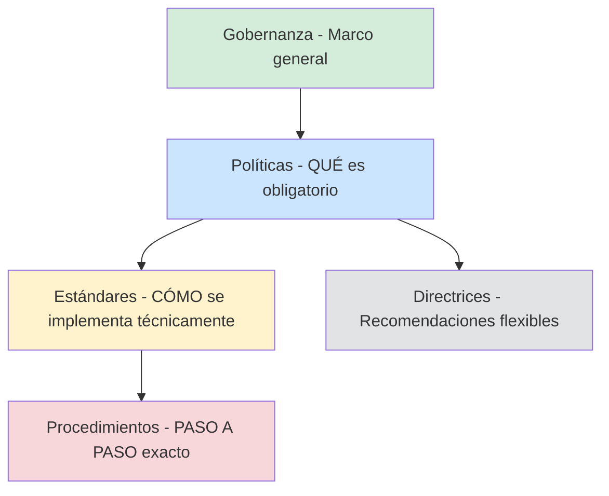
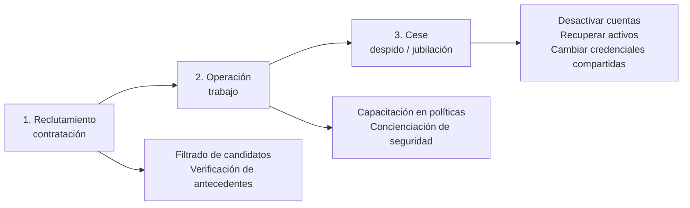
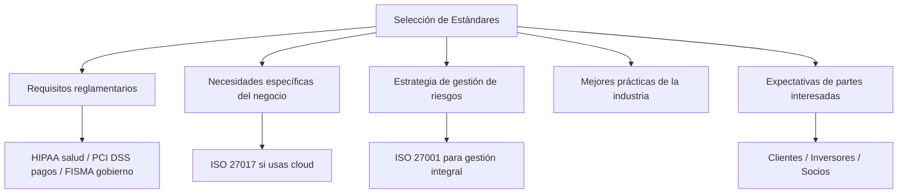
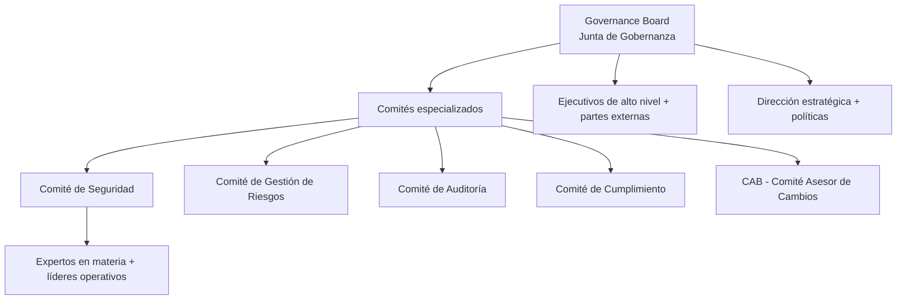
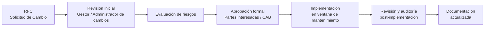
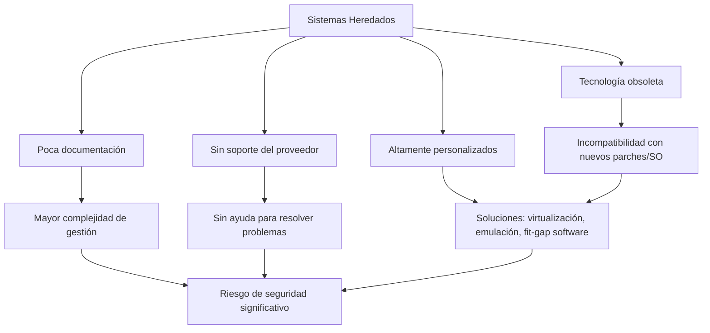
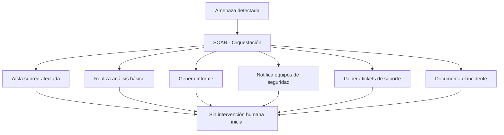
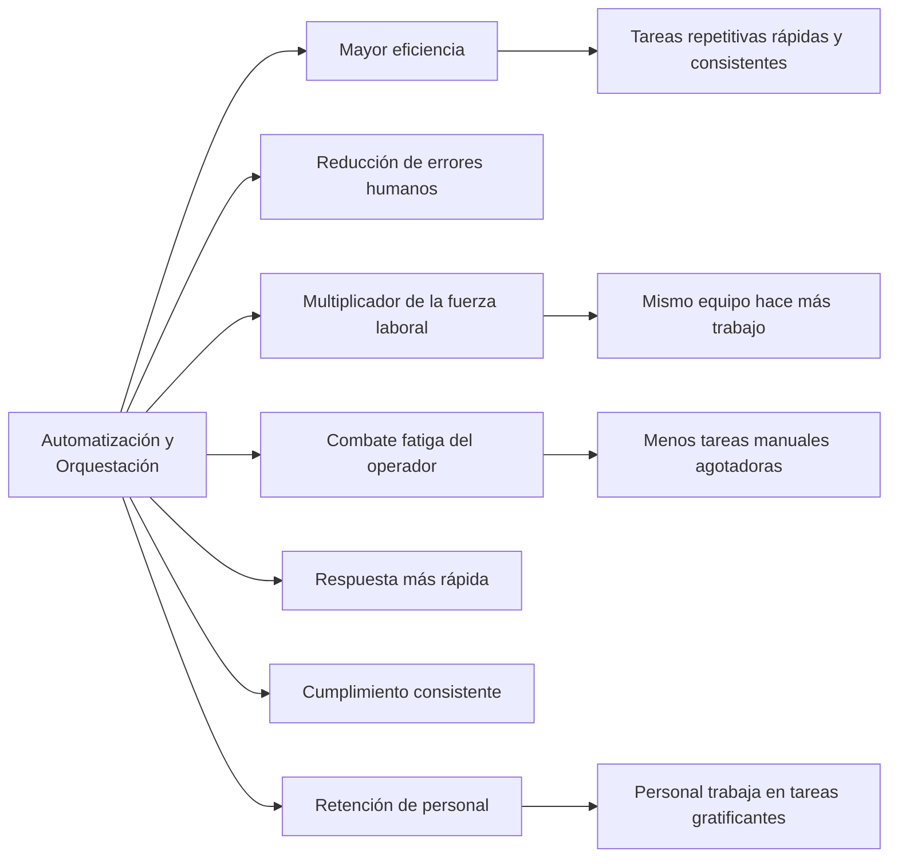

> **Estado:** 🟢 Completo
> **Última actualización:** 2026-06
> **Nivel:** Principiante — se explican los conceptos desde cero

---

- [1. Políticas, Estándares y Procedimientos](#1-políticas-estándares-y-procedimientos)
  - [La Jerarquía de Gobernanza](#la-jerarquía-de-gobernanza)
  - [Políticas](#políticas)
    - [Políticas Organizativas Comunes](#políticas-organizativas-comunes)
    - [Directrices](#directrices)
  - [Procedimientos](#procedimientos)
    - [Administración de Personal: Las 3 Fases](#administración-de-personal-las-3-fases)
    - [Comprobación de Antecedentes](#comprobación-de-antecedentes)
    - [Incorporación (Onboarding)](#incorporación-onboarding)
    - [Manuales de Estrategias (Playbooks)](#manuales-de-estrategias-playbooks)
    - [Desvinculación (Offboarding)](#desvinculación-offboarding)
  - [Estándares](#estándares)
    - [Estándares Internacionales y de Industria](#estándares-internacionales-y-de-industria)
    - [Factores que Impulsan la Adopción de Estándares](#factores-que-impulsan-la-adopción-de-estándares)
    - [Estándares Internos Clave](#estándares-internos-clave)
  - [Entorno Legal](#entorno-legal)
    - [Concepto de Diligencia Debida](#concepto-de-diligencia-debida)
    - [Marco Legal EE.UU.](#marco-legal-eeuu)
    - [Regulaciones Globales de Privacidad](#regulaciones-globales-de-privacidad)
    - [Regulaciones por Sector](#regulaciones-por-sector)
    - [Otras Regulaciones Nacionales](#otras-regulaciones-nacionales)
  - [Gobernanza y Responsabilidad](#gobernanza-y-responsabilidad)
    - [Modelos de Gobernanza: Centralizado vs. Descentralizado](#modelos-de-gobernanza-centralizado-vs-descentralizado)
    - [Estructura: Juntas y Comités](#estructura-juntas-y-comités)
    - [Entidades Gubernamentales de Gobernanza](#entidades-gubernamentales-de-gobernanza)
    - [Funciones de Gobernanza de Datos (RGPD)](#funciones-de-gobernanza-de-datos-rgpd)
- [2. Administración de Cambios](#2-administración-de-cambios)
  - [Objetivo Central](#objetivo-central)
  - [Programas de Gestión de Cambios](#programas-de-gestión-de-cambios)
    - [Tipos de Cambios Gestionados](#tipos-de-cambios-gestionados)
    - [Proceso Estándar de Aprobación](#proceso-estándar-de-aprobación)
    - [Conceptos Clave de Administración de Cambios](#conceptos-clave-de-administración-de-cambios)
    - [Partes Interesadas en Gestión de Cambios](#partes-interesadas-en-gestión-de-cambios)
  - [Cambios Permitidos y Bloqueados](#cambios-permitidos-y-bloqueados)
    - [Allow-list y Deny-list en Gestión de Cambios](#allow-list-y-deny-list-en-gestión-de-cambios)
    - [Problema con Allow-list basada en Hashes](#problema-con-allow-list-basada-en-hashes)
    - [Actividades Restringidas](#actividades-restringidas)
  - [Reinicios, Dependencias y Tiempo de Inactividad](#reinicios-dependencias-y-tiempo-de-inactividad)
    - [Tipos de Cambios que Requieren Reinicio](#tipos-de-cambios-que-requieren-reinicio)
    - [Tipos de Tiempo de Inactividad](#tipos-de-tiempo-de-inactividad)
    - [Dependencias: El Problema Oculto](#dependencias-el-problema-oculto)
    - [Aplicaciones y Sistemas Heredados (Legacy)](#aplicaciones-y-sistemas-heredados-legacy)
  - [Documentación y Control de Versiones](#documentación-y-control-de-versiones)
    - [Control de Versiones](#control-de-versiones)
    - [Documentos Afectados por los Cambios](#documentos-afectados-por-los-cambios)
- [3. Automatización y Orquestación](#3-automatización-y-orquestación)
  - [Automatización y Scripting](#automatización-y-scripting)
    - [Funciones de Automatización en Seguridad](#funciones-de-automatización-en-seguridad)
    - [SOAR (Orquestación, Automatización y Respuesta de Seguridad)](#soar-orquestación-automatización-y-respuesta-de-seguridad)
  - [Implementación de Automatización y Orquestación](#implementación-de-automatización-y-orquestación)
    - [Beneficios Principales](#beneficios-principales)
    - [Fatiga del Operador (Operator Fatigue)](#fatiga-del-operador-operator-fatigue)
    - [Línea de Base Estándar (Standard Baseline)](#línea-de-base-estándar-standard-baseline)
    - [Desafíos de Implementación](#desafíos-de-implementación)
- [4. Glosario](#4-glosario)
- [5. Regulaciones y Su Ámbito](#5-regulaciones-y-su-ámbito)
- [6. Política vs. Estándar vs. Procedimiento vs. Directriz](#6-política-vs-estándar-vs-procedimiento-vs-directriz)
- [7. Automatización vs. Orquestación](#7-automatización-vs-orquestación)

---

# 1. Políticas, Estándares y Procedimientos

## La Jerarquía de Gobernanza

> **Analogía:** Imagina una empresa como un país. La **política** es la Constitución (qué es obligatorio). Los **estándares** son las leyes específicas (cómo se implementa). Los **procedimientos** son el reglamento interno (paso a paso exacto). Las **directrices** son recomendaciones del gobierno (buenas prácticas, no obligatorias).

| Documento | Obligatorio | Nivel de detalle | Ejemplo |
|-----------|------------|-----------------|---------|
| **Política** | ✅ Sí | Alto nivel | "Los datos de clientes deben estar cifrados" |
| **Estándar** | ✅ Sí | Técnico/específico | "Usar AES-256 con gestión de claves X" |
| **Procedimiento** | ✅ Sí | Paso a paso | "1. Abrir consola... 2. Ejecutar comando..." |
| **Directriz** | ❌ Recomendación | Flexible | "Se recomienda revisar logs a las 9am" |

## Políticas

> **Gobernanza** = procesos para dirigir y controlar la organización, incluyendo toma de decisiones y gestión de riesgos. Las **políticas** son el resultado de la gobernanza.

> **Cumplimiento** = grado de adhesión de una organización a regulaciones, políticas, estándares y leyes.

### Políticas Organizativas Comunes

| Política | Propósito | Elementos clave |
|----------|-----------|-----------------|
| **AUP** (Política de Uso Aceptable) | Define comportamiento aceptable en uso de redes y sistemas | Navegación web, contenido, descargas, firma obligatoria del empleado |
| **Política de Seguridad de la Información** | Garantiza cumplimiento de reglas de seguridad en toda la org | Marco para todos los usuarios de TI |
| **BCP / COOP** (Continuidad del Negocio / Continuidad de Operaciones) | Mantener procesos críticos durante interrupciones | Desastres naturales, ciberataques |
| **Recuperación ante Desastres (DR)** | Restaurar operaciones tras evento catastrófico | Falla de hardware, violación grave de seguridad |
| **Respuesta a Incidentes (IR)** | Gestionar violaciones de seguridad y ciberataques | Identificar, investigar, contener, mitigar, comunicar |
| **SDLC** (Ciclo de Vida del Desarrollo de Software) | Regir el desarrollo de software | Fases desde requisitos hasta mantenimiento |
| **Administración de Cambios** | Gestionar cambios en sistemas TI | Solicitud, revisión, aprobación, implementación, documentación |

### Directrices

- Son **recomendaciones**, no reglas obligatorias
- Mayor discreción para quien las implementa
- Ejemplo: tono de respuesta en correos del help desk (recomienda lenguaje, permite flexibilidad)
- Se deben revisar periódicamente para mantenerse relevantes

> **👉 Enfoque de Examen SY0-701:**
> La distinción política vs. directriz es una pregunta directa: **política = obligatoria**; **directriz = recomendación**. CompTIA puede presentar un escenario: *"Un documento describe las mejores prácticas para responder a solicitudes, pero permite que cada técnico adapte su enfoque — ¿qué tipo de documento es?"* → **Directriz**. AUP es la política más frecuentemente mencionada en el examen — recordar que debe incluir consecuencias del incumplimiento y requerir firma del empleado.

## Procedimientos

> **Analogía:** Si la política dice "los autos deben cumplir normas de seguridad", el procedimiento es la lista de verificación punto a punto que sigue el mecánico en la ITV.

### Administración de Personal: Las 3 Fases

### Comprobación de Antecedentes

- Verifica identidad y ausencia de historial criminal o conexiones de riesgo
- Más rigurosas para entornos de alta confidencialidad o alto valor
- En empleos federales que requieren autorización de seguridad: **obligatorias**
- Pueden realizarlas internamente o mediante tercero externo

### Incorporación (Onboarding)

Proceso al dar la bienvenida a nuevo empleado/proveedor/contratista:

| Tarea | Descripción | Riesgo si falla |
|-------|-------------|-----------------|
| **Transmisión segura de credenciales** | Enviar contraseña inicial o tarjeta inteligente de forma segura | Backdoor explotable con contraseñas predeterminadas |
| **Asignación de activos** | Equipos corporativos o BYOD (trae tu propio dispositivo) | Shadow IT, dispositivos no gestionados |
| **Capacitación / políticas** | Certificación de concienciación de seguridad | Empleado sin conocimiento de políticas |

> **Automatización de IAM (Gestión de Identidades y Accesos)** acelera el onboarding: creación automática de cuentas, asignación de privilegios según rol, sincronización con sistemas RR.HH.

### Manuales de Estrategias (Playbooks)

- Repositorio central de estrategias y tácticas estandarizadas
- **Para respuesta a incidentes:** detallan procedimientos de emergencia y planes de contingencia
- Facilitan decisiones rápidas bajo presión
- Referencias: **MITRE ATT&CK** (`attack.mitre.org`) y **NIST SP 800-61** (Guía de Respuesta a Incidentes)
- Beneficios: continuidad ante rotación de personal, calidad consistente, mejora continua

### Desvinculación (Offboarding)

| Categoría | Acciones requeridas |
|-----------|---------------------|
| **Administración de cuentas** | Desactivar cuenta y privilegios; asegurar acceso a archivos cifrados/protegidos del empleado |
| **Activos de la empresa** | Recuperar dispositivos, llaves, tarjetas inteligentes, USBs |
| **Activos personales** | Borrar datos corporativos del dispositivo personal del empleado |
| **Credenciales compartidas** | Cambiar **inmediatamente** todas las credenciales de cuentas compartidas a las que tuvo acceso |

> **⚠️ Riesgo crítico:** Empleados con conocimientos de sistemas de seguridad + acceso a credenciales compartidas = máxima prioridad en el proceso de desvinculación.

> **👉 Enfoque de Examen SY0-701:**
> Onboarding y offboarding son escenarios frecuentes. Pregunta tipo: *"Un empleado se va voluntariamente — ¿cuál es el primer paso de seguridad?"* → **Desactivar la cuenta y revocar privilegios**. BYOD en onboarding introduce riesgos de Shadow IT. Playbooks son la herramienta estándar para IR — referencia directa a MITRE ATT&CK en el examen significa que la respuesta involucra TTPs documentados.

## Estándares

> **Diferencia clave Política vs. Estándar:**
> - Política → *práctica empresarial* (qué se debe lograr)
> - Estándar → *implementación técnica* (cómo se logra exactamente)

### Estándares Internacionales y de Industria

| Estándar | Ámbito | Para qué sirve |
|----------|--------|----------------|
| **ISO/IEC 27001** | Internacional | Marco SGSI (Sistema de Gestión de Seguridad de la Información) |
| **ISO/IEC 27002** | Internacional | Guía detallada de controles específicos para SGSI (complementa 27001) |
| **ISO/IEC 27017** | Internacional | Extensión de 27001 para **servicios en la nube** |
| **ISO/IEC 27018** | Internacional | Protección de **PII** (Información de Identificación Personal) en nubes públicas |
| **NIST SP 800-63** | EE.UU. (gobierno) | Directrices de identidad digital, contraseñas, control de acceso |
| **PCI DSS** | Industria de pagos | Protección de datos de titulares de tarjetas de crédito |
| **FIPS** | EE.UU. federal | Requisitos criptográficos para sistemas del gobierno federal |

### Factores que Impulsan la Adopción de Estándares

### Estándares Internos Clave

| Categoría | Elementos |
|-----------|-----------|
| **Contraseñas** | Algoritmos de hashing, salting (protección rainbow tables), transmisión segura, reset, gestores de contraseñas |
| **Control de acceso** | Modelos (RBAC, DAC, MAC), verificación de identidad, gestión de privilegios, protocolos de autenticación (Kerberos, OAuth, SAML), gestión de sesiones, logs de auditoría |
| **Seguridad física** | Acceso a edificios (CCTV, tarjetas), workstations, centros de datos (biométricos, registros), desecho de equipos, gestión de visitantes |
| **Cifrado** | Algoritmos permitidos (AES simétrico, ECC asimétrico), longitudes de clave mínimas, gestión de claves (generación, distribución, rotación, revocación) |

> **👉 Enfoque de Examen SY0-701:**
> Saber qué estándar aplica a qué sector es pregunta directa: **HIPAA** → salud; **PCI DSS** → pagos; **FISMA** → gobierno federal EE.UU.; **ISO 27001** → SGSI general; **NIST SP 800-63** → identidad digital y contraseñas. Distractor: ISO 27001 vs. ISO 27002 — 27001 es el **marco/certificación**; 27002 es la **guía de controles** (complementaria). Salting de contraseñas protege específicamente contra **ataques de tabla de arco iris (rainbow table)**.

## Entorno Legal

> **Analogía:** La gobernanza sin conocimiento legal es como construir un edificio sin saber los códigos de construcción — técnicamente puede funcionar, pero cualquier accidente crea responsabilidad legal.

### Concepto de Diligencia Debida

- **Diligencia debida (Due Diligence):** término legal que significa que los responsables no fueron negligentes en sus funciones
- La negligencia puede crear responsabilidades **penales y civiles**
- Muchos países penalizan la negligencia en la gestión de información

### Marco Legal EE.UU.

| Ley | Año | Ámbito |
|-----|-----|--------|
| **Ley de Seguridad Informática** | 1987 | Agencias federales deben desarrollar políticas de seguridad |
| **SOX** (Sarbanes-Oxley) | 2002 | Evaluaciones de riesgos, controles internos, auditorías |
| **FISMA** (Ley Federal de Gestión de Seguridad de la Información) | 2002 | Seguridad de datos en agencias del gobierno federal |

### Regulaciones Globales de Privacidad

| Regulación | Origen | Ámbito y puntos clave |
|------------|--------|----------------------|
| **RGPD** (Reglamento General de Protección de Datos) | Unión Europea | Datos personales no se pueden recopilar sin consentimiento informado; derecho a retirar consentimiento, inspeccionar, modificar o borrar datos; multas muy elevadas por incumplimiento |
| **CCPA** (Ley de Privacidad del Consumidor de California) | EE.UU. (California) | Derecho a saber qué datos se recopilan, con quién se comparten, y a eliminarlos; aplica a org. con >$25M ingresos o que compran/venden datos de >50K consumidores |

> **RGPD:** aplica independientemente de fronteras geopolíticas a cualquier organización que procese datos de ciudadanos de la UE.

### Regulaciones por Sector

| Sector | Regulación | País/Región |
|--------|-----------|-------------|
| **Salud** | HIPAA (Ley de Portabilidad y Responsabilidad de Seguros Médicos) | EE.UU. |
| **Salud** | RGPD | Unión Europea |
| **Servicios financieros** | GLBA (Gramm-Leach-Bliley Act) | EE.UU. |
| **Pagos** | PCI DSS | Global (obligación contractual) |
| **Telecomunicaciones** | CALEA | EE.UU. |
| **Energía** | NERC CIP | EE.UU., Canadá, Norte de México |
| **Educación infantil** | FERPA / CIPA / COPPA | EE.UU. |
| **Gobierno federal** | FISMA / CJIS | EE.UU. |

### Otras Regulaciones Nacionales

| País | Regulación |
|------|-----------|
| **Reino Unido** | Ley de Protección de Datos 2018, NIS 2018 |
| **Canadá** | PIPEDA |
| **India** | Ley de Tecnologías de la Información 2000 |
| **Australia** | Ley de Privacidad 1988 |

> **👉 Enfoque de Examen SY0-701:**
> HIPAA, RGPD, FISMA y PCI DSS son las más preguntadas. Diferencia clave: **RGPD y CCPA** son regulaciones de **privacidad**; **HIPAA** es de **privacidad en salud**; **FISMA** es de **seguridad del gobierno federal**. CMMC (Certificación del Modelo de Madurez de Ciberseguridad) aparece en el examen para contratistas de defensa de EE.UU. La **diligencia debida** es el concepto legal que protege a los responsables de responsabilidades penales — su ausencia es **negligencia**.

## Gobernanza y Responsabilidad

### Modelos de Gobernanza: Centralizado vs. Descentralizado

| Característica | **Centralizado** | **Descentralizado** | **Híbrido** |
|---------------|-----------------|---------------------|-------------|
| **Toma de decisiones** | Un grupo/departamento | Distribuida por unidades | Mix según decisión |
| **Consistencia** | ✅ Alta | ❌ Variable | ✅ Media-alta |
| **Adaptabilidad local** | ❌ Baja | ✅ Alta | ✅ Flexible |
| **Control de recursos** | Centralizado | Local | Por área |
| **Ideal para** | Orgs. homogéneas | Orgs. con unidades muy distintas | La mayoría de empresas medianas/grandes |

### Estructura: Juntas y Comités

### Entidades Gubernamentales de Gobernanza

| Entidad | Función |
|---------|---------|
| **Agencias reguladoras** | Establecen y aplican normas; supervisan cumplimiento por sector |
| **Agencias de inteligencia** | Recopilan/analizan amenazas; informan política nacional |
| **Fuerzas de seguridad** | Aplican leyes; investigan delitos cibernéticos |
| **Organizaciones militares/defensa** | Seguridad nacional; ciberseguridad de defensa |
| **Autoridades de protección de datos** | Protegen datos personales; aplican normativa de privacidad |
| **Agencias nacionales de ciberseguridad** | Protegen infraestructura crítica; coordinan respuesta a incidentes |

### Funciones de Gobernanza de Datos (RGPD)

> **Analogía:** En un hospital, el **propietario** (director médico) decide qué datos se protegen. El **responsable** (el hospital) decide para qué se usan y bajo qué condiciones. El **encargado** (laboratorio externo) los procesa por contrato. El **custodio** (TI) los almacena y protege físicamente.

| Rol | También llamado | Responsabilidad | Quién lo ejerce típicamente |
|-----|----------------|-----------------|----------------------------|
| **Propietario** (Owner) | — | Clasifica datos; decide quién accede y qué seguridad aplicar; orientación estratégica | Directivo de alto rango (VP, Director) |
| **Responsable** (Controller) | Controlador | Determina fines y medios del tratamiento de datos personales; garantiza cumplimiento legal | La organización misma o su DPO |
| **Encargado** (Processor) | Procesador | Procesa datos en nombre del responsable; aplica medidas de seguridad | Proveedor cloud (CSP), socios, proveedores |
| **Custodio** (Custodian) | Administrador de datos | Custodia, transporte, almacenamiento; implementa controles técnicos establecidos por Owner/Controller | Departamento de TI |

> **👉 Enfoque de Examen SY0-701:**
> Propietario vs. Custodio es una distinción frecuente: el **propietario** toma decisiones estratégicas sobre los datos (qué proteger, quién accede); el **custodio** (TI) los protege técnicamente. En RGPD, **responsable** (controller) decide el "para qué"; **encargado** (processor) lo ejecuta — los CSP suelen ser encargados. La junta de gobernanza es estratégica; los comités son operativos/técnicos.

# 2. Administración de Cambios

> **Analogía:** Cambiar una pieza de un avión en pleno vuelo sin un proceso formal puede provocar un desastre. La administración de cambios es el manual de mantenimiento aeronáutico de la organización TI.

## Objetivo Central

Minimizar el riesgo e interrupción mientras se maximiza el valor de los cambios. Evita que los cambios introduzcan vulnerabilidades, interrumpan servicios o afecten el estado de cumplimiento.

## Programas de Gestión de Cambios

### Tipos de Cambios Gestionados

- Implementaciones de software
- Actualizaciones del sistema y parches
- Reemplazos o actualizaciones de hardware
- Modificaciones de red y configuración
- Nuevas integraciones de software
- Cambios en entornos de soporte

### Proceso Estándar de Aprobación

### Conceptos Clave de Administración de Cambios

| Concepto | Descripción |
|----------|-------------|
| **RFC** (Solicitud de Cambio) | Documento que describe: propósito, alcance, impacto potencial del cambio propuesto |
| **CAB** (Comité Asesor de Cambios) | Grupo que evalúa, aprueba o rechaza cambios; incluye TI, negocio, cumplimiento |
| **Análisis del impacto** | Identifica y evalúa cómo el cambio afecta usuarios, procesos, sistemas interconectados |
| **Resultados de prueba** | Validación en entorno de prueba antes de producción; identifica inconvenientes sin afectar operaciones |
| **Plan de retroceso (Rollback)** | Plan de contingencia para revertir cambios y restaurar estado anterior si falla la implementación |
| **Período de mantenimiento** | Ventana de tiempo predefinida para implementar cambios; se programa en horas de baja actividad |
| **SOP** (Procedimientos Operativos Estándar) | Instrucciones paso a paso para operaciones rutinarias; desarrolladas durante fase de pruebas |

### Partes Interesadas en Gestión de Cambios

- **Stakeholders:** toda persona con interés directo en el cambio (TI, negocio, cumplimiento, clientes, proveedores)
- **Propietario del cambio:** principal responsable de implementarlo; puede ser gerente de proyecto o líder de equipo
- Participación activa de stakeholders → mayor probabilidad de éxito en la implementación

> **👉 Enfoque de Examen SY0-701:**
> RFC → CAB → Aprobación → Implementación → Revisión es el flujo estándar a memorizar. **Rollback plan** es obligatorio en cualquier cambio significativo. El **período de mantenimiento** es la ventana programada de tiempo de inactividad autorizado. Pregunta tipo: *"¿Quién aprueba formalmente los cambios en un programa de gestión de cambios?"* → **CAB (Comité Asesor de Cambios)**. Un cambio sin plan de retroceso es una violación del proceso de gestión de cambios.

## Cambios Permitidos y Bloqueados

### Allow-list y Deny-list en Gestión de Cambios

| Lista | En gestión de cambios | En seguridad técnica |
|-------|----------------------|---------------------|
| **Allow-list** (Lista de permitidos) | Cambios/software/hardware aprobados que no requieren pasar por todo el proceso | Software aprobado que puede ejecutarse; hashes de ejecutables permitidos |
| **Deny-list** (Lista de denegados) | Cambios/software/hardware explícitamente bloqueados; personas sin autorización | Software prohibido; IPs/dominios bloqueados en firewall |

### Problema con Allow-list basada en Hashes

> **⚠️ Trampa de los parches:** Si una allow-list usa hashes de ejecutables para validar software, un parche cambia el hash del ejecutable → el software parcheado ya no está en la lista → sistema actualizado e inutilizable para los usuarios.

**Solución:** Incorporar el impacto de allow/deny lists en el **plan de pruebas** de la gestión de cambios.

### Actividades Restringidas

Acciones que requieren inspección adicional, controles más rigurosos o niveles más altos de aprobación por su impacto en:
- Sistemas críticos
- Datos sensibles
- Estado de cumplimiento normativo

> **👉 Enfoque de Examen SY0-701:**
> Allow-list en seguridad = solo el software explícitamente aprobado puede ejecutarse (más seguro). Deny-list = todo está permitido salvo lo explícitamente bloqueado (más flexible, menos seguro). Pregunta trampa: *"Un parche provoca que el software aprobado no pueda ejecutarse — ¿por qué?"* → La allow-list está basada en **hashes de archivo** que cambiaron al aplicar el parche. Solución: actualizar la allow-list como parte del proceso de aplicación del parche.

## Reinicios, Dependencias y Tiempo de Inactividad

### Tipos de Cambios que Requieren Reinicio

| Tipo de cambio | Por qué requiere reinicio |
|---------------|--------------------------|
| **Actualizaciones y parches de software** | Para implementar efectivamente los cambios y verificar correcto funcionamiento |
| **Cambios en la configuración del sistema** | Los ajustes (servidor, red, DB) requieren reiniciar servicios afectados |
| **Cambios en infraestructura** | Switches, routers, firewalls, balanceadores de carga |
| **Cambios de seguridad** | Protocolos de cifrado, features de seguridad, configuración de control de acceso |

### Tipos de Tiempo de Inactividad

| Tipo | Descripción |
|------|-------------|
| **Tiempo de inactividad programado** | Ventana de mantenimiento planificada; las partes interesadas son notificadas con anticipación |
| **Tiempo de inactividad no programado** | Interrupción inesperada causada por fallo durante o post-cambio |

### Dependencias: El Problema Oculto

> **Analogía:** Si un servidor de base de datos es el corazón del sistema, reiniciarlo es como parar el corazón — todo lo que depende de él (aplicaciones, procesos de negocio) también se detiene.

- Un cambio aparentemente menor puede afectar una cadena entera de servicios
- Las dependencias impactan en:
  - **Tiempo necesario** para el cambio (más servicios a detener/reiniciar)
  - **Plan de retroceso** (debe considerar cómo restaurar la cadena completa)
  - **Comunicación** a stakeholders afectados

### Aplicaciones y Sistemas Heredados (Legacy)

> **👉 Enfoque de Examen SY0-701:**
> Las dependencias son el principal generador de **downtime no previsto** en cambios aparentemente simples. Los sistemas heredados son riesgo de seguridad porque carecen de parches del proveedor — esto los convierte en superficie de ataque permanente. Pregunta tipo: *"¿Qué solución permite ejecutar aplicaciones heredadas incompatibles con el SO moderno?"* → **Virtualización / emulación**.

## Documentación y Control de Versiones

### Control de Versiones

- Mantiene registro histórico de cambios en documentos, código y configuraciones
- Garantiza que solo se implementen modificaciones aprobadas
- Permite revertir rápidamente a versión anterior
- Evita confusión por documentos desactualizados o inconsistentes

### Documentos Afectados por los Cambios

| Documento | Qué actualizar |
|-----------|----------------|
| **Solicitudes de cambio (RFC)** | Estado, modificaciones y aprobaciones durante el proceso |
| **Políticas y procedimientos** | Alinear con nuevos procesos, controles o directrices introducidos |
| **Documentación de sistema/proceso** | Arquitectura, diagramas, flujos de proceso, SOPs, manuales de usuario |
| **Documentación de configuración** | Elementos de configuración en el sistema de administración de configuración |
| **Materiales de capacitación** | Presentaciones, manuales, módulos eLearning actualizados al nuevo estado |
| **Planes de recuperación / IR** | Actualizar para reflejar nuevas configuraciones, dependencias y procedimientos |

> **Regla de oro:** Las políticas y procedimientos deben cambiar con la misma frecuencia que la tecnología.

> **👉 Enfoque de Examen SY0-701:**
> Control de versiones en gestión de cambios = garantiza que se use la documentación más reciente y que cambios no autorizados sean detectables. Cualquier cambio significativo en TI **debe** actualizar la documentación de configuración y los planes de IR/DR. Las versiones anteriores se archivan pero permanecen accesibles — no se eliminan.

---

# 3. Automatización y Orquestación

> **Analogía:** La **automatización** es como tener un robot que realiza tareas repetitivas (escanear vulnerabilidades, aplicar parches). La **orquestación** es el director de orquesta que coordina todos los robots para que trabajen juntos en el momento justo.

| Concepto | Qué hace | Ejemplo |
|----------|----------|---------|
| **Automatización** | Realiza tareas repetitivas basadas en reglas sin intervención humana | Script que aplica parches automáticamente |
| **Orquestación** | Coordina y gestiona múltiples procesos y sistemas automatizados | SOAR que al detectar amenaza: aísla subred + analiza + genera ticket + notifica |

## Automatización y Scripting

### Funciones de Automatización en Seguridad

| Función | Descripción | Beneficio de seguridad |
|---------|-------------|----------------------|
| **Aprovisionamiento** | Creación, modificación y eliminación de cuentas y derechos de acceso | Implementación consistente; reduce errores humanos |
| **Barandillas y grupos de seguridad** | Aplican y supervisan políticas de seguridad automáticamente | Previenen comportamientos de riesgo; detectan acceso no autorizado |
| **Emisión de tickets** | Detectan incidentes y generan tickets automáticamente con enrutamiento inteligente | Respuesta rápida; garantía de SLA; escalado automático de críticos |
| **Administración de servicios** | Activar/desactivar servicios, modificar derechos, ciclo de vida de recursos TI | Libera analistas para tareas estratégicas |
| **CI/CD** (Integración/Entrega Continua) | Desarrolladores integran cambios periódicamente; cada combinación se prueba automáticamente | Mejora calidad del código; reduce riesgo de integración |
| **APIs** | Permiten comunicación entre sistemas; base para plataformas SOAR | Flujos de trabajo sin fricción; automatización compleja |

### SOAR (Orquestación, Automatización y Respuesta de Seguridad)

> **👉 Enfoque de Examen SY0-701:**
> SOAR = **S**ecurity **O**rchestration, **A**utomation and **R**esponse — coordina múltiples herramientas de seguridad en flujos de trabajo automatizados. CI/CD es el proceso donde cada commit se prueba automáticamente — reduce el riesgo de bugs de seguridad. APIs son el "pegamento" que hace posible la orquestación entre sistemas heterogéneos.

## Implementación de Automatización y Orquestación

### Beneficios Principales

### Fatiga del Operador (Operator Fatigue)

> **Analogía:** Un guardia de seguridad que revisa 1000 alertas idénticas cada día acaba ignorándolas todas. Así pierde la genuinamente peligrosa.

- Agotamiento mental de profesionales de ciberseguridad por trabajo continuo de alta intensidad
- Causas: monitorear múltiples sistemas, gestionar grandes volúmenes de alertas (incluidos falsos positivos), responder amenazas rápidamente
- **Consecuencias:** menor estado de alerta, peor función cognitiva, omisión de alertas críticas, mayor probabilidad de errores
- **Solución:** automatizar tareas repetitivas → el analista se concentra en casos complejos que requieren juicio humano

### Línea de Base Estándar (Standard Baseline)

- Conjunto bien definido de configuraciones y ajustes aprobados que sirven como punto de referencia
- La automatización **invalida automáticamente los cambios no autorizados** que desvíen la configuración de la línea base
- Garantiza consistencia y seguridad en toda la infraestructura

### Desafíos de Implementación

| Desafío | Descripción | Mitigación |
|---------|-------------|-----------|
| **Complejidad** | Requiere comprensión profunda de sistemas e interdependencias; mala planificación agrega más complejidad | Diseño cuidadoso, documentación exhaustiva |
| **Costo** | Alto costo inicial (herramientas, integración, capacitación) + mantenimiento continuo | Análisis ROI; implementación progresiva |
| **Punto único de falla** | Si un sistema automatizado crítico falla, afecta múltiples áreas | Redundancia; fallback manual |
| **Deuda técnica** | Implementación apresurada → código mal documentado, integraciones frágiles | Estándares de código; revisiones periódicas |
| **Soporte continuo** | Los sistemas requieren actualizaciones, parches y mejoras constantes | Equipo dedicado de mantenimiento |

> **⚠️ Ironía de la deuda técnica:** Los problemas de los sistemas de automatización mal mantenidos (frágiles, indocumentados, sin soporte) se parecen a los problemas de los sistemas heredados.

> **👉 Enfoque de Examen SY0-701:**
> **Fatiga del operador** es un concepto específico del examen — la automatización es la solución primaria. **Multiplicador de la fuerza laboral** = automatización permite que el mismo equipo haga más trabajo efectivo. **Deuda técnica** surge de implementar automatización sin planificación adecuada. Punto único de falla es el principal riesgo de depender demasiado de la automatización. Pregunta tipo: *"¿Qué beneficio principal ofrece SOAR para un SOC pequeño?"* → **Multiplicador de la fuerza laboral / reducción de fatiga del operador**.

# 4. Glosario

| Acrónimo | Significado |
|----------|-------------|
| **AUP** | Acceptable Use Policy (Política de Uso Aceptable) |
| **BCP** | Business Continuity Plan (Plan de Continuidad del Negocio) |
| **CAB** | Change Advisory Board (Comité Asesor de Cambios) |
| **CALEA** | Communications Assistance for Law Enforcement Act |
| **CCPA** | California Consumer Privacy Act (Ley de Privacidad del Consumidor de California) |
| **CDE** | Cardholder Data Environment (Entorno de Datos del Titular de Tarjeta) |
| **CI/CD** | Continuous Integration / Continuous Delivery |
| **CJIS** | Criminal Justice Information Services |
| **CMMC** | Cybersecurity Maturity Model Certification |
| **COOP** | Continuity of Operations Plan (Plan de Continuidad de Operaciones) |
| **DAC** | Discretionary Access Control (Control de Acceso Discrecional) |
| **DPO** | Data Protection Officer (Oficial de Protección de Datos) |
| **DR** | Disaster Recovery (Recuperación ante Desastres) |
| **ECC** | Elliptic Curve Cryptography (Criptografía de Curva Elíptica) |
| **FERPA** | Family Educational Rights and Privacy Act |
| **FIPS** | Federal Information Processing Standards |
| **FISMA** | Federal Information Security Management Act |
| **GLBA** | Gramm-Leach-Bliley Act |
| **HIPAA** | Health Insurance Portability and Accountability Act |
| **IAM** | Identity and Access Management (Gestión de Identidades y Accesos) |
| **IR** | Incident Response (Respuesta a Incidentes) |
| **ISO** | International Organization for Standardization |
| **MAC** | Mandatory Access Control (Control de Acceso Obligatorio) |
| **NERC** | North American Electric Reliability Corporation |
| **NIS** | Network and Information Systems (Directive) |
| **NIST** | National Institute of Standards and Technology |
| **PCI DSS** | Payment Card Industry Data Security Standard |
| **PII** | Personally Identifiable Information (Información de Identificación Personal) |
| **PIPEDA** | Personal Information Protection and Electronic Documents Act (Canadá) |
| **RBAC** | Role-Based Access Control (Control de Acceso Basado en Roles) |
| **RFC** | Request for Change (Solicitud de Cambio) |
| **RGPD / GDPR** | Reglamento General de Protección de Datos (General Data Protection Regulation) |
| **SDLC** | Software Development Life Cycle (Ciclo de Vida del Desarrollo de Software) |
| **SGSI** | Sistema de Gestión de Seguridad de la Información (ISMS en inglés) |
| **SLA** | Service Level Agreement (Acuerdo de Nivel de Servicio) |
| **SOAR** | Security Orchestration, Automation and Response |
| **SOC** | Security Operations Center |
| **SOP** | Standard Operating Procedures (Procedimientos Operativos Estándar) |
| **SOX** | Sarbanes-Oxley Act |

# 5. Regulaciones y Su Ámbito

| Regulación | Tipo | Ámbito principal | Consecuencia incumplimiento |
|-----------|------|-----------------|---------------------------|
| **RGPD** | Privacidad | Datos personales ciudadanos UE | Multas muy elevadas |
| **CCPA** | Privacidad | Residentes California | Multas, acciones legales |
| **HIPAA** | Salud + Privacidad | Datos médicos EE.UU. | Multas, prisión |
| **PCI DSS** | Pagos | Tarjetas de crédito | Pérdida de capacidad de procesar pagos |
| **FISMA** | Gobierno | Agencias federales EE.UU. | Sanciones administrativas |
| **SOX** | Finanzas | Empresas cotizadas EE.UU. | Responsabilidad penal ejecutivos |
| **GLBA** | Financiero | Instituciones financieras EE.UU. | Multas regulatorias |
| **FERPA** | Educación | Datos educativos EE.UU. | Pérdida de financiación federal |
| **COPPA** | Infancia | Datos de menores online EE.UU. | Multas FTC |
| **CMMC** | Defensa | Contratistas DoD EE.UU. | Pérdida de contratos gubernamentales |

# 6. Política vs. Estándar vs. Procedimiento vs. Directriz

| Aspecto | Política | Estándar | Procedimiento | Directriz |
|---------|---------|---------|--------------|----------|
| **Obligatorio** | ✅ | ✅ | ✅ | ❌ |
| **Nivel de detalle** | Alto nivel | Técnico específico | Paso a paso | Recomendaciones |
| **Flexibilidad** | Ninguna | Poca | Ninguna | Alta |
| **Ejemplo** | "Los datos deben cifrarse" | "Usar AES-256" | "1. Abrir consola... 2. Ejecutar..." | "Se recomienda cifrar al exportar" |
| **Aprobado por** | Alta dirección | TI / Cumplimiento | Operaciones | Cualquier área |
| **Frecuencia de revisión** | Anual o ante cambios | Con cambios tecnológicos | Con cambios de proceso | Periódica |

# 7. Automatización vs. Orquestación

| Aspecto | Automatización | Orquestación |
|---------|---------------|-------------|
| **Qué hace** | Ejecuta tareas individuales automáticamente | Coordina múltiples sistemas y tareas automatizadas |
| **Alcance** | Una tarea o proceso | Flujo de trabajo complejo multi-sistema |
| **Ejemplo** | Script que aplica parches | SOAR que detecta amenaza y activa aislamiento + análisis + notificación |
| **Dependencia** | Puede existir sola | Depende de automatización subyacente |
| **Complejidad** | Moderada | Alta |