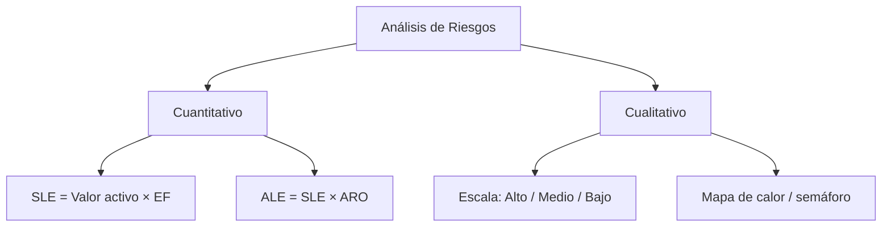
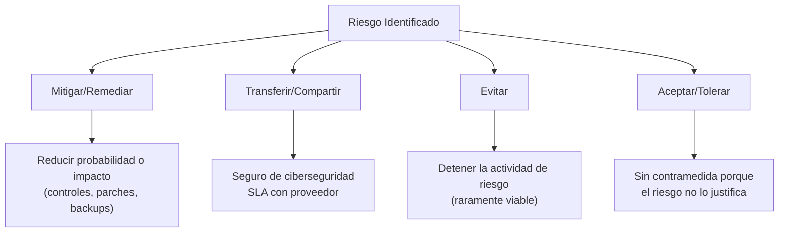
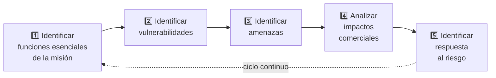
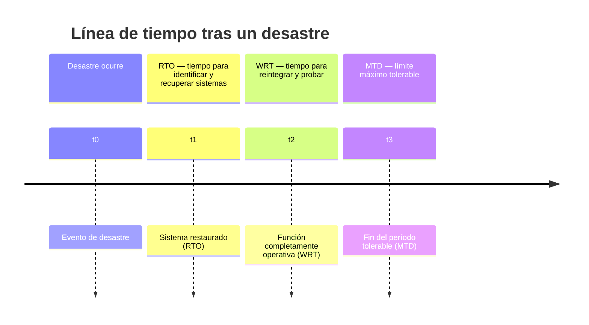
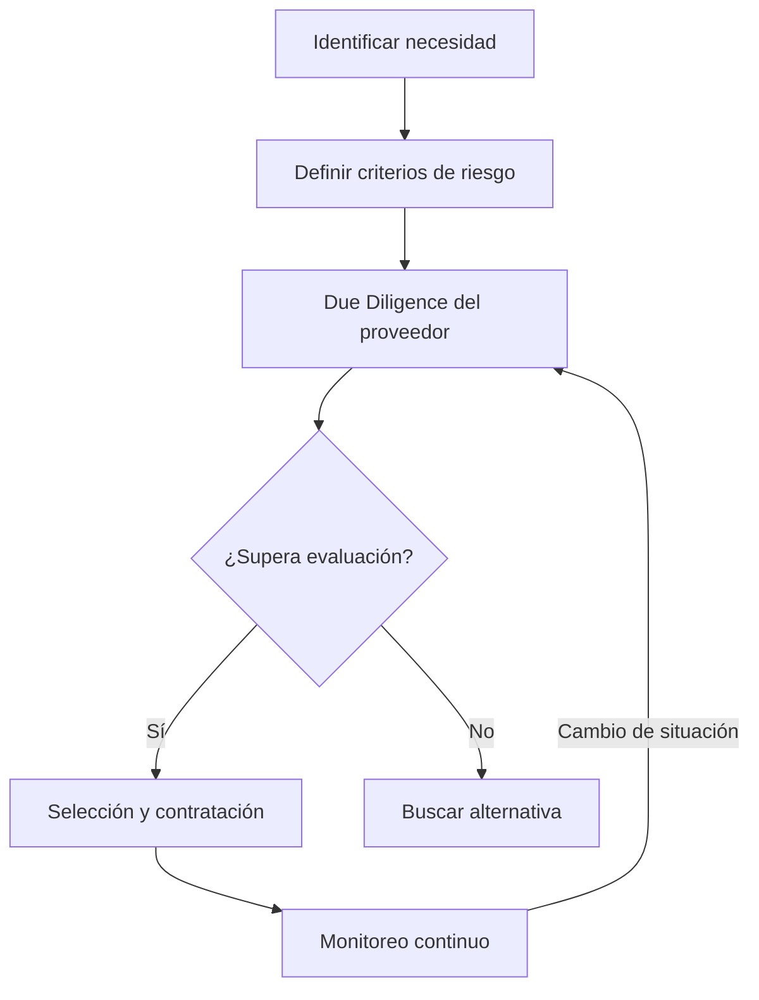
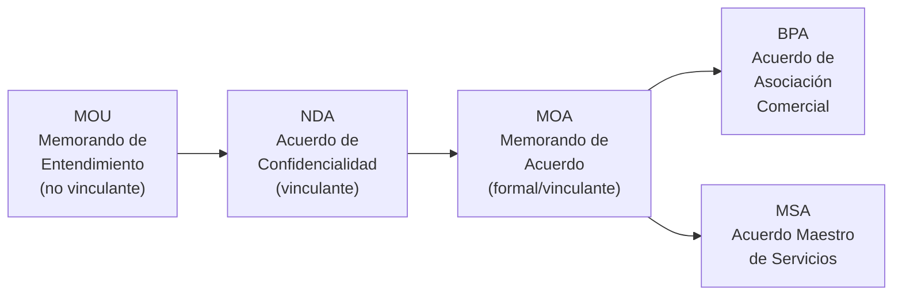
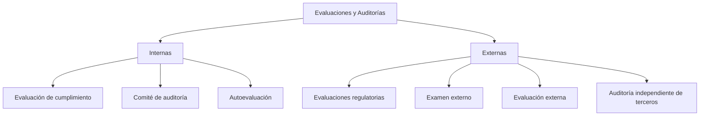
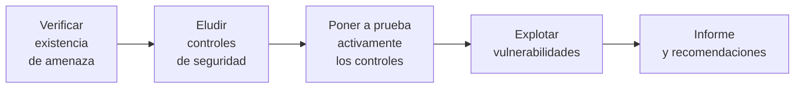
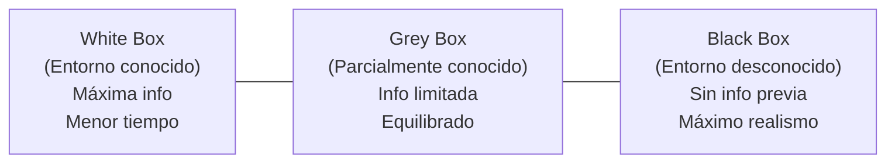
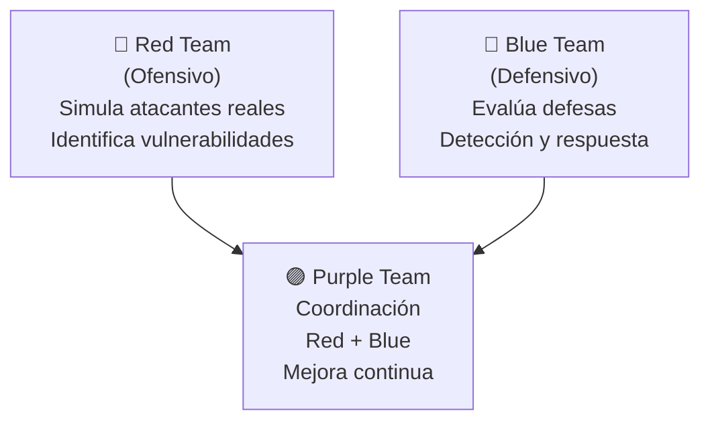

> **Estado:** 🟢 Completo
> **Última actualización:** 2026-06
> **Nivel:** Principiante — se explican los conceptos desde cero

---

- [1. Conceptos Fundamentales de Gestión de Riesgos](#1-conceptos-fundamentales-de-gestión-de-riesgos)
  - [Analogía del mundo real](#analogía-del-mundo-real)
  - [Términos clave](#términos-clave)
- [2. Identificación y Evaluación de Riesgos](#2-identificación-y-evaluación-de-riesgos)
  - [2.1 Tipos de evaluaciones de riesgos](#21-tipos-de-evaluaciones-de-riesgos)
  - [2.2 Análisis cuantitativo vs. cualitativo](#22-análisis-cuantitativo-vs-cualitativo)
    - [Análisis cuantitativo — las fórmulas clave](#análisis-cuantitativo--las-fórmulas-clave)
    - [Análisis cualitativo](#análisis-cualitativo)
  - [2.3 Riesgo inherente](#23-riesgo-inherente)
  - [2.4 Clasificación FIPS 199](#24-clasificación-fips-199)
- [3. Estrategias de Respuesta al Riesgo](#3-estrategias-de-respuesta-al-riesgo)
  - [Analogía del mundo real](#analogía-del-mundo-real-1)
  - [3.1 Excepción vs. exención de riesgo](#31-excepción-vs-exención-de-riesgo)
  - [3.2 Riesgo residual vs. apetito por el riesgo](#32-riesgo-residual-vs-apetito-por-el-riesgo)
- [4. Procesos y Herramientas de Gestión de Riesgos](#4-procesos-y-herramientas-de-gestión-de-riesgos)
  - [4.1 Las 5 fases del proceso de gestión de riesgos](#41-las-5-fases-del-proceso-de-gestión-de-riesgos)
  - [4.2 Marcos de referencia](#42-marcos-de-referencia)
  - [4.3 RCSA vs. RCA](#43-rcsa-vs-rca)
  - [4.4 Registro de riesgos](#44-registro-de-riesgos)
  - [4.5 Indicadores clave de riesgo (KRI)](#45-indicadores-clave-de-riesgo-kri)
  - [4.6 Niveles de apetito por el riesgo](#46-niveles-de-apetito-por-el-riesgo)
- [5. Análisis de Impacto Empresarial (BIA)](#5-análisis-de-impacto-empresarial-bia)
  - [Analogía del mundo real](#analogía-del-mundo-real-2)
  - [5.1 Identificación de sistemas críticos](#51-identificación-de-sistemas-críticos)
  - [5.2 MEF vs. PBF](#52-mef-vs-pbf)
  - [5.3 Las métricas clave del BIA](#53-las-métricas-clave-del-bia)
  - [5.4 MTBF y MTTR](#54-mtbf-y-mttr)
- [6. Gestión de Proveedores y Terceros](#6-gestión-de-proveedores-y-terceros)
  - [Analogía del mundo real](#analogía-del-mundo-real-3)
  - [6.1 Por qué importa la evaluación de terceros](#61-por-qué-importa-la-evaluación-de-terceros)
  - [6.2 Proceso de selección de proveedores](#62-proceso-de-selección-de-proveedores)
  - [6.3 Conflictos de interés en proveedores](#63-conflictos-de-interés-en-proveedores)
  - [6.4 Métodos de evaluación de proveedores](#64-métodos-de-evaluación-de-proveedores)
  - [6.5 Monitoreo continuo de proveedores](#65-monitoreo-continuo-de-proveedores)
- [7. Acuerdos Legales con Proveedores](#7-acuerdos-legales-con-proveedores)
  - [7.1 Acuerdos iniciales (marco de relación)](#71-acuerdos-iniciales-marco-de-relación)
  - [7.2 Acuerdos operativos detallados](#72-acuerdos-operativos-detallados)
  - [7.3 Reglas de Intervención (RoE)](#73-reglas-de-intervención-roe)
- [8. Auditorías y Evaluaciones](#8-auditorías-y-evaluaciones)
  - [8.1 Diferencia entre auditoría y evaluación](#81-diferencia-entre-auditoría-y-evaluación)
  - [8.2 Evaluaciones internas vs. externas](#82-evaluaciones-internas-vs-externas)
    - [Evaluaciones internas](#evaluaciones-internas)
    - [Evaluaciones externas](#evaluaciones-externas)
  - [8.3 Valor combinado: interno + externo](#83-valor-combinado-interno--externo)
- [9. Pruebas de Penetración](#9-pruebas-de-penetración)
  - [Analogía del mundo real](#analogía-del-mundo-real-4)
  - [9.1 ¿Qué es un pen test?](#91-qué-es-un-pen-test)
  - [9.2 Fases de una prueba de penetración](#92-fases-de-una-prueba-de-penetración)
  - [9.3 Reconocimiento activo vs. pasivo](#93-reconocimiento-activo-vs-pasivo)
  - [9.4 Métodos por conocimiento previo (White/Grey/Black box)](#94-métodos-por-conocimiento-previo-whitegreyblack-box)
- [10. Tipos de Ejercicios de Pentest](#10-tipos-de-ejercicios-de-pentest)
  - [10.1 Red Team vs. Blue Team vs. Purple Team](#101-red-team-vs-blue-team-vs-purple-team)
  - [10.2 Pruebas de penetración física](#102-pruebas-de-penetración-física)
  - [10.3 Pruebas integradas y continuas](#103-pruebas-integradas-y-continuas)
- [11. Glosario de Acrónimos](#11-glosario-de-acrónimos)

---

## 1. Conceptos Fundamentales de Gestión de Riesgos

### Analogía del mundo real

> Imagina que gestionas un restaurante. Identificas riesgos (incendio, robo, intoxicación), los evalúas (¿cuán probable? ¿cuánto cuesta si pasa?), implementas controles (extintores, cámaras, protocolos de higiene) y los monitorizas continuamente. Eso es, exactamente, gestión de riesgos en ciberseguridad.

La **gestión de riesgos** es el proceso sistemático de:

1. **Identificar** amenazas y vulnerabilidades potenciales
2. **Evaluar** su probabilidad e impacto
3. **Mitigar** su exposición con controles adecuados
4. **Monitorizar** su evolución en el tiempo

### Términos clave

| Término | Definición |
|---|---|
| **Riesgo** | Probabilidad × Impacto de un evento negativo |
| **Amenaza** | Agente o evento que puede causar daño |
| **Vulnerabilidad** | Debilidad explotable por una amenaza |
| **Control** | Salvaguarda que reduce la probabilidad o el impacto |
| **Apetito por el riesgo** | Nivel de riesgo que la organización está dispuesta a aceptar estratégicamente |
| **Tolerancia al riesgo** | Variación admisible respecto al apetito por el riesgo (más granular) |
| **Postura ante el riesgo** | Estado general de gestión de riesgos de la organización |

> **👉 Enfoque de Examen SY0-701:**
> CompTIA distingue **apetito por el riesgo** (nivel estratégico, toda la organización) de **tolerancia al riesgo** (variación específica aceptable en un sistema concreto). Una pregunta típica: *"¿Qué término describe la cantidad de riesgo que la dirección está dispuesta a asumir en toda la empresa?"* → **Apetito por el riesgo**.

---

## 2. Identificación y Evaluación de Riesgos

### 2.1 Tipos de evaluaciones de riesgos

| Tipo | Cuándo se usa | Ejemplo |
|---|---|---|
| **Ad hoc** | En respuesta a un evento puntual | Noticia de zero-day activo |
| **Única (one-time)** | Implementación de nuevo sistema | Migración a la nube |
| **Recurrente** | En intervalos regulares | Auditoría anual PCI-DSS |
| **Continua** | Monitorización constante con herramientas | IDS + escáner de vulnerabilidades con agente |

### 2.2 Análisis cuantitativo vs. cualitativo

#### Análisis cuantitativo — las fórmulas clave

> **Analogía:** Es como calcular el coste de asegurar tu coche. El valor del coche (activo), la probabilidad de accidente (ARO), el porcentaje de daño estimado (EF) y la pérdida esperada (SLE, ALE) son exactamente los mismos conceptos.

| Sigla | Nombre completo | Fórmula | Ejemplo |
|---|---|---|---|
| **EF** | Exposure Factor (Factor de Exposición) | % del activo que se perdería | Tornado destruye 40% del edificio → EF = 0,40 |
| **SLE** | Single Loss Expectancy (Expectativa de Pérdida Individual) | `SLE = Valor Activo × EF` | $200.000 × 0,40 = **$80.000** |
| **ARO** | Annualized Rate of Occurrence (Tasa Anual de Ocurrencia) | Nº de veces/año que ocurre el evento | 2 tornados/año → ARO = 2 |
| **ALE** | Annualized Loss Expectancy (Expectativa de Pérdida Anualizada) | `ALE = SLE × ARO` | $80.000 × 2 = **$160.000/año** |

**Regla de oro:** si el control cuesta menos que el ALE, se justifica implementarlo.

#### Análisis cualitativo

- Usa **juicio subjetivo** y palabras en lugar de números
- Ventajas: rápido, accesible, no requiere datos históricos
- Limitaciones: subjetivo, difícil comparar entre departamentos
- Herramienta habitual: **mapa de calor / matriz semáforo** (🔴 rojo = alto riesgo, 🟡 amarillo = medio, 🟢 verde = bajo)

**Ejemplo de mapa de calor:**

| Factor de riesgo | Impacto | ARO | Costo controles | **Riesgo global** |
|---|---|---|---|---|
| Clientes Windows heredados | 🟡 | 🔴 | 🟡 | 🔴 |
| Personal sin capacitación | 🟢 | 🟡 | 🟢 | 🟡 |
| Sin software antivirus | 🟡 | 🔴 | 🟡 | 🔴 |

### 2.3 Riesgo inherente

- **Riesgo inherente:** nivel de riesgo **antes** de aplicar ningún control
- Es el punto de partida; ningún entorno es riesgo-cero
- El objetivo es reducirlo hasta el nivel de **tolerancia al riesgo**

### 2.4 Clasificación FIPS 199

**FIPS 199** categoriza el impacto en sistemas de información según CIA (Confidencialidad, Integridad, Disponibilidad):

| Nivel | Descripción |
|---|---|
| **Bajo** | Daños/pérdidas menores; funciones esenciales operativas |
| **Moderado** | Daño/pérdida significativa de activos o rendimiento |
| **Alto** | Daño/pérdida importante o incapacidad de funciones esenciales |

> **👉 Enfoque de Examen SY0-701:**
> Las fórmulas cuantitativas son casi garantía de examen. Practica: dado valor de activo, EF, ARO → calcula SLE y ALE. **Trampa frecuente:** confundir SLE (pérdida por evento) con ALE (pérdida anual). También pueden preguntarte en qué orden se multiplican los factores — memoriza: `SLE = Activo × EF` y `ALE = SLE × ARO`.

---

## 3. Estrategias de Respuesta al Riesgo

### Analogía del mundo real

> Las 4 respuestas al riesgo son como las opciones ante el riesgo de inundación en tu casa: puedes **mitigarlo** (instalar barreras), **transferirlo** (contratar seguro), **evitarlo** (mudarte a tierra alta) o **aceptarlo** (quedarte y asumir las consecuencias si hay poca probabilidad).

| Estrategia | Descripción | Cuándo aplicar |
|---|---|---|
| **Mitigación** (Remediación) | Reducir probabilidad o impacto con controles | Cuando el costo del control < ALE |
| **Transferencia** (Compartición) | Seguro cibernético, externalización de responsabilidad | Cuando el riesgo residual supera la capacidad interna |
| **Evitación** | Detener la actividad que genera el riesgo | Cuando el riesgo es mayor que el beneficio de la actividad |
| **Aceptación** (Tolerancia) | No implementar contramedidas, asumir el riesgo | Cuando el costo del control > impacto potencial |

### 3.1 Excepción vs. exención de riesgo

| Concepto | Descripción |
|---|---|
| **Excepción de riesgo** | Un riesgo no puede mitigarse por razones técnicas/financieras/operativas en un plazo dado. Es **temporal**, debe aprobarse formalmente y revisarse |
| **Exención de riesgo** | El riesgo permanece sin mitigar por **decisión estratégica** (beneficio supera el riesgo). También requiere documentación y aprobación ejecutiva |

### 3.2 Riesgo residual vs. apetito por el riesgo

- **Riesgo residual:** lo que queda después de aplicar controles (inherente − mitigación)
- **Apetito por el riesgo:** nivel estratégico tolerable para toda la organización
- El riesgo residual debe mantenerse **dentro del apetito por el riesgo**

> **👉 Enfoque de Examen SY0-701:**
> Las 4 respuestas al riesgo son pregunta casi segura: **Mitigar, Transferir, Evitar, Aceptar**. CompTIA puede usar sinónimos: "remediation" = mitigar; "risk sharing" = transferir; "risk avoidance" = evitar; "risk tolerance" = aceptar. También distingue **excepción** (temporal, obstáculo técnico) de **exención** (permanente, decisión estratégica).

---

## 4. Procesos y Herramientas de Gestión de Riesgos

### 4.1 Las 5 fases del proceso de gestión de riesgos

1. **Identificar funciones esenciales de la misión:** ¿qué actividades, si fallan, hunden el negocio?
2. **Identificar vulnerabilidades:** escaneos, auditorías, análisis de sistemas críticos
3. **Identificar amenazas:** actores, vectores, eventos que podrían explotar las vulnerabilidades
4. **Analizar impactos comerciales:** cuantificar/calificar probabilidad × impacto
5. **Identificar respuesta:** mitigar, transferir, evitar o aceptar

### 4.2 Marcos de referencia

| Marco | Descripción |
|---|---|
| **NIST RMF** (Risk Management Framework) | Marco federal EE.UU. para gestión de riesgos en sistemas de información |
| **ISO 31000** | Norma internacional de gestión de riesgos |
| **ISO 27001/27002** | SGSI (Sistema de Gestión de Seguridad de la Información) |
| **ERM** (Enterprise Risk Management) | Gestión de Riesgos Empresariales — política y procedimientos internos |

### 4.3 RCSA vs. RCA

| Sigla | Nombre | Quién lo realiza |
|---|---|---|
| **RCSA** | Risk and Control Self-Assessment (Autoevaluación de Riesgos y Control) | **Internamente** — cuestionarios y talleres con gerentes |
| **RCA** | Risk and Control Assessment (Evaluación de Riesgos y Control) | **Externamente** — parte externa contratada |

### 4.4 Registro de riesgos

El **registro de riesgos** es el documento central que recoge:

- Descripción del riesgo y su ID
- Fecha de identificación
- Calificaciones de **impacto** y **probabilidad**
- Contramedidas identificadas
- **Responsable del riesgo** (risk owner)
- Ruta de escalamiento y estado

Se puede representar como:
- Tabla / hoja de cálculo
- **Mapa de calor / matriz semáforo**
- **Gráfico de dispersión** (eje X = probabilidad, eje Y = impacto)

### 4.5 Indicadores clave de riesgo (KRI)

Los **KRI** (Key Risk Indicators) son **indicadores predictivos** que alertan del aumento de exposición al riesgo **antes** de que se materialice.

> Diferencia con KPI (Key Performance Indicator): el KPI mide rendimiento pasado; el KRI mide riesgo futuro.

**Ejemplo:** una tendencia creciente de tiempo de inactividad del sistema es un KRI que puede indicar problemas operativos crecientes.

### 4.6 Niveles de apetito por el riesgo

| Nivel | Perfil organizacional |
|---|---|
| **Expansivo** | Acepta altos riesgos buscando crecimiento agresivo (startups, mercados volátiles) |
| **Neutro** | Equilibrio entre riesgo y beneficio alineado con objetivos estratégicos |
| **Conservador** | Prioriza evitar riesgos: preservar capital, reputación y cumplimiento normativo |

> **👉 Enfoque de Examen SY0-701:**
> El examen puede presentar un escenario donde una organización "no implementa controles porque el costo supera el riesgo" → respuesta correcta: **aceptación del riesgo**. Si preguntan por el documento que registra riesgos, su propietario y contramedidas → **registro de riesgos**. KRI como "indicador predictivo temprano" es distractor frecuente vs. KPI.

---

## 5. Análisis de Impacto Empresarial (BIA)

### Analogía del mundo real

> Una aerolínea tiene funciones críticas (vuelos) y funciones de soporte (ventas, catering). Si falla el sistema de reservas, ¿cuánto tiempo puede operar sin él? ¿Cuántos datos de reservas puede perder? Eso es exactamente lo que cuantifica el BIA.

### 5.1 Identificación de sistemas críticos

El **BIA** (Business Impact Analysis — Análisis de Impacto Empresarial) comienza con identificar:

**Tipos de activos:**
- **Personas:** empleados, visitantes, proveedores
- **Activos tangibles:** edificios, equipos TIC, documentos
- **Activos intangibles:** reputación, marca, propiedad intelectual
- **Procedimientos:** cadenas de suministro, SOPs (Standard Operating Procedures — Procedimientos Operativos Estándar)

**BPA** (Business Process Analysis — Análisis de Procesos Empresariales) identifica para cada función:
- **Entradas:** información necesaria para ejecutar la función
- **Hardware:** sistemas que procesan la función
- **Facilitadores:** personal y recursos de apoyo
- **Producto:** salida de la función
- **Flujo del proceso:** pasos detallados

### 5.2 MEF vs. PBF

| Sigla | Nombre | Descripción |
|---|---|---|
| **MEF** | Mission Essential Function (Función Esencial de la Misión) | No puede aplazarse; debe restaurarse primero tras un incidente |
| **PBF** | Primary Business Function (Función Empresarial Primaria) | Soporta a la empresa o a una MEF, pero no es crítica en sí misma |

### 5.3 Las métricas clave del BIA

| Métrica | Nombre completo | Qué mide |
|---|---|---|
| **MTD** | Maximum Tolerable Downtime (Tiempo Máximo Tolerable de Inactividad) | Máximo tiempo que puede estar inactiva una función antes de daño irreversible |
| **RTO** | Recovery Time Objective (Objetivo de Tiempo de Recuperación) | Tiempo para restaurar un sistema TI tras el desastre |
| **WRT** | Work Recovery Time (Tiempo de Recuperación Operativa) | Tiempo adicional para reintegrar sistemas, probar y notificar usuarios |
| **RPO** | Recovery Point Objective (Objetivo de Punto de Recuperación) | Máxima pérdida de datos tolerable, medida en tiempo |

**Relación crítica:** `RTO + WRT ≤ MTD`

**Ejemplo práctico:**

| Escenario | RPO | Solución adecuada |
|---|---|---|
| Base de datos CRM (tolerante) | Días | Backup en cinta diario |
| Procesamiento de pedidos (crítico) | Minutos/cero | Clúster con failover automático |

### 5.4 MTBF y MTTR

| Métrica | Nombre completo | Fórmula |
|---|---|---|
| **MTBF** | Mean Time Between Failures (Tiempo Medio Entre Fallos) | `MTBF = Total horas operativas / Nº de fallos` |
| **MTTR** | Mean Time to Repair (Tiempo Medio de Reparación) | `MTTR = Total horas mantenimiento no planificado / Nº de incidentes` |

**Ejemplo MTBF:** 10 dispositivos × 50 horas, 2 fallos → `MTBF = (10×50)/2 = 250 horas/fallo`

- **MTBF alto** → mayor confiabilidad, más tiempo entre fallos
- **MTTR bajo** → recuperación más rápida, menor tiempo de inactividad

> **👉 Enfoque de Examen SY0-701:**
> Las métricas de BIA son terreno de examen frecuente. Memoriza la relación `RTO + WRT ≤ MTD`. CompTIA suele preguntar: *"¿Qué métrica indica cuántos datos puede perder una organización?"* → **RPO**. *"¿Qué describe el tiempo máximo que puede estar caída una función crítica?"* → **MTD**. Trampa: confundir RTO (recuperar el sistema) con RPO (cuántos datos se pueden perder). Son dimensiones ortogonales: tiempo de recuperación vs. pérdida de datos.

---

## 6. Gestión de Proveedores y Terceros

### Analogía del mundo real

> Contratar un proveedor de nube es como subcontratar la cocina de tu restaurante. Si el proveedor envenena a tus clientes, tú eres responsable ante ellos, aunque no fuera tu cocinero. Por eso debes evaluarlos antes de contratarlos y supervisarlos continuamente.

### 6.1 Por qué importa la evaluación de terceros

Estadísticas reales (Ponemon Institute + Bomgar):
- Las empresas permiten acceso a sus redes a un promedio de **89 proveedores por semana**
- El **69%** de organizaciones ha sufrido brecha de datos por deficiencias de proveedores
- El **65%** considera difícil gestionar el riesgo cibernético de terceros
- El **64%** prioriza el coste sobre la seguridad al subcontratar

### 6.2 Proceso de selección de proveedores

**Criterios de evaluación:**
- Estabilidad financiera
- Prácticas de seguridad y cumplimiento normativo
- Historial de incidentes y breaches
- Capacidades técnicas
- Reputación e independencia

### 6.3 Conflictos de interés en proveedores

| Tipo | Ejemplo |
|---|---|
| **Intereses financieros** | Proveedor recibe comisiones por recomendar ciertos productos |
| **Relaciones personales** | Proveedor tiene vínculos con decisores de la organización |
| **Relaciones competitivas** | Proveedor tiene intereses con un competidor en evaluación |
| **Información privilegiada** | Proveedor accede a planes estratégicos confidenciales |

### 6.4 Métodos de evaluación de proveedores

| Método | Descripción |
|---|---|
| **Pruebas de penetración** | Evalúan vulnerabilidades en sistemas del proveedor; proporciona evidencia de resiliencia |
| **Cláusula de derecho a auditoría** | Disposición contractual que autoriza auditar al proveedor en cualquier momento |
| **Evidencia de auditorías internas** | Verificar que el proveedor tiene prácticas de auditoría interna establecidas |
| **Evaluaciones independientes** | Expertos externos evalúan al proveedor sin sesgo; incluyen reevaluación periódica |
| **Análisis de cadena de suministro** | Evalúa riesgos de toda la red de proveedores y sus dependencias |
| **Visitas a instalaciones** | Observación directa de procesos, controles físicos y operaciones |
| **Cuestionarios** | Recopilan información estructurada sobre políticas, controles y cumplimiento |

### 6.5 Monitoreo continuo de proveedores

- Revisiones periódicas del desempeño
- Evaluaciones recurrentes de seguridad
- Monitoreo en tiempo real de actividades del proveedor
- Verificación de cumplimiento normativo continuo (GDPR, HIPAA, ISO 27001, PCI-DSS)

> **👉 Enfoque de Examen SY0-701:**
> CompTIA puede preguntar: *"¿Qué cláusula contractual permite a la organización auditar las prácticas de seguridad del proveedor?"* → **Right-to-audit clause (cláusula de derecho a auditoría)**. Cadena de suministro como vector de ataque (ej: SolarWinds) es escenario de examen habitual: el riesgo de un proveedor comprometido puede trasladarse a toda la red cliente.

---

## 7. Acuerdos Legales con Proveedores

### 7.1 Acuerdos iniciales (marco de relación)

| Sigla | Nombre completo | Carácter | Uso principal |
|---|---|---|---|
| **MOU** | Memorandum of Understanding (Memorando de Entendimiento) | **No vinculante** | Intenciones y términos generales preliminares |
| **NDA** | Non-Disclosure Agreement (Acuerdo de Confidencialidad) | **Vinculante** | Protege información confidencial compartida; suele acompañar al MOU |
| **MOA** | Memorandum of Agreement (Memorando de Acuerdo) | **Vinculante** | Define términos, responsabilidades y objetivos formales |
| **BPA** | Business Partnership Agreement (Acuerdo de Asociación Comercial) | **Vinculante** | Asociaciones estratégicas a largo plazo; incluye IP, finanzas, disputas |
| **MSA** | Master Service Agreement (Acuerdo Maestro de Servicios) | **Vinculante** | Marco para contratos recurrentes (ej: SaaS, soporte); define alcance, precios, entregables |

### 7.2 Acuerdos operativos detallados

| Sigla | Nombre completo | Contenido |
|---|---|---|
| **SLA** | Service-Level Agreement (Acuerdo de Nivel de Servicio) | Métricas de rendimiento, estándares de calidad y niveles de servicio esperados |
| **SOW** / **WO** | Statement of Work / Work Order (Declaración/Orden de Trabajo) | Alcance, entregables, plazos y responsabilidades de un proyecto específico |

### 7.3 Reglas de Intervención (RoE)

Las **RoE** (Rules of Engagement — Reglas de Intervención) definen los límites operativos de la relación proveedor-cliente:

- **Funciones y responsabilidades:** quién identifica, evalúa y mitiga cada tipo de riesgo
- **Requisitos de seguridad:** controles, cifrado, acceso, respuesta a incidentes
- **Obligaciones de cumplimiento:** GDPR, HIPAA, PCI-DSS, etc.
- **Informes y comunicación:** canales, frecuencia, nivel de detalle
- **Administración de cambios:** aprobaciones, pruebas, documentación
- **Disposiciones contractuales:** indemnizaciones, responsabilidad, seguro, rescisión

> **👉 Enfoque de Examen SY0-701:**
> La tabla de acuerdos es pregunta frecuente. Clave: el **MOU es no vinculante** (intenciones); el **NDA es vinculante** (confidencialidad); el **SLA define métricas de rendimiento**. CompTIA puede preguntar: *"¿Qué acuerdo describe el nivel de disponibilidad esperado del servicio?"* → **SLA**. *"¿Qué documento no vinculante establece intenciones de colaboración?"* → **MOU**. Distractor común: confundir MOA (formal, responsabilidades) con MOU (informal, intenciones).

---

## 8. Auditorías y Evaluaciones

### 8.1 Diferencia entre auditoría y evaluación

| Término | Enfoque | Objetivo |
|---|---|---|
| **Auditoría** | Verificación sistemática contra estándares definidos | Detectar incumplimientos, generar recomendaciones de mejora |
| **Evaluación** | Valorar eficacia y eficiencia de sistemas/controles | Identificar vulnerabilidades, analizar riesgos |

La **ratificación** es la confirmación formal e independiente de que los controles de seguridad cumplen con estándares o regulaciones específicas.

### 8.2 Evaluaciones internas vs. externas

#### Evaluaciones internas

| Enfoque | Descripción |
|---|---|
| **Evaluación de cumplimiento** | Verifica que las prácticas cumplan leyes, regulaciones, políticas éticas. Identifica áreas de incumplimiento |
| **Comité de auditoría** | Órgano independiente (miembros de junta) que supervisa información financiera, controles internos y gestión de riesgos. Fundamental para gobernanza corporativa |
| **Autoevaluación** | Personas u organizaciones evalúan su propio desempeño contra métricas predeterminadas. Requiere personal interno con experiencia en el área evaluada |

> **Obligatoriedad:** las evaluaciones internas son mandatorias para agencias gubernamentales bajo `NIST RMF`, `PCI-DSS` y otros marcos.

#### Evaluaciones externas

| Enfoque | Descripción |
|---|---|
| **Regulatorias** | Realizadas por autoridades reguladoras; verifican cumplimiento de leyes/estándares de la industria |
| **Examen externo** | Evaluación formal e independiente de exactitud y cumplimiento (ej: auditoría de estados financieros) |
| **Evaluación externa** | Amplia valoración por consultores externos; cubre estrategia, eficiencia, riesgos, ciberseguridad |
| **Auditoría independiente de terceros** | Evaluación objetiva e imparcial de sistemas, controles y cumplimiento; genera confianza entre stakeholders |

**Quiénes realizan evaluaciones externas:** CPA (Certified Public Accountants — Contadores Públicos Certificados), auditores externos, consultoras, organismos reguladores, agencias de evaluación especializadas.

### 8.3 Valor combinado: interno + externo

| Auditoría interna | Auditoría externa |
|---|---|
| Supervisión continua | Perspectiva imparcial |
| Detección temprana de problemas | Validación contra estándares de industria |
| Conocimiento profundo del entorno | Identifica puntos ciegos internos |
| Menor coste | Mayor credibilidad ante reguladores e inversores |

> **👉 Enfoque de Examen SY0-701:**
> CompTIA diferencia claramente **auditoría** (verificación contra estándar) de **evaluación** (valoración de eficacia). Una pregunta clásica: *"¿Qué proporciona una perspectiva objetiva e imparcial al comparar prácticas con estándares de la industria?"* → **Auditoría independiente de terceros**. También puede preguntar qué marco requiere evaluaciones internas → **NIST RMF** y **PCI-DSS**.

---

## 9. Pruebas de Penetración

### Analogía del mundo real

> Un pen test es como contratar a un ladrón profesional para que intente robar tu banco antes de que lo haga uno real. Si entra, has encontrado una vulnerabilidad antes de que lo haga un atacante malicioso.

### 9.1 ¿Qué es un pen test?

Una **prueba de penetración** (pen test / pentest / ethical hacking — hacking ético) usa técnicas de intrusión **autorizadas** para descubrir vulnerabilidades explotables en sistemas reales.

**Diferencia clave con evaluación de vulnerabilidades:**
- Evaluación de vulnerabilidades: **pasiva** (identifica, no explota)
- Pen test: **activa** (intenta explotar las vulnerabilidades encontradas)

### 9.2 Fases de una prueba de penetración

1. **Verificar amenaza:** reconocimiento, escaneo de red, análisis de vulnerabilidades
2. **Eludir controles:** buscar rutas alternativas (ej: acceso físico si el firewall es robusto)
3. **Probar controles activamente:** contraseñas débiles, misconfigurations, versiones sin parche
4. **Explotar vulnerabilidades:** demostrar impacto real (acceso a datos, instalar backdoors)

### 9.3 Reconocimiento activo vs. pasivo

| Tipo | Descripción | Técnicas habituales |
|---|---|---|
| **Active reconnaissance** (Reconocimiento activo) | Interacción directa con sistemas objetivo; genera tráfico de red | Escaneo de puertos, enumeración de servicios, OS fingerprinting, enumeración DNS, crawling de apps web |
| **Passive reconnaissance** (Reconocimiento pasivo) | Sin interacción directa; recopila datos públicos; menor riesgo de detección | OSINT (Open Source Intelligence — Inteligencia de Fuentes Abiertas), análisis de tráfico de red |

### 9.4 Métodos por conocimiento previo (White/Grey/Black box)

| Método | Conocimiento del evaluador | Objetivo |
|---|---|---|
| **Entorno conocido** (White box) | Detallado: arquitectura, configuraciones, usuarios, vulnerabilidades conocidas | Evaluar vulnerabilidades ya identificadas |
| **Entorno parcialmente conocido** (Grey box) | Limitado: arquitectura parcial, algunas tecnologías en uso | Combina reconocimiento con pruebas dirigidas |
| **Entorno desconocido** (Black box) | Ninguno: simula atacante externo sin información previa | Descubrir vulnerabilidades no identificadas; requiere extenso reconocimiento |

> **👉 Enfoque de Examen SY0-701:**
> CompTIA usa los términos "known environment" (white box), "partially known" (grey box) y "unknown environment" (black box). Una pregunta frecuente: *"¿Qué tipo de prueba simula mejor a un atacante externo sin información previa?"* → **Entorno desconocido / Black box**. Otra trampa: un escaneo de vulnerabilidades NO es un pen test — el pen test **explota** activamente; el escaneo solo **identifica**. El reconocimiento **pasivo** (OSINT) no genera tráfico y tiene menor riesgo de detección.

---

## 10. Tipos de Ejercicios de Pentest

### 10.1 Red Team vs. Blue Team vs. Purple Team

| Equipo | Rol | Objetivo |
|---|---|---|
| **Red Team** | Ofensivo — simula atacantes reales con TTPs (Tactics, Techniques, and Procedures — Tácticas, Técnicas y Procedimientos) | Identificar vulnerabilidades y vectores de ataque |
| **Blue Team** | Defensivo — evalúa controles de seguridad, detección e IR (Incident Response — Respuesta a Incidentes) | Mejorar capacidades defensivas y de detección |
| **Purple Team** | Coordinación Red + Blue | Combinar hallazgos ofensivos con mejoras defensivas en tiempo real |

### 10.2 Pruebas de penetración física

Evalúa controles de **seguridad física**:
- Controles de acceso (tarjetas, biometría, guardias)
- Sistemas de vigilancia (CCTV)
- Defensas perimetrales
- Técnicas usadas: **tailgating** (seguir a alguien autorizado), **lock picking** (forzado de cerraduras), ingeniería social, evasión de alarmas

### 10.3 Pruebas integradas y continuas

| Tipo | Descripción |
|---|---|
| **Pruebas integradas** | Combinan múltiples metodologías (red + blue + física) para evaluación holística de la postura de seguridad |
| **Pentesting continuo** | Aprovecha automatización; especialmente en entornos `CI/CD` (Continuous Integration / Continuous Delivery — Integración/Entrega Continua); identifica vulnerabilidades técnicas de forma sostenida |

> **👉 Enfoque de Examen SY0-701:**
> La terminología Red/Blue/Purple Team es pregunta habitual. Memoriza: **Red = ataca, Blue = defiende, Purple = ambos coordinados**. Pruebas físicas incluyen tailgating e ingeniería social. El pentesting continuo es relevante en contextos de `CI/CD`. CompTIA también puede preguntar sobre el objetivo del reconocimiento **pasivo** (OSINT, sin interacción, menor riesgo de detección) vs. **activo** (escaneo de puertos, interactúa con el objetivo).

---

## 11. Glosario de Acrónimos

| Acrónimo | Nombre completo | Español |
|---|---|---|
| **ALE** | Annualized Loss Expectancy | Expectativa de Pérdida Anualizada |
| **ARO** | Annualized Rate of Occurrence | Tasa Anual de Ocurrencia |
| **BIA** | Business Impact Analysis | Análisis de Impacto Empresarial |
| **BPA** (contrato) | Business Partnership Agreement | Acuerdo de Asociación Comercial |
| **BPA** (análisis) | Business Process Analysis | Análisis de Procesos Empresariales |
| **CIA** | Confidentiality, Integrity, Availability | Confidencialidad, Integridad, Disponibilidad |
| **CI/CD** | Continuous Integration / Continuous Delivery | Integración/Entrega Continua |
| **CPA** | Certified Public Accountant | Contador Público Certificado |
| **EF** | Exposure Factor | Factor de Exposición |
| **ERM** | Enterprise Risk Management | Gestión de Riesgos Empresariales |
| **FIPS** | Federal Information Processing Standards | Estándares Federales de Procesamiento de Información |
| **GRC** | Governance, Risk, Compliance | Gobernanza, Riesgo y Cumplimiento |
| **IR** | Incident Response | Respuesta a Incidentes |
| **KPI** | Key Performance Indicator | Indicador Clave de Rendimiento |
| **KRI** | Key Risk Indicator | Indicador Clave de Riesgo |
| **MEF** | Mission Essential Function | Función Esencial de la Misión |
| **MOA** | Memorandum of Agreement | Memorando de Acuerdo |
| **MOU** | Memorandum of Understanding | Memorando de Entendimiento |
| **MSA** | Master Service Agreement | Acuerdo Maestro de Servicios |
| **MTBF** | Mean Time Between Failures | Tiempo Medio Entre Fallos |
| **MTD** | Maximum Tolerable Downtime | Tiempo Máximo Tolerable de Inactividad |
| **MTTR** | Mean Time to Repair | Tiempo Medio de Reparación |
| **NDA** | Non-Disclosure Agreement | Acuerdo de Confidencialidad |
| **NIST RMF** | NIST Risk Management Framework | Marco de Gestión de Riesgos del NIST |
| **OSINT** | Open Source Intelligence | Inteligencia de Fuentes Abiertas |
| **PBF** | Primary Business Function | Función Empresarial Primaria |
| **RCA** | Risk and Control Assessment | Evaluación de Riesgos y Control (externa) |
| **RCSA** | Risk and Control Self-Assessment | Autoevaluación de Riesgos y Control (interna) |
| **RMF** | Risk Management Framework | Marco de Gestión de Riesgos |
| **RoE** | Rules of Engagement | Reglas de Intervención |
| **RPO** | Recovery Point Objective | Objetivo de Punto de Recuperación |
| **RTO** | Recovery Time Objective | Objetivo de Tiempo de Recuperación |
| **SC** | Security Categorization | Categorización de Seguridad |
| **SLA** | Service-Level Agreement | Acuerdo de Nivel de Servicio |
| **SLE** | Single Loss Expectancy | Expectativa de Pérdida Individual |
| **SOP** | Standard Operating Procedure | Procedimiento Operativo Estándar |
| **SOW** | Statement of Work | Declaración de Trabajo |
| **TTP** | Tactics, Techniques, and Procedures | Tácticas, Técnicas y Procedimientos |
| **WO** | Work Order | Orden de Trabajo |
| **WRT** | Work Recovery Time | Tiempo de Recuperación Operativa |