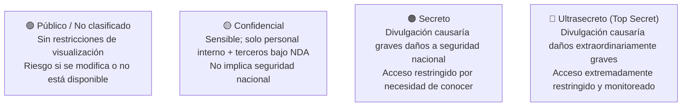
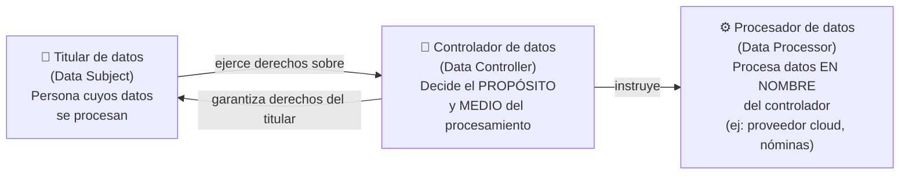
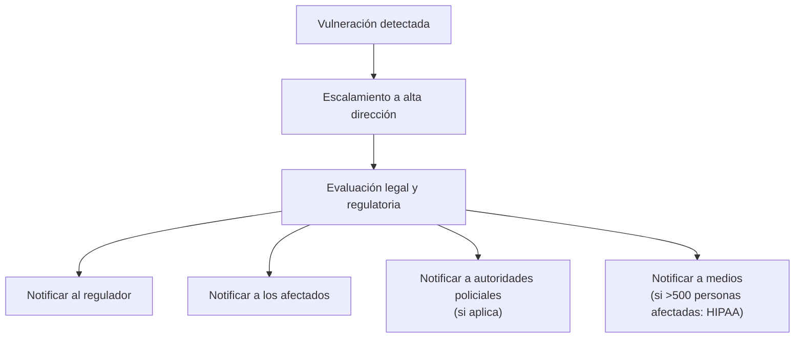
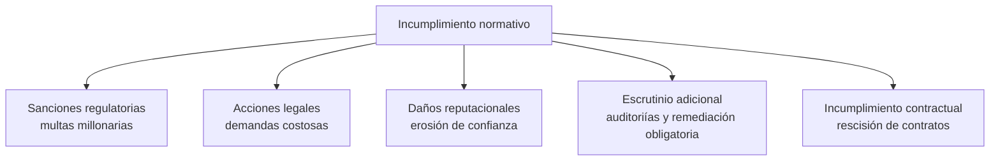
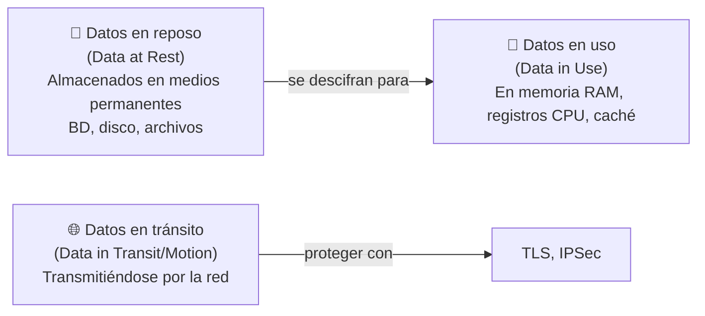
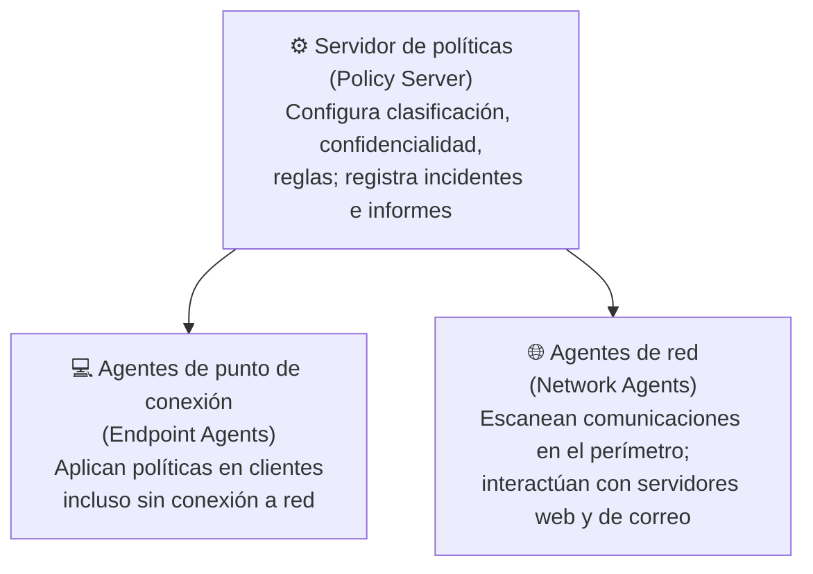
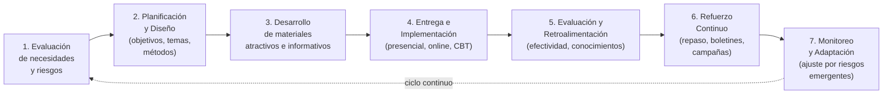

> **Estado:** 🟢 Completo
> **Última actualización:** 2026-06
> **Nivel:** Principiante — se explican los conceptos desde cero

---

- [1. Tipos de Datos](#1-tipos-de-datos)
  - [Datos regulados](#datos-regulados)
  - [Secretos comerciales](#secretos-comerciales)
  - [Datos legales y financieros](#datos-legales-y-financieros)
  - [Datos legibles vs. no legibles por humanos](#datos-legibles-vs-no-legibles-por-humanos)
- [2. Clasificaciones de Datos](#2-clasificaciones-de-datos)
  - [Analogía del mundo real](#analogía-del-mundo-real)
  - [Esquema por nivel de confidencialidad (gubernamental/corporativo)](#esquema-por-nivel-de-confidencialidad-gubernamentalcorporativo)
  - [Esquema por tipo de activo de información](#esquema-por-tipo-de-activo-de-información)
- [3. Soberanía de Datos y Consideraciones Geográficas](#3-soberanía-de-datos-y-consideraciones-geográficas)
  - [Soberanía de datos](#soberanía-de-datos)
  - [Consideraciones geográficas](#consideraciones-geográficas)
- [4. Datos de Privacidad y Derechos del Titular](#4-datos-de-privacidad-y-derechos-del-titular)
  - [Diferencia: datos de privacidad vs. datos confidenciales](#diferencia-datos-de-privacidad-vs-datos-confidenciales)
  - [Roles en el procesamiento de datos (RGPD)](#roles-en-el-procesamiento-de-datos-rgpd)
  - [Derechos del titular de datos (RGPD / CCPA)](#derechos-del-titular-de-datos-rgpd--ccpa)
  - [Derecho al olvido (Right to be Forgotten)](#derecho-al-olvido-right-to-be-forgotten)
  - [Inventarios y retención de datos](#inventarios-y-retención-de-datos)
- [5. Vulneraciones de Privacidad y de Datos](#5-vulneraciones-de-privacidad-y-de-datos)
  - [Definiciones clave](#definiciones-clave)
  - [Consecuencias de una vulneración](#consecuencias-de-una-vulneración)
  - [Notificación de vulneraciones](#notificación-de-vulneraciones)
- [6. Cumplimiento Normativo](#6-cumplimiento-normativo)
  - [¿Qué es el cumplimiento de seguridad?](#qué-es-el-cumplimiento-de-seguridad)
  - [Impactos del incumplimiento](#impactos-del-incumplimiento)
  - [Licencias de software y cumplimiento](#licencias-de-software-y-cumplimiento)
  - [Impactos del incumplimiento contractual](#impactos-del-incumplimiento-contractual)
- [7. Monitoreo e Informes de Cumplimiento](#7-monitoreo-e-informes-de-cumplimiento)
  - [Informes internos vs. externos](#informes-internos-vs-externos)
  - [Control del cumplimiento](#control-del-cumplimiento)
- [8. Protección de Datos: Estados y Métodos](#8-protección-de-datos-estados-y-métodos)
  - [Los tres estados de los datos](#los-tres-estados-de-los-datos)
  - [Métodos de protección de datos](#métodos-de-protección-de-datos)
  - [Diferencia clave: Enmascaramiento vs. Tokenización vs. Ofuscación](#diferencia-clave-enmascaramiento-vs-tokenización-vs-ofuscación)
- [9. Prevención de Pérdida de Datos (DLP)](#9-prevención-de-pérdida-de-datos-dlp)
  - [Componentes de una solución DLP](#componentes-de-una-solución-dlp)
  - [Tipos de contenido que escanea DLP](#tipos-de-contenido-que-escanea-dlp)
  - [Mecanismos de remediación DLP](#mecanismos-de-remediación-dlp)
- [10. Políticas de Conducta del Personal](#10-políticas-de-conducta-del-personal)
  - [Política de uso aceptable (AUP)](#política-de-uso-aceptable-aup)
  - [Código de conducta y análisis de redes sociales](#código-de-conducta-y-análisis-de-redes-sociales)
  - [BYOD y Shadow IT](#byod-y-shadow-it)
  - [Política de escritorio limpio (Clean Desk Policy)](#política-de-escritorio-limpio-clean-desk-policy)
- [11. Capacitación y Concienciación en Seguridad](#11-capacitación-y-concienciación-en-seguridad)
  - [Por qué es crítica la capacitación](#por-qué-es-crítica-la-capacitación)
  - [Temas fundamentales de capacitación en seguridad](#temas-fundamentales-de-capacitación-en-seguridad)
  - [Técnicas de capacitación](#técnicas-de-capacitación)
  - [Campañas de phishing como herramienta de capacitación](#campañas-de-phishing-como-herramienta-de-capacitación)
  - [Reconocimiento de comportamientos de riesgo](#reconocimiento-de-comportamientos-de-riesgo)
- [12. Ciclo de Vida de la Capacitación en Seguridad](#12-ciclo-de-vida-de-la-capacitación-en-seguridad)
  - [Fases del ciclo de vida](#fases-del-ciclo-de-vida)
  - [Medición de la efectividad](#medición-de-la-efectividad)
  - [Métricas clave de capacitación](#métricas-clave-de-capacitación)
- [13. Glosario](#13-glosario)

---

# 1. Tipos de Datos

> Piensa en el archivo de un hospital: tiene datos médicos (regulados por HIPAA), fórmulas de medicamentos patentados (secretos comerciales), contratos con proveedores (datos legales), y notas de médicos escritas a mano (datos legibles por humanos). Cada tipo requiere protección diferente.

Los **tipos de datos** categorizan la información según sus características, estructura y uso previsto para determinar las medidas de seguridad y controles adecuados.

## Datos regulados

Los **datos regulados** son información sujeta a requisitos legales o reglamentarios específicos sobre su manejo, almacenamiento y protección.

| Tipo de datos regulados | Regulación aplicable |
|---|---|
| Información clínica / historias médicas | `HIPAA` |
| Datos de tarjetas de crédito/pago | `PCI DSS` |
| Datos personales de residentes UE | `RGPD / GDPR` |
| Datos financieros de empresas cotizadas | `SOX` |
| Números de seguro social, PII | Leyes estatales de notificación de breaches |

**Obligaciones para datos regulados:**
- Implementar medidas de seguridad apropiadas
- Cifrado de datos y controles de acceso
- Procedimientos de notificación de vulneraciones
- Políticas de retención y destrucción de datos

## Secretos comerciales

Los **secretos comerciales** son información confidencial y valiosa que da a una empresa ventaja competitiva. Incluyen:
- Fórmulas, procesos y métodos propietarios
- Listas de clientes e información de precios
- Estrategias de marketing y datos críticos de negocio

**Protección:** los empleados y contratistas deben firmar **NDA** (Non-Disclosure Agreement — Acuerdo de Confidencialidad). Su divulgación no autorizada tiene consecuencias legales graves.

## Datos legales y financieros

| Categoría | Ejemplos |
|---|---|
| **Datos legales** | Contratos, registros judiciales, litigios, presentaciones de propiedad intelectual, gobernanza corporativa |
| **Datos financieros** | Estados financieros, balances, asientos contables, registros fiscales, proyecciones, cuentas a pagar/cobrar |

Ambos son altamente sensibles: un mal manejo puede afectar la reputación, la posición legal y la estabilidad financiera.

## Datos legibles vs. no legibles por humanos

| Tipo | Descripción | Controles de seguridad relevantes |
|---|---|---|
| **Legibles por humanos** | Texto, imágenes, multimedia, documentos comprensibles directamente | Monitoreo de seguridad, DLP, conciencia del usuario, filtrado de contenido |
| **No legibles por humanos** | Código binario, datos cifrados, formatos que requieren programas para interpretarse | Cifrado, controles de acceso, IDS/IPS, intercambio seguro de datos |

> Los datos no legibles por humanos pueden **obstaculizar** controles de seguridad convencionales — requieren enfoques especializados de inspección.

> **👉 Enfoque de Examen SY0-701:**
> CompTIA puede preguntar: *"¿Qué tipo de datos requiere herramientas especializadas para su inspección y no puede ser fácilmente analizado con métodos convencionales?"* → **Datos no legibles por humanos**. También puede relacionar tipos de datos con su regulación: historias médicas → HIPAA; datos de tarjetas → PCI DSS; datos personales de ciudadanos UE → RGPD.

# 2. Clasificaciones de Datos

## Analogía del mundo real

> Las clasificaciones de datos son como los sistemas de autorización de acceso en una base militar: no todo el mundo puede ver todo. Un soldado raso ve documentos "públicos"; un coronel puede ver "secretos"; solo unos pocos pueden acceder a "top secret". En empresas funciona igual.

Un **esquema de clasificación de datos** es un árbol de decisiones que asigna una o más etiquetas a cada activo de datos para gestionar su ciclo de vida.

## Esquema por nivel de confidencialidad (gubernamental/corporativo)

| Nivel | Descripción | Impacto si se divulga |
|---|---|---|
| **Público / No clasificado** | Sin restricciones de visualización | Bajo (riesgo si se modifica o no disponible) |
| **Confidencial** | Solo personal interno + terceros bajo NDA | Medio (pérdida competitiva o reputacional) |
| **Secreto** | Acceso por necesidad de conocer | Alto (daños graves a seguridad nacional) |
| **Ultrasecreto (Top Secret)** | Acceso extremadamente restringido | Crítico (daños extraordinariamente graves) |

## Esquema por tipo de activo de información

| Clasificación | Descripción | Ejemplo |
|---|---|---|
| **De uso exclusivo** (Propietario / PI) | Propiedad intelectual creada por la empresa; objetivo de competidores y espionaje | Algoritmos, código fuente, diseños de productos |
| **Datos privados o personales** | Información que identifica a un individuo: PII, historias clínicas, biometría, credenciales | Nombre, SSN, número de tarjeta, datos de salud |
| **Sensibles** | Información cuya divulgación podría perjudicar a un individuo o sesgar decisiones sobre él | Según RGPD: creencias religiosas, opiniones políticas, orientación sexual, datos genéticos, salud |
| **Restringidos** | Datos altamente confidenciales con acceso muy limitado; daño significativo si se exponen | Planes estratégicos, información de seguridad nacional, datos de alto valor |

> **👉 Enfoque de Examen SY0-701:**
> Las clasificaciones son pregunta habitual. Distingue el esquema gubernamental (público/confidencial/secreto/top secret) del esquema corporativo por tipo (propietario/privado/sensible/restringido). El RGPD define categorías específicas de datos "sensibles" — pueden preguntar cuáles son: religión, política, sindicatos, género, orientación sexual, raza, genética, salud. Una trampa: "público" no significa "sin riesgo" — los datos públicos tienen riesgo de integridad y disponibilidad aunque no de confidencialidad.

# 3. Soberanía de Datos y Consideraciones Geográficas

> Imagina que tienes un servidor en Alemania con datos de ciudadanos franceses. El gobierno alemán puede exigir que esos datos se mantengan en su territorio; el gobierno francés puede exigir que la ley francesa se aplique. La soberanía de datos es el choque entre estas jurisdicciones.

## Soberanía de datos

La **data sovereignty (soberanía de datos)** ocurre cuando una jurisdicción impide o restringe que el procesamiento y almacenamiento de datos tengan lugar en sistemas que no residen físicamente dentro de dicha jurisdicción.

**Implicaciones prácticas:**
- Los proveedores cloud deben ofrecer opción de seleccionar la región donde se almacenan los datos
- Si la jurisdicción destino no tiene protecciones equivalentes al RGPD, se necesitan **garantías contractuales**
- Los ciudadanos UE pueden **negar consentimiento** para transferir sus datos fuera del EEE

**Cumplimiento de soberanía de datos:**
- **Localización de datos:** almacenar y procesar en centros de datos dentro de los límites legales
- **Acuerdos contractuales:** los contratos con proveedores definen restricciones y salvaguardas obligatorias

## Consideraciones geográficas

| Escenario | Implicación |
|---|---|
| Selección de ubicación de almacenamiento | Los proveedores cloud permiten elegir la región; garantiza cumplimiento de soberanía |
| Empleados que acceden desde múltiples ubicaciones | Controles de acceso basados en geolocalización; valida ubicación antes de autorizar |

**Impacto en otras funciones:**
- **Protección de datos:** la replicación y dispersión de datos deben respetar límites geográficos
- **Investigaciones forenses:** las restricciones jurisdiccionales limitan el acceso e intercambio de datos durante investigaciones

> **👉 Enfoque de Examen SY0-701:**
> Preguntas típicas: *"¿Qué concepto describe la exigencia de mantener datos dentro de los límites físicos de una jurisdicción?"* → **Soberanía de datos / Data sovereignty**. Relacionado: el RGPD se aplica a datos de ciudadanos UE **independientemente de dónde esté la organización** (efecto extraterritorial). El EEE (Espacio Económico Europeo — European Economic Area) incluye la UE más Noruega, Islandia y Liechtenstein.

# 4. Datos de Privacidad y Derechos del Titular

## Diferencia: datos de privacidad vs. datos confidenciales

| Aspecto | Datos de privacidad | Datos confidenciales |
|---|---|---|
| **Alcance** | Información que identifica o afecta la privacidad de un **individuo** | Cualquier información que requiere protección, incluidas las propietarias |
| **Objetivo principal** | Proteger derechos de privacidad individuales, prevenir robo de identidad | Proteger la competitividad comercial e integridad organizacional |
| **Derechos del titular** | Sí — acceso, rectificación, eliminación, portabilidad | No — no otorga derechos específicos a externos |
| **Consentimiento** | Generalmente requerido para recopilación y procesamiento | No siempre necesario (información interna) |
| **Regulación** | RGPD, CCPA, HIPAA | NDA, secretos comerciales, derecho corporativo |

## Roles en el procesamiento de datos (RGPD)

| Rol | Responsabilidad | Ejemplos |
|---|---|---|
| **Controlador de datos** (Data Controller) | Determina propósitos y medios del procesamiento; obligaciones legales directas; obtiene consentimiento; implementa políticas de privacidad | Tu empresa cuando recopila datos de clientes |
| **Procesador de datos** (Data Processor) | Procesa datos solo según instrucciones del controlador; sin poder de decisión independiente; mantiene registros de actividades | AWS, Google Cloud, empresa de nóminas |
| **Titular de datos** (Data Subject) | Persona a quien pertenecen los datos; tiene derechos de ejercer sobre el controlador | El cliente, empleado, usuario |

## Derechos del titular de datos (RGPD / CCPA)

| Derecho | Descripción |
|---|---|
| **Acceso** | Solicitar qué datos se tienen, con qué fin, quién los recibe, cuánto tiempo se conservarán |
| **Rectificación** | Corregir datos inexactos o incompletos |
| **Supresión / Eliminación** | Solicitar borrado cuando los datos ya no son necesarios o se retira el consentimiento |
| **Restricción del procesamiento** | Datos pueden almacenarse pero no procesarse en condiciones específicas |
| **Portabilidad** | Recibir datos en formato común y legible por máquina para transferirlos |
| **Oposición** | Oponerse al procesamiento para fines no legítimos o marketing directo |
| **Retirar consentimiento** | Si el procesamiento se basa en consentimiento, puede revocarse en cualquier momento |

## Derecho al olvido (Right to be Forgotten)

El **derecho al olvido** permite solicitar la supresión de datos personales de plataformas online y bases de datos. El controlador debe eliminar los datos **sin demora** salvo que existan motivos legítimos para rechazar la solicitud (ej: libertad de expresión, obligación legal, defensa en litigios).

Este derecho se extiende a **terceros** con quienes se hayan compartido los datos.

## Inventarios y retención de datos

Las leyes de privacidad (RGPD, CCPA) exigen:

- **Inventario de datos:** registro detallado de qué datos personales se recopilan, con qué fin, base legal y destinatarios
- **Minimización de datos:** recopilar solo los datos necesarios para fines específicos y legítimos
- **Limitación de almacenamiento:** conservar solo el tiempo necesario para el fin previsto o lo que exija la ley
- **Eliminación segura:** cuando los datos ya no son necesarios, deben eliminarse o anonimizarse

> **👉 Enfoque de Examen SY0-701:**
> Los roles son pregunta frecuente: *"¿Qué entidad determina el propósito y los medios del procesamiento de datos personales?"* → **Controlador de datos**. *"¿Qué entidad procesa datos en nombre de otra organización?"* → **Procesador de datos**. El "derecho al olvido" es RGPD — permite solicitar la eliminación de datos. Trampa: el procesador de datos NO puede tomar decisiones independientes sobre cómo usar los datos; solo sigue instrucciones del controlador.

# 5. Vulneraciones de Privacidad y de Datos

## Definiciones clave

| Término | Definición |
|---|---|
| **Vulneración de datos** (Data breach) | Cualquier dato leído, modificado o eliminado sin autorización — incluyendo PI corporativa, cualquier tipo de datos |
| **Vulneración de privacidad** (Privacy breach) | Específicamente la pérdida o divulgación de **datos personales y confidenciales** |

> **Nota importante:** si un administrador ejecuta una consulta que muestra números de tarjetas sin censurar, eso **es una vulneración de datos** aunque la consulta no salga del servidor.

## Consecuencias de una vulneración

| Consecuencia | Descripción |
|---|---|
| **Daños a la reputación** | Publicidad negativa; pérdida de confianza de clientes |
| **Usurpación de identidad** | El titular puede demandar por daños y perjuicios |
| **Multas regulatorias** | Cantidad fija o porcentaje de la facturación anual |
| **Robo de PI** (Propiedad Intelectual) | Pérdida de ingresos, patentes, secretos comerciales; difícil de remediar en mercados extranjeros |

## Notificación de vulneraciones

| Regulación | A quién notificar | Plazo |
|---|---|---|
| **RGPD** | Autoridad supervisora de protección de datos | **72 horas** desde conocer la vulneración |
| **HIPAA** | Personas afectadas + Secretario HHS; medios si >500 personas afectadas | 60 días para individuos; anualmente si <500 |

**Contenido típico de la divulgación:**
- Descripción de la información vulnerada
- Datos del punto de contacto principal
- Consecuencias probables de la vulneración
- Medidas adoptadas para mitigarla

> **Escalamiento:** cualquier vulneración de datos personales y la mayoría de vulneraciones de PI deben escalarse a los altos responsables de toma de decisiones. NO se puede reparar silenciosamente para evitar obligaciones de notificación — hacerlo pone a la empresa en riesgo legal.

> **👉 Enfoque de Examen SY0-701:**
> El plazo de **72 horas del RGPD** es dato de examen. HIPAA exige notificar a medios cuando afecta a más de **500 personas**. Pregunta típica: *"¿Cuándo existe vulneración de datos incluso si no hay acceso externo?"* → Cuando existe la **posibilidad** de acceso no autorizado (ej: permisos mal configurados). Diferencia data breach (cualquier dato) de privacy breach (datos personales).

# 6. Cumplimiento Normativo

## ¿Qué es el cumplimiento de seguridad?

El **cumplimiento de seguridad** es la adhesión a normas, reglamentos y mejores prácticas para proteger información confidencial, mitigar riesgos y garantizar la CIA (Confidencialidad, Integridad, Disponibilidad).

## Impactos del incumplimiento

| Tipo de consecuencia | Descripción |
|---|---|
| **Sanciones legales / multas** | Pueden ascender a millones o miles de millones según la gravedad |
| **Responsabilidad civil** | Demandas de individuos afectados; acuerdos costosos |
| **Daño reputacional** | Pérdida de clientes, contratos y oportunidades de negocio |
| **Escrutinio regulatorio adicional** | Auditorías frecuentes, investigaciones, medidas de remediación obligatorias |

## Licencias de software y cumplimiento

El incumplimiento de licencias de software incluye:
- Exceder las instalaciones permitidas
- Uso compartido no autorizado
- Modificar o distribuir software sin autorización

**Consecuencias:** revocación de licencias, acciones legales, interrupciones operativas, daño reputacional.

**Remediación:** rehabilitación de licencias, gestión adecuada y auditorías de software.

## Impactos del incumplimiento contractual

| Impacto | Descripción |
|---|---|
| **Incumplimiento de contrato** | Los contratos incluyen cláusulas de ciberseguridad y protección de datos; violarlas genera responsabilidad por daños |
| **Rescisión de contratos** | La parte que no cumple puede perder el contrato y relaciones comerciales futuras |
| **Indemnización y responsabilidad** | Cláusulas de indemnización trasladan la responsabilidad financiera a la parte incumplidora |
| **Sanciones por incumplimiento** | Multas o daños contractuales por no cumplir requisitos de ciberseguridad acordados |

> **👉 Enfoque de Examen SY0-701:**
> CompTIA puede presentar un escenario donde una organización usa más licencias de software de las contratadas → consecuencia: **incumplimiento contractual con el proveedor**. Las multas del RGPD pueden llegar al **4% de la facturación global anual** o 20 millones de euros (lo que sea mayor). La "diligencia debida" en protección de datos describe la evaluación exhaustiva de las prácticas de protección de datos de una organización.

# 7. Monitoreo e Informes de Cumplimiento

## Informes internos vs. externos

| Tipo | Destinatarios | Enfoque | Propósito |
|---|---|---|---|
| **Informe interno de cumplimiento** | Gestores de riesgo, ejecutivos, analistas de seguridad, responsables de privacidad | Detalles operativos; información granular sobre controles | Soporte a toma de decisiones interna |
| **Informe externo de cumplimiento** | Accionistas, clientes, reguladores, socios comerciales | Resúmenes de alto nivel; alineado a requisitos normativos | Transparencia y rendición de cuentas externas |

## Control del cumplimiento

El **control del cumplimiento** incluye:
- **Auditorías e investigaciones** de terceros (proveedores, socios) para verificar cumplimiento de normativas
- **Certificaciones y reconocimientos:** firmar que se comprenden y se cumplirán las obligaciones
- **Autoevaluaciones** internas y **auditorías independientes** externas
- **Automatización:** software de gestión del cumplimiento que agiliza recopilación, análisis e informes

> La automatización mejora la precisión y la capacidad de detectar incumplimientos o anomalías con prontitud.

# 8. Protección de Datos: Estados y Métodos

## Los tres estados de los datos

| Estado | Descripción | Controles de seguridad |
|---|---|---|
| **Datos en reposo** | En medios de almacenamiento permanente (BD, disco, archivos) | Cifrado de disco completo, cifrado de BD, cifrado a nivel de archivo; ACL / LCA (Listas de Control de Acceso) |
| **Datos en tránsito** (en movimiento) | Transmitiéndose por la red (web, acceso remoto, sincronización cloud) | Protocolos de cifrado de transporte: `TLS`, `IPSec`; claves de sesión temporales |
| **Datos en uso** (en procesamiento) | En memoria volátil (RAM, caché de CPU) mientras se procesan | TEE (Trusted Execution Environment — Entorno de Ejecución de Confianza), como Intel SGX; cifrado en memoria |

**Desafío clave:** los datos en reposo requieren mantener las claves de cifrado seguras durante más tiempo que los datos en tránsito (que usan claves temporales de sesión).

## Métodos de protección de datos

| Método | Descripción | Caso de uso típico |
|---|---|---|
| **Restricciones geográficas** | Limitar acceso a datos según ubicación geográfica | Cumplimiento de soberanía de datos en nube |
| **Cifrado** | Convierte datos en formato codificado; solo descifrable con clave | Datos en reposo y en tránsito; protección de confidencialidad |
| **Hashing** | Convierte datos en cadena de longitud fija irreversible | Verificación de integridad; almacenamiento seguro de contraseñas |
| **Enmascaramiento** | Sustituye datos sensibles por valores ficticios conservando formato | Ocultar campos sensibles en formularios; proteger PII en entornos de prueba |
| **Tokenización** | Sustituye datos sensibles por token aleatorio; datos originales almacenados por separado | Sistemas de pago (reemplaza número de tarjeta por token) |
| **Ofuscación** | Modifica datos para dificultar comprensión o ingeniería inversa sin alterar funcionalidad | Proteger código fuente y propiedad intelectual en software |
| **Segmentación** | Divide redes, datos y aplicaciones en componentes aislados | EHR (Electronic Health Records — Historias Clínicas Electrónicas); acceso por mínimo privilegio |
| **Restricciones de permisos** | Controla acceso por rol, regla, atributo u obligación | ACL, RBAC, ABAC, MAC; principio de mínimo privilegio |

## Diferencia clave: Enmascaramiento vs. Tokenización vs. Ofuscación

| Técnica | ¿Reversible? | ¿Conserva formato? | Uso principal |
|---|---|---|---|
| **Enmascaramiento** | No (datos ficticios) | Sí (mismo formato/longitud) | Mostrar sin revelar (ej: `****1234`) |
| **Tokenización** | Sí (con bóveda de tokens) | No necesariamente | Pagos; reducir PCI DSS scope |
| **Ofuscación** | Varía | No necesariamente | Proteger código fuente; incluye masking, hashing, type conversion |
| **Hashing** | No (unidireccional) | No | Integridad; contraseñas (con salt) |

> **👉 Enfoque de Examen SY0-701:**
> Los tres estados de datos son pregunta casi garantizada. Memoriza: **en reposo → cifrado de disco/archivo/BD**; **en tránsito → TLS/IPSec**; **en uso → TEE/Intel SGX**. La tokenización se asocia con pagos (PCI DSS). El hashing es unidireccional (no se puede revertir). CompTIA puede preguntar: *"¿Qué método reemplaza un número de tarjeta de crédito con un valor aleatorio sin valor por sí mismo?"* → **Tokenización**. *"¿Qué técnica protege datos en memoria en uso?"* → **TEE / Trusted Execution Environment**.

# 9. Prevención de Pérdida de Datos (DLP)

> El DLP es como el guardia de seguridad de la empresa que revisa todo lo que sale por la puerta — correos, USBs, uploads a la nube — y bloquea aquello que no debería salir según las políticas de la empresa.

## Componentes de una solución DLP

| Componente | Función |
|---|---|
| **Servidor de políticas** | Configurar reglas de clasificación, confidencialidad y privacidad; registrar incidentes; generar informes |
| **Agentes de punto de conexión** (Endpoint Agents) | Aplicar políticas en equipos cliente aunque no estén conectados a la red corporativa |
| **Agentes de red** (Network Agents) | Escanear comunicaciones en el perímetro; interactuar con servidores web y de mensajería |

## Tipos de contenido que escanea DLP

- **Formatos estructurados:** bases de datos con control de acceso formal
- **Formatos no estructurados:** correos electrónicos, documentos de texto libre → aplica **transformación de datos** para hacerlos escaneables

**Canales monitorizados:** transferencias a USB, correo electrónico, mensajería instantánea, redes sociales, servicios de almacenamiento cloud (vía proxy o API del proveedor).

## Mecanismos de remediación DLP

| Mecanismo | Descripción |
|---|---|
| **Solo alerta** (Alert only) | Se permite la copia/transferencia; el sistema registra el incidente y puede notificar al administrador |
| **Bloqueo** (Block) | Se impide copiar el archivo original; el usuario puede seguir accediendo a él; se registra el incidente |
| **Cuarentena** (Quarantine) | Se niega el acceso al archivo: se cifra en su ubicación o se mueve a área de cuarentena |
| **Marcador** (Tombstone) | El archivo original entra en cuarentena y se reemplaza por un aviso que describe la violación y cómo recuperarlo |

**Remediación en canales de comunicación:**
- **Lado del cliente:** previene adjuntar archivos antes de enviar
- **Lado del servidor:** escanea adjuntos y contenido, elimina datos sensibles o bloquea la entrega

> **👉 Enfoque de Examen SY0-701:**
> DLP es tema central del examen. Pregunta típica: *"¿Qué componente DLP aplica políticas en los equipos de los usuarios incluso cuando no están conectados a la red corporativa?"* → **Agente de punto de conexión**. Otro escenario: empleado intenta copiar PII a un USB → el mecanismo DLP que reemplaza el archivo con un aviso → **Tombstone/Marcador**. Distingue "solo alerta" (permite pero registra) de "bloqueo" (impide copiar pero permite acceso local) de "cuarentena" (deniega acceso al archivo).

# 10. Políticas de Conducta del Personal

## Política de uso aceptable (AUP)

La **AUP** (Acceptable Use Policy — Política de Uso Aceptable) define qué pueden y no pueden hacer los empleados con los equipos e infraestructura de la organización.

**Contenido habitual de una AUP:**
- Prohibición de uso del equipo para fraudes, difamación u obtención de material ilegal
- Prohibición de instalación de hardware o software no autorizado
- Prohibición de acceder a datos confidenciales sin autorización
- Restricciones de uso de Internet y herramientas personales durante el trabajo

## Código de conducta y análisis de redes sociales

El **código de conducta** establece estándares profesionales esperados, incluyendo:
- Uso de redes sociales (riesgo de infección de virus, pérdida de tiempo, derechos de autor, difamación)
- Monitoreo de comunicaciones: los correos y mensajes en sistemas corporativos pueden estar almacenados y ser supervisados
- **Los empleadores pueden monitorear cuentas personales de redes sociales** para verificar infracciones de políticas
- Personal con acceso privilegiado debe estar sujeto a cláusulas que prohíban el uso indebido de privilegios

## BYOD y Shadow IT

**BYOD** (Bring Your Own Device — Trae tu Propio Dispositivo): los dispositivos personales (smartphones, USB, tabletas) facilitan la copia de archivos y presentan riesgos de:
- Exfiltración de datos
- Transporte de malware
- Violaciones de licencias de software
- Grabaciones de voz/imagen en áreas sensibles

**Shadow IT:** uso de software o servicios no sancionados para un proyecto (correo personal, mensajería instantánea, apps SaaS no aprobadas). Puede dejar a la organización abierta a vulnerabilidades de seguridad.

**Controles:** soluciones DLP y gestión del punto de conexión / NAC (Network Access Control — Control de Acceso a la Red).

## Política de escritorio limpio (Clean Desk Policy)

Cada área de trabajo debe estar **libre de documentos dejados a la vista**. Objetivo: evitar que personal o visitantes no autorizados obtengan información sensible en el lugar de trabajo.

> **👉 Enfoque de Examen SY0-701:**
> CompTIA puede preguntar: *"¿Qué política controla el uso aceptable de equipos corporativos?"* → **AUP**. *"¿Qué término describe el uso de servicios no aprobados por TI para proyectos empresariales?"* → **Shadow IT**. La política de escritorio limpio (clean desk) protege contra ataques de **shoulder surfing** y acceso físico no autorizado. Recuerda: las comunicaciones en sistemas corporativos pueden ser **monitoreadas legalmente** por el empleador.

# 11. Capacitación y Concienciación en Seguridad

## Por qué es crítica la capacitación

> Los usuarios sin capacitación representan la **vulnerabilidad más grave** de cualquier sistema: son susceptibles a ingeniería social, malware y manejo descuidado de datos sensibles.

La capacitación debe alcanzar **todos los niveles:** usuarios finales, personal técnico y ejecutivos.

## Temas fundamentales de capacitación en seguridad

| Tema | Descripción |
|---|---|
| **Políticas/Manuales** | Familiarizar con políticas de uso aceptable, manejo de datos y confidencialidad; consecuencias del incumplimiento |
| **Conciencia situacional** | Reconocer y responder a posibles amenazas; informar actividades sospechosas |
| **Amenazas internas** | Reconocer signos de insider threats; promover cultura de responsabilidad |
| **Administración de contraseñas** | Contraseñas únicas y seguras; no reutilizar; MFA (Multi-Factor Authentication — Autenticación Multifactor) |
| **Cables y medios extraíbles** | Riesgos de USBs no autorizados; cables de carga maliciosos como vector de ataque |
| **Ingeniería social** | Reconocer phishing, pretexting, baiting; escepticismo ante solicitudes desconocidas |
| **Seguridad operativa** | Seguridad física, estaciones de trabajo, clasificación de datos, comunicaciones seguras |
| **Trabajo híbrido/remoto** | Acceso remoto seguro, Wi-Fi segura, protección del espacio físico en casa |

## Técnicas de capacitación

| Técnica | Descripción |
|---|---|
| **CBT** (Computer-Based Training — Capacitación en Computadora) | Simulaciones, escenarios de ramificación, elementos de videojuego (insignias, niveles) |
| **CTF** (Capture the Flag — Captura la Bandera) | Competición para crear conciencia; responde bien a desafíos competitivos |
| **Talleres y eventos presenciales** | Facilitados por instructores; permiten discusión y preguntas |
| **Tutoría individual** | Para roles específicos que requieren capacitación personalizada |
| **Campañas de phishing simuladas** | Ataques de phishing controlados para evaluar y entrenar la respuesta de empleados |

## Campañas de phishing como herramienta de capacitación

Las **campañas de phishing simuladas** son ataques controlados que:
- Mejoran la conciencia de las amenazas
- Protegen información confidencial
- Mitigan riesgos de ingeniería social
- Fortalecen la respuesta a incidentes
- Generan métricas medibles (tasas de clics, capturas exitosas)

El phishing es efectivo porque explota vulnerabilidades **humanas**: suplantación de entidades de confianza, urgencia, manipulación psicológica y amplio alcance.

## Reconocimiento de comportamientos de riesgo

| Tipo de comportamiento | Descripción | Ejemplos |
|---|---|---|
| **Conductas de riesgo** | Actividades que amenazan la seguridad de datos/sistemas | Clic en enlaces sospechosos, descargar software no autorizado, contraseñas débiles |
| **Conductas inesperadas** | Desviaciones de protocolos de seguridad establecidos | Acceso no autorizado a datos confidenciales, eludir controles de seguridad |
| **Conductas no intencionales** | Sin intención maliciosa pero con consecuencias perjudiciales | Errores humanos, mal manejo de datos, caer en ingeniería social |

**Marco de referencia:** NIST NICE (National Initiative for Cybersecurity Education — Iniciativa Nacional para la Educación en Ciberseguridad) define KSA (Knowledge, Skills, and Abilities — Conocimientos, Habilidades y Destrezas) para distintos roles de ciberseguridad. Los programas de concienciación se describen en `NIST SP 800-50`.

> **👉 Enfoque de Examen SY0-701:**
> La capacitación basada en roles es objetivo 5.6. Preguntas típicas: *"¿Qué técnica de capacitación usa ataques simulados para evaluar la respuesta de los empleados?"* → **Campañas de phishing simuladas**. *"¿Qué término describe usar aplicaciones SaaS personales no aprobadas para trabajo corporativo?"* → **Shadow IT**. El CBT incluye gamificación: insignias, niveles, avatares. Los cables de carga maliciosos como vector de ataque son tema emergente que puede aparecer en el examen.

# 12. Ciclo de Vida de la Capacitación en Seguridad

## Fases del ciclo de vida

## Medición de la efectividad

| Tipo de efectividad | Descripción | Métodos de medición |
|---|---|---|
| **Efectividad inicial** | Impacto inmediato tras la capacitación | Pre/post evaluaciones; cuestionarios sobre comprensión de conceptos |
| **Efectividad recurrente** | Impacto a largo plazo; si se retienen y aplican conocimientos en el tiempo | Seguimiento de comportamiento continuo; auditorías periódicas |

## Métricas clave de capacitación

| Métrica | Qué mide |
|---|---|
| **Evaluaciones y cuestionarios** | Conocimientos adquiridos; retención y comprensión cuantitativa |
| **Informes de incidentes** | Impacto del programa en detección y respuesta; patrones y tendencias |
| **Simulaciones de phishing** | Tasas de clics, capturas exitosas; susceptibilidad ante phishing |
| **Observaciones y comentarios** | Aplicación práctica; desafíos reales que enfrentan los empleados |
| **Métricas de rendimiento** | Incidentes reportados, cumplimiento de políticas, higiene de contraseñas |
| **Tasas de finalización** | Compromiso y cumplimiento de requisitos de capacitación |

> **👉 Enfoque de Examen SY0-701:**
> El ciclo de vida de capacitación mide la efectividad en dos dimensiones: **inicial** (inmediata, post-training) y **recurrente** (sostenida en el tiempo). Una pregunta típica: *"¿Qué tipo de medición evalúa si los empleados aplican los conocimientos adquiridos en sus actividades diarias durante un período prolongado?"* → **Efectividad recurrente**. Las simulaciones de phishing generan métricas cuantitativas sobre tasas de clics y susceptibilidad.

# 13. Glosario 

| Acrónimo | Nombre completo | Español |
|---|---|---|
| **ACL / LCA** | Access Control List | Lista de Control de Acceso |
| **AUP** | Acceptable Use Policy | Política de Uso Aceptable |
| **BYOD** | Bring Your Own Device | Trae tu Propio Dispositivo |
| **CCPA** | California Consumer Privacy Act | Ley de Privacidad del Consumidor de California |
| **CBT** | Computer-Based Training | Capacitación en Computadora |
| **CIA** | Confidentiality, Integrity, Availability | Confidencialidad, Integridad, Disponibilidad |
| **CTF** | Capture the Flag | Captura la Bandera |
| **DLP** | Data Loss Prevention | Prevención de Pérdida de Datos |
| **EEE** | Espacio Económico Europeo | European Economic Area (EEA) |
| **EHR** | Electronic Health Records | Historias Clínicas Electrónicas |
| **FERPA** | Family Educational Rights and Privacy Act | Ley de Derechos Educativos y Privacidad Familiar |
| **GDPR / RGPD** | General Data Protection Regulation | Reglamento General de Protección de Datos |
| **HIPAA** | Health Insurance Portability and Accountability Act | Ley de Portabilidad y Responsabilidad del Seguro de Salud |
| **HHS** | Department of Health and Human Services | Departamento de Salud y Servicios Humanos (EE.UU.) |
| **IDS/IPS** | Intrusion Detection/Prevention System | Sistema de Detección/Prevención de Intrusiones |
| **KSA** | Knowledge, Skills, and Abilities | Conocimientos, Habilidades y Destrezas |
| **MAC** | Mandatory Access Control | Control de Acceso Obligatorio |
| **MFA** | Multi-Factor Authentication | Autenticación Multifactor |
| **NAC** | Network Access Control | Control de Acceso a la Red |
| **NDA** | Non-Disclosure Agreement | Acuerdo de Confidencialidad |
| **NICE** | National Initiative for Cybersecurity Education | Iniciativa Nacional para la Educación en Ciberseguridad |
| **NIST** | National Institute of Standards and Technology | Instituto Nacional de Estándares y Tecnología |
| **PCI DSS** | Payment Card Industry Data Security Standard | Estándar de Seguridad de Datos de la Industria de Tarjetas de Pago |
| **PI / IP** | Propiedad Intelectual | Intellectual Property |
| **PII** | Personally Identifiable Information | Información de Identificación Personal |
| **RBAC** | Role-Based Access Control | Control de Acceso Basado en Roles |
| **SOX** | Sarbanes-Oxley Act | Ley Sarbanes-Oxley |
| **TEE** | Trusted Execution Environment | Entorno de Ejecución de Confianza |
| **TLS** | Transport Layer Security | Seguridad de Capa de Transporte |