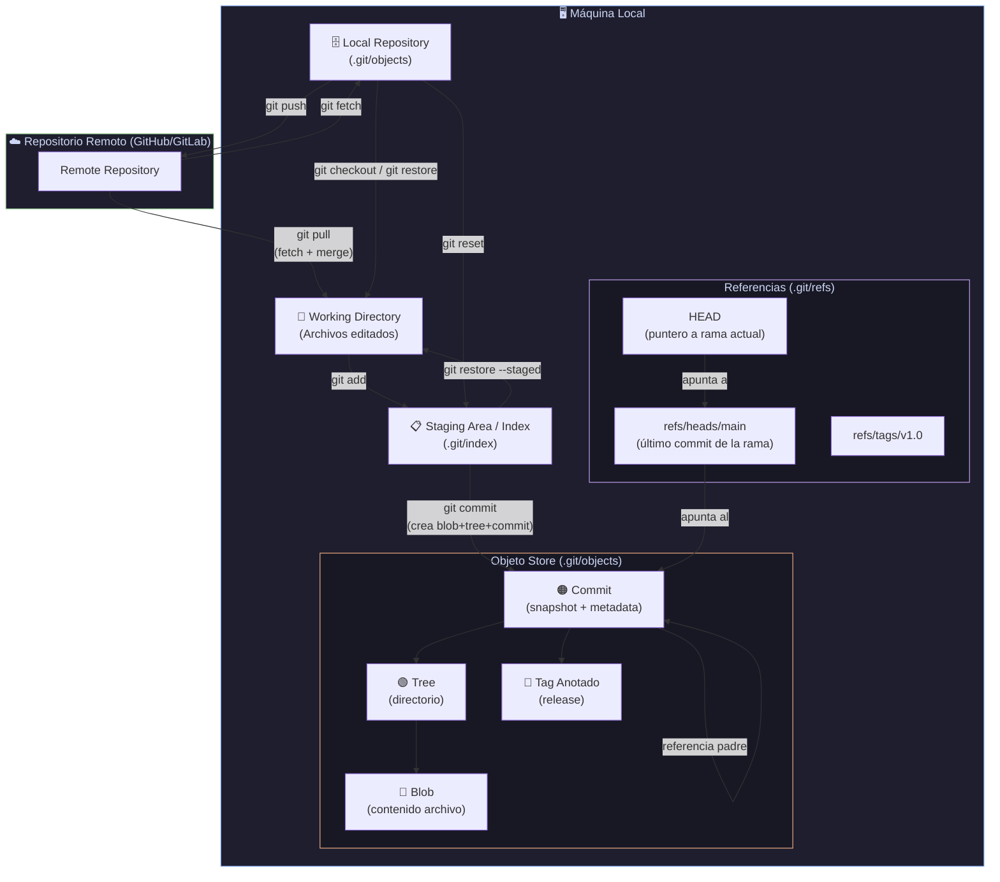
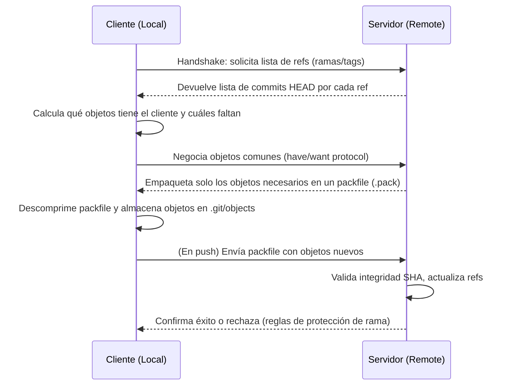
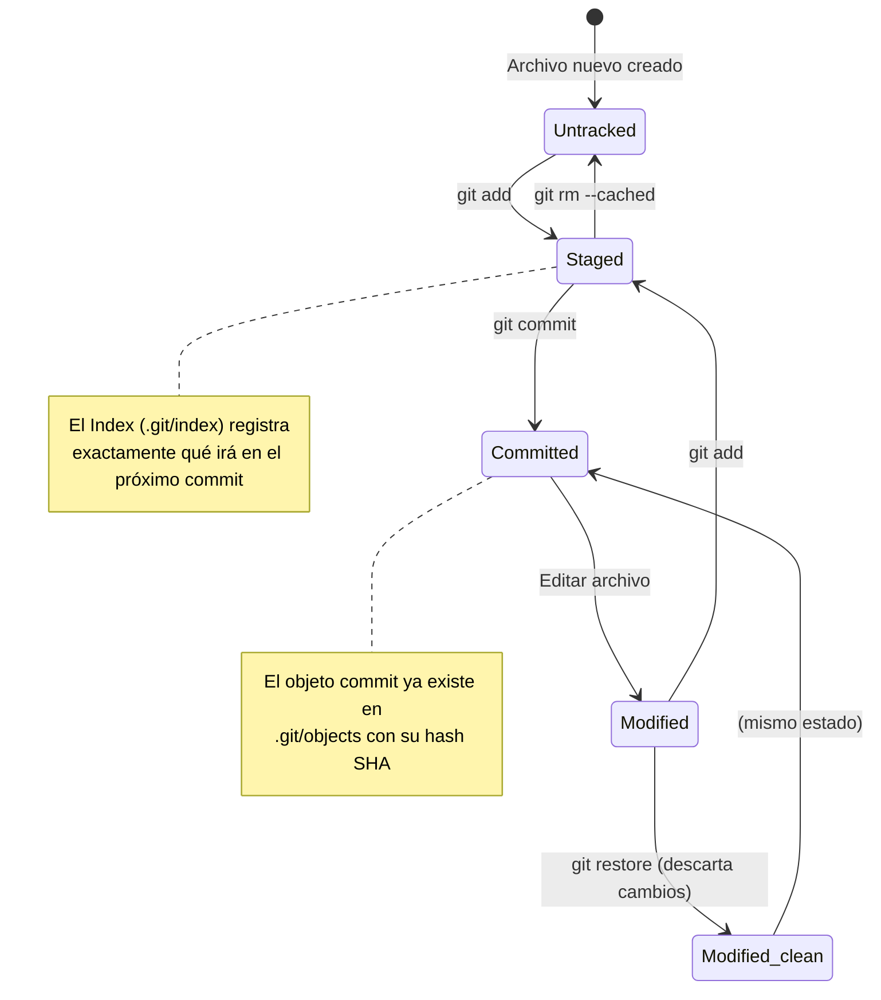
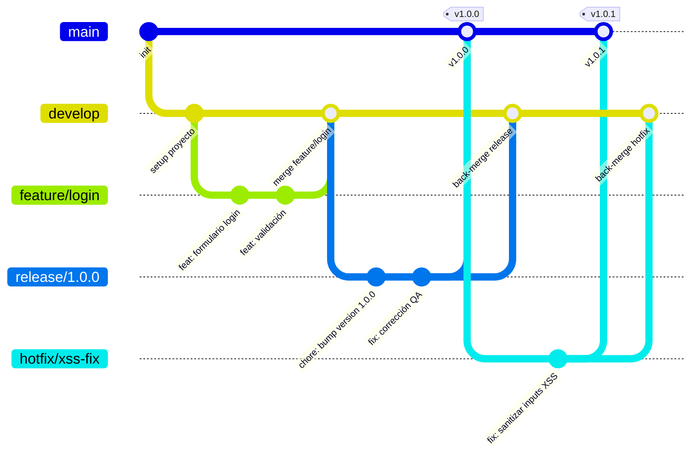
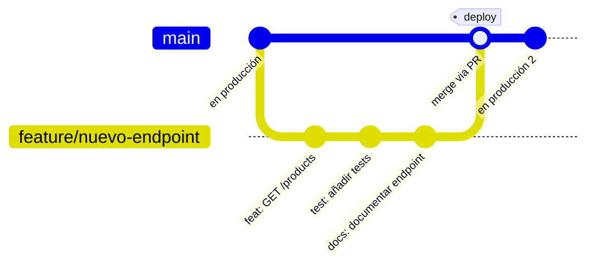
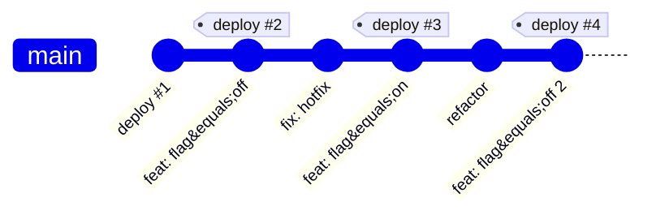
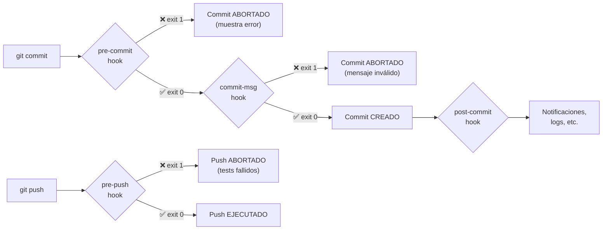

> **Estado:** 🟢 Completo
> **Última actualización:** 2026-05

- [Git](#git)
  - [Metadata](#metadata)
  - [1. Introducción y Filosofía de Diseño](#1-introducción-y-filosofía-de-diseño)
    - [Características Clave](#características-clave)
  - [2. Arquitectura Interna: El Modelo de Objetos](#2-arquitectura-interna-el-modelo-de-objetos)
    - [2.1 Los 4 Tipos de Objetos](#21-los-4-tipos-de-objetos)
    - [2.2 Diagrama: Flujo de Datos Interno de Git](#22-diagrama-flujo-de-datos-interno-de-git)
    - [2.3 La Carpeta `.git` Explicada a Fondo](#23-la-carpeta-git-explicada-a-fondo)
  - [3. Ciclo de Vida de los Archivos](#3-ciclo-de-vida-de-los-archivos)
  - [4. Configuración de Git](#4-configuración-de-git)
    - [4.1 Niveles de Configuración](#41-niveles-de-configuración)
    - [4.2 Tabla de Directivas Clave](#42-tabla-de-directivas-clave)
    - [4.3 Seguridad: Firma de Commits con GPG/SSH](#43-seguridad-firma-de-commits-con-gpgssh)
  - [5. Convenciones de Commits (Conventional Commits)](#5-convenciones-de-commits-conventional-commits)
    - [Tipos y su impacto en SemVer](#tipos-y-su-impacto-en-semver)
  - [6. Estrategias de Branching](#6-estrategias-de-branching)
    - [6.1 GitFlow](#61-gitflow)
    - [6.2 GitHub Flow](#62-github-flow)
    - [6.3 Trunk-Based Development (TBD)](#63-trunk-based-development-tbd)
    - [6.4 Tabla Comparativa de Estrategias](#64-tabla-comparativa-de-estrategias)
  - [7. Git Hooks: Automatización en Producción](#7-git-hooks-automatización-en-producción)
    - [Hooks más útiles en producción](#hooks-más-útiles-en-producción)
  - [8. Comandos Esenciales](#8-comandos-esenciales)
    - [8.1 Configuración e Inicialización](#81-configuración-e-inicialización)
    - [8.2 Staging y Commits](#82-staging-y-commits)
    - [8.3 Historial y Comparación](#83-historial-y-comparación)
    - [8.4 Repositorios Remotos](#84-repositorios-remotos)
    - [8.5 Ramas, Merge y Rebase](#85-ramas-merge-y-rebase)
    - [8.6 Deshacer Cambios: Reset, Revert y Restore](#86-deshacer-cambios-reset-revert-y-restore)
    - [8.7 Herramientas de Productividad](#87-herramientas-de-productividad)
  - [9. Resolución Avanzada de Conflictos](#9-resolución-avanzada-de-conflictos)
    - [El marcador de conflicto con `zdiff3`](#el-marcador-de-conflicto-con-zdiff3)
    - [Estrategias de merge para resolución automática](#estrategias-de-merge-para-resolución-automática)
    - [Git Mergetool — resolución visual](#git-mergetool--resolución-visual)
    - [Flujo recomendado para conflictos complejos](#flujo-recomendado-para-conflictos-complejos)
  - [10. El Fichero `.gitignore`](#10-el-fichero-gitignore)
    - [Sintaxis y patrones](#sintaxis-y-patrones)
    - [`.gitignore` para proyectos Node.js/TypeScript en producción](#gitignore-para-proyectos-nodejstypescript-en-producción)
  - [11. Antipatrones y Errores Comunes](#11-antipatrones-y-errores-comunes)
  - [12. Recetas de Producción (Cheatsheet)](#12-recetas-de-producción-cheatsheet)

---

# Git

> **dev-handbook** · Versión 1.0  
> Última revisión: 2026 · Nivel: Ingeniero Senior

---

## Metadata

| Campo | Valor |
|---|---|
| **Versión de la guía** | 2.0 |
| **Tecnología** | Git (DVCS) |
| **Versión mínima recomendada** | Git 2.40+ |
| **Tipo de componente** | Herramienta de control de versiones distribuido |
| **Casos de uso ideales** | Cualquier proyecto de software con ≥1 colaboradores; proyectos open source; CI/CD pipelines; auditoría y trazabilidad de cambios en producción |
| **Casos a evitar** | Repositorios con binarios grandes (>50 MB por archivo) sin Git LFS; datasets de ML o archivos multimedia masivos sin estrategia de almacenamiento externo |

---

## 1. Introducción y Filosofía de Diseño

Git es un **sistema de control de versiones distribuido** (DVCS) creado por Linus Torvalds en 2005 para gestionar el kernel de Linux. Su filosofía se apoya en tres pilares:

- **Distribuido**: Cada desarrollador posee una copia completa del historial. No existe un único punto de fallo.
- **Basado en snapshots, no en diffs**: A diferencia de SVN o CVS que almacenan deltas, Git guarda una instantánea completa del árbol de ficheros en cada commit (optimizando con punteros a blobs no modificados).
- **Integridad criptográfica**: Cada objeto se identifica con su hash SHA-1 (en tránsito a SHA-256). Es imposible modificar el historial sin que Git lo detecte.

### Características Clave

| Característica | Descripción |
|---|---|
| **Distribuido** | Copia local completa del historial; operaciones offline sin dependencia de red |
| **Snapshots** | Cada commit es una foto del proyecto completo, no un diff incremental |
| **Ramas ligeras** | Crear una rama es simplemente crear un puntero de 41 bytes (el hash del commit) |
| **Integridad SHA** | El hash de cada objeto depende de su contenido; cualquier corrupción es detectable |
| **Staging Area** | Área de preparación explícita que da control granular sobre qué va en cada commit |

---

## 2. Arquitectura Interna: El Modelo de Objetos

Git es, en esencia, una **base de datos de objetos inmutable con direccionamiento por contenido** (*content-addressable storage*). Todo lo que Git almacena se reduce a cuatro tipos de objetos, cada uno identificado por el hash SHA-1 de su contenido.

### 2.1 Los 4 Tipos de Objetos

| Tipo | Descripción | Almacena |
|---|---|---|
| **Blob** | Contenido puro de un fichero | El contenido binario del archivo (sin nombre ni permisos) |
| **Tree** | Equivale a un directorio | Referencias a blobs (archivos) y otros trees (subdirectorios), con nombres y permisos |
| **Commit** | Snapshot del proyecto en un momento | Referencia al tree raíz, referencia(s) al(los) commit(s) padre(s), autor, committer, fecha y mensaje |
| **Tag** (anotado) | Puntero permanente a un commit | Referencia a un commit, nombre del tag, tagger, fecha y mensaje |

**Inspección directa de objetos:**

```bash
# Ver el tipo de un objeto por su hash
git cat-file -t a1b2c3d4

# Ver el contenido en texto plano de un objeto
git cat-file -p a1b2c3d4

# Ver el tree de un commit específico
git ls-tree HEAD

# Ver el tree de forma recursiva
git ls-tree -r --name-only HEAD
```

**Ejemplo real — trazando un commit hasta el contenido:**

```bash
# 1. Obtenemos el hash del último commit
git log --oneline -1
# → e19c7a1 feat: añadir autenticación JWT

# 2. Inspeccionamos el objeto commit
git cat-file -p e19c7a1
# tree 3b18e5f2...         ← hash del tree raíz
# parent 7c2e9b3a...       ← commit anterior
# author Ana García <ana@empresa.com> 1700000000 +0100
# committer Ana García <ana@empresa.com> 1700000000 +0100
# feat: añadir autenticación JWT

# 3. Inspeccionamos el tree raíz
git cat-file -p 3b18e5f2
# 100644 blob d8e8fca2... .gitignore
# 100644 blob a5c3d219... README.md
# 040000 tree 9f2e1b3c... src

# 4. Llegamos al blob (contenido puro del archivo)
git cat-file -p d8e8fca2
# node_modules/
# .env
# dist/
```

### 2.2 Diagrama: Flujo de Datos Interno de Git

El siguiente diagrama muestra cómo se relacionan los objetos internos, las áreas de trabajo y el flujo de comandos:



**Diagrama del protocolo de transferencia de red (git push/fetch):**



### 2.3 La Carpeta `.git` Explicada a Fondo

```bash
.git/
├── HEAD              # Apunta a la rama actual: "ref: refs/heads/main"
├── config            # Configuración LOCAL del repositorio
├── index             # Staging Area (binario): árbol de archivos preparados
├── COMMIT_EDITMSG    # Mensaje del último commit (usado por hooks)
├── MERGE_HEAD        # Hash del commit que se está mergeando (durante un merge)
├── MERGE_MSG         # Mensaje propuesto para el merge commit
├── objects/          # Base de datos de objetos (blobs, trees, commits, tags)
│   ├── pack/         # Packfiles: objetos comprimidos juntos para eficiencia
│   └── info/
├── refs/
│   ├── heads/        # Una referencia (archivo con hash) por cada rama local
│   ├── remotes/      # Referencias a ramas remotas (origin/main, etc.)
│   └── tags/         # Referencias a tags
├── logs/
│   ├── HEAD          # Historial de todos los movimientos de HEAD (fuente de reflog)
│   └── refs/heads/   # Historial de cada rama
├── hooks/            # Scripts ejecutados en eventos del ciclo de vida
└── info/
    └── exclude       # Como .gitignore pero local y no versionado
```

---

## 3. Ciclo de Vida de los Archivos

Git gestiona los archivos a través de tres áreas y cuatro estados:



| Estado | Área | Descripción |
|---|---|---|
| **Untracked** | Working Directory | Git no lo conoce; nunca ha sido añadido |
| **Modified** | Working Directory | Git lo rastrea pero hay cambios no preparados |
| **Staged** | Staging Area (Index) | Cambios marcados para el próximo commit |
| **Committed** | Repository (.git) | Objeto commit creado; forma parte del historial permanente |

---

## 4. Configuración de Git

### 4.1 Niveles de Configuración

Los niveles tienen precedencia: **local** sobreescribe **global**, que sobreescribe **system**.

```bash
# SYSTEM: /etc/gitconfig — todos los usuarios del SO
git config --system core.autocrlf input

# GLOBAL: ~/.gitconfig — todos los repos del usuario actual
git config --global user.name "Ana García"
git config --global user.email "ana@empresa.com"

# LOCAL: .git/config — solo este repositorio
git config --local core.hooksPath .githooks

# Ver qué valor está en efecto y de dónde viene
git config --show-origin user.email
```

### 4.2 Tabla de Directivas Clave

| Directiva | Valores | Descripción | Recomendación |
|---|---|---|---|
| `user.name` | String | Nombre del autor en cada commit | Obligatorio |
| `user.email` | Email | Correo del autor en cada commit | Obligatorio |
| `core.editor` | `vim`, `nano`, `code --wait` | Editor para mensajes de commit | `code --wait` en equipos modernos |
| `core.autocrlf` | `true` (Win) / `input` (Unix) | Conversión de saltos de línea | `input` en Linux/Mac; `true` en Windows |
| `core.fileMode` | `true` / `false` | Rastrea cambios de permisos de archivo | `false` en entornos mixtos |
| `pull.rebase` | `true` / `false` / `merges` | Estrategia al hacer `git pull` | `true` para historial limpio |
| `fetch.prune` | `true` / `false` | Elimina automáticamente ramas remotas borradas | `true` recomendado |
| `merge.conflictstyle` | `merge` / `diff3` / `zdiff3` | Formato del marcador de conflicto | `zdiff3` (muestra ancestro común) |
| `rebase.autosquash` | `true` / `false` | Aplica automáticamente fixup!/squash! | `true` en flujos con rebase |
| `diff.algorithm` | `myers` / `patience` / `histogram` | Algoritmo de diff | `histogram` para diffs más legibles |
| `init.defaultBranch` | `main` / `master` | Nombre de la rama inicial | `main` (estándar moderno) |
| `commit.gpgsign` | `true` / `false` | Firma todos los commits automáticamente | `true` en producción |
| `core.hooksPath` | Ruta relativa | Directorio personalizado de hooks (versionable) | `.githooks/` para compartir en equipo |
| `alias.*` | Comandos | Atajos personalizados | Ver sección de alias |

**Configuración global recomendada para un equipo profesional:**

```bash
# Identidad
git config --global user.name "Ana García"
git config --global user.email "ana@empresa.com"

# Comportamiento
git config --global init.defaultBranch main
git config --global pull.rebase true          # pull = fetch + rebase, no merge
git config --global fetch.prune true          # limpia ramas remotas eliminadas
git config --global rebase.autosquash true    # aplica fixup! automáticamente

# Calidad de diffs y conflictos
git config --global merge.conflictstyle zdiff3 # muestra la versión ancestro
git config --global diff.algorithm histogram

# Editor y paginador
git config --global core.editor "code --wait"
git config --global core.pager "delta"         # instalar: brew install git-delta

# Alias de productividad
git config --global alias.st status
git config --global alias.co checkout
git config --global alias.br branch
git config --global alias.lg "log --oneline --graph --decorate --all"
git config --global alias.undo "reset HEAD~1 --mixed"
git config --global alias.fixup "commit --fixup"
```

### 4.3 Seguridad: Firma de Commits con GPG/SSH

En entornos de producción, un atacante podría suplantar tu identidad en un commit (el campo `user.name` es solo texto). La firma criptográfica garantiza la autenticidad.

**Opción A: Firma con GPG (método clásico)**

```bash
# 1. Generar par de claves GPG
gpg --full-generate-key
# Elige: RSA and RSA, 4096 bits, sin expiración para uso personal

# 2. Obtener el ID de la clave
gpg --list-secret-keys --keyid-format=long
# → sec   rsa4096/3AA5C34371567BD2  (el ID es: 3AA5C34371567BD2)

# 3. Configurar Git para usar esta clave
git config --global user.signingkey 3AA5C34371567BD2
git config --global commit.gpgsign true      # firmar TODOS los commits
git config --global tag.gpgsign true         # firmar TODOS los tags

# 4. Exportar la clave pública a GitHub/GitLab
gpg --armor --export 3AA5C34371567BD2
# Pega la salida en: GitHub → Settings → SSH and GPG keys → New GPG key

# 5. Verificar la firma de un commit
git log --show-signature -1
```

**Opción B: Firma con SSH (método moderno, recomendado desde Git 2.34)**

```bash
# 1. Configurar la clave SSH existente para firma
git config --global gpg.format ssh
git config --global user.signingkey ~/.ssh/id_ed25519.pub
git config --global commit.gpgsign true

# 2. Crear el archivo de claves permitidas (para verificación local)
mkdir -p ~/.config/git
echo "ana@empresa.com namespaces=\"git\" $(cat ~/.ssh/id_ed25519.pub)" \
  >> ~/.config/git/allowed_signers
git config --global gpg.ssh.allowedSignersFile ~/.config/git/allowed_signers

# 3. Verificar
git log --show-signature -1
```

> **💡 Tip de Producción:** En GitHub, activa "Vigilant mode" en Settings → SSH and GPG keys. Esto marca los commits NO firmados de tu cuenta como "Unverified", dificultando suplantaciones.

---

## 5. Convenciones de Commits (Conventional Commits)

El estándar [Conventional Commits](https://www.conventionalcommits.org) permite automatizar changelogs, versionado semántico (SemVer) y la generación de release notes.

**Formato:**

```
<tipo>[alcance opcional]: <descripción corta>

[cuerpo opcional — explica el "por qué", no el "qué"]

[pie opcional — referencias a issues, breaking changes]
```

### Tipos y su impacto en SemVer

| Tipo | Descripción | Impacto SemVer |
|---|---|---|
| `feat` | Nueva funcionalidad | MINOR (1.x.0) |
| `fix` | Corrección de bug | PATCH (1.0.x) |
| `feat!` o `BREAKING CHANGE:` en el pie | Cambio que rompe compatibilidad | MAJOR (x.0.0) |
| `docs` | Solo documentación | Sin versión |
| `style` | Formato, espacios, punto y coma | Sin versión |
| `refactor` | Reestructuración sin fix ni feat | Sin versión |
| `perf` | Mejora de rendimiento | PATCH |
| `test` | Añadir o corregir tests | Sin versión |
| `build` | Sistema de build, dependencias | Sin versión |
| `ci` | Configuración de CI/CD | Sin versión |
| `chore` | Tareas de mantenimiento | Sin versión |
| `revert` | Revertir un commit anterior | Depende del commit revertido |

**Ejemplos reales de commits bien formados:**

```bash
# ✅ CORRECTO — Feature con alcance
git commit -m "feat(auth): implementar login con OAuth2 Google

Añade proveedor Google al flujo de autenticación. Utiliza
la librería passport-google-oauth20.

Closes #142"

# ✅ CORRECTO — Fix con breaking change
git commit -m "fix!: cambiar formato de respuesta del endpoint /users

BREAKING CHANGE: el campo 'nombre' ha sido renombrado a 'fullName'
para alinear con el estándar de la API REST corporativa.
Los consumidores deben actualizar sus integraciones."

# ❌ INCORRECTO — Mensajes vagos (antipatrón)
git commit -m "fix"
git commit -m "cambios"
git commit -m "WIP"
git commit -m "arreglado el bug ese"
```

**Herramientas que leen Conventional Commits:**

```bash
# standard-version: genera CHANGELOG.md y hace bump de versión automático
npx standard-version

# commitlint: valida el formato en el hook commit-msg (ver sección Hooks)
npm install --save-dev @commitlint/cli @commitlint/config-conventional
```

---

## 6. Estrategias de Branching

### 6.1 GitFlow

Diseñado por Vincent Driessen (2010). Ideal para proyectos con releases planificadas y versionado explícito.



**Comandos con la extensión `git-flow`:**

```bash
# Instalar (macOS)
brew install git-flow-avh

# Inicializar en el repositorio (acepta nombres por defecto con -d)
git flow init -d

# Ciclo de vida de una feature
git flow feature start nueva-funcionalidad    # Crea y cambia a feature/nueva-funcionalidad
# ... desarrollo y commits ...
git flow feature finish nueva-funcionalidad   # Merge a develop, borra la rama feature

# Ciclo de vida de un release
git flow release start 2.1.0                  # Crea release/2.1.0 desde develop
# ... commits de preparación, bump de versión, QA ...
git flow release finish 2.1.0                 # Merge a main Y develop, crea tag v2.1.0

# Ciclo de vida de un hotfix
git flow hotfix start fix-sql-injection       # Crea hotfix desde main
git flow hotfix finish fix-sql-injection      # Merge a main Y develop, crea tag
```

### 6.2 GitHub Flow

Flujo simplificado para despliegue continuo. Solo existe `main` y ramas de feature/fix con vida corta.



**Flujo de trabajo:**

```bash
# 1. Siempre partir de main actualizado
git switch main && git pull

# 2. Crear rama descriptiva
git switch -c feat/stripe-payment-integration

# 3. Commits frecuentes y pequeños
git add src/payments/stripe.service.ts
git commit -m "feat(payments): integrar SDK de Stripe"

# 4. Push y abrir Pull Request en GitHub
git push -u origin feat/stripe-payment-integration
# → Abrir PR en GitHub → Revisión de código → CI pasa → Merge

# 5. Limpiar después del merge
git switch main
git pull
git branch -d feat/stripe-payment-integration
```

### 6.3 Trunk-Based Development (TBD)

Estándar en Google, Meta y empresas con alto volumen de deploys. Todos los desarrolladores integran a `main` (trunk) varias veces al día. Se apoya en **feature flags** para ocultar funcionalidades incompletas.



**Conceptos clave de TBD:**

```bash
# Las ramas de feature son muy cortas (< 2 días) o no existen

# Uso de feature flags en código:
# if (featureFlags.isEnabled('new-checkout-flow')) { ... }

# Commits directos a main con tests sólidos
git switch main
git pull --rebase
# ... cambio pequeño ...
git push  # CI/CD despliega automáticamente si pasa
```

### 6.4 Tabla Comparativa de Estrategias

| Criterio | GitFlow | GitHub Flow | Trunk-Based Dev |
|---|---|---|---|
| **Complejidad** | Alta | Baja | Media |
| **Nº de ramas activas** | 5+ tipos | 2 (main + feature) | 1-2 (main + short-lived) |
| **Frecuencia de releases** | Planificada (semanal/mensual) | Continua (diaria) | Continua (múltiple/día) |
| **Ideal para** | Apps con versiones, móviles, librerías | SaaS, APIs, proyectos web | Equipos maduros con CI/CD robusto |
| **Requiere** | Disciplina de flujo | PRs y revisión de código | Feature flags, tests exhaustivos |
| **Riesgo de merge conflicts** | Alto (ramas de larga vida) | Bajo | Muy bajo |
| **Curva de aprendizaje** | Alta | Baja | Media-Alta |

---

## 7. Git Hooks: Automatización en Producción

Los hooks son scripts que Git ejecuta automáticamente antes o después de eventos. Son la base de la **automatización de calidad** en equipos profesionales.



### Hooks más útiles en producción

| Hook | Cuándo se ejecuta | Casos de uso |
|---|---|---|
| `pre-commit` | Antes de crear el commit | Linting, formateo, detección de secrets |
| `commit-msg` | Después de escribir el mensaje | Validar Conventional Commits |
| `pre-push` | Antes de enviar al remoto | Ejecutar tests, comprobar rama destino |
| `post-commit` | Después del commit | Notificaciones internas |
| `post-merge` | Después de un merge | Instalar dependencias si cambia package.json |
| `pre-rebase` | Antes del rebase | Evitar rebase en ramas protegidas |

**Ejemplo real: hook `pre-commit` con linting y detección de secrets**

```bash
#!/bin/sh
# .githooks/pre-commit
# Instalar: git config core.hooksPath .githooks

set -e  # Salir inmediatamente si algún comando falla

echo "🔍 Ejecutando pre-commit checks..."

# 1. Linting con ESLint (solo archivos en staging)
STAGED_JS=$(git diff --cached --name-only --diff-filter=ACM | grep -E '\.(js|ts|jsx|tsx)$' || true)
if [ -n "$STAGED_JS" ]; then
  echo "  → Ejecutando ESLint..."
  npx eslint $STAGED_JS --max-warnings=0 || {
    echo "❌ ESLint encontró errores. Corrígelos antes de hacer commit."
    exit 1
  }
fi

# 2. Detección de secrets con truffleHog o detect-secrets
if command -v detect-secrets-hook &> /dev/null; then
  echo "  → Escaneando por secrets..."
  git diff --cached | detect-secrets-hook --baseline .secrets.baseline || {
    echo "❌ Posible secret detectado. Revisa los cambios."
    exit 1
  }
fi

# 3. Evitar commits de archivos de entorno
if git diff --cached --name-only | grep -qE '^\.env$|^\.env\.(local|production|staging)$'; then
  echo "❌ No hagas commit de archivos .env directamente."
  exit 1
fi

echo "✅ pre-commit checks pasados."
```

**Ejemplo real: hook `commit-msg` validando Conventional Commits**

```bash
#!/bin/sh
# .githooks/commit-msg

COMMIT_MSG_FILE=$1
COMMIT_MSG=$(cat "$COMMIT_MSG_FILE")

# Patrón de Conventional Commits
PATTERN="^(feat|fix|docs|style|refactor|perf|test|build|ci|chore|revert)(\(.+\))?(!)?: .{1,72}"

if ! echo "$COMMIT_MSG" | grep -qE "$PATTERN"; then
  echo ""
  echo "❌ Mensaje de commit inválido."
  echo "   Formato requerido: <tipo>[alcance]: <descripción>"
  echo "   Ejemplo: feat(auth): implementar login con Google"
  echo "   Tipos: feat|fix|docs|style|refactor|perf|test|build|ci|chore|revert"
  echo ""
  exit 1
fi
```

**Ejemplo real: hook `post-merge` para instalar dependencias automáticamente**

```bash
#!/bin/sh
# .githooks/post-merge
# Se ejecuta después de git pull o git merge

CHANGED_FILES=$(git diff-tree -r --name-only --no-commit-id ORIG_HEAD HEAD)

check_run() {
  echo "$CHANGED_FILES" | grep -q "$1" && echo "  → $2" && eval "$3"
}

check_run "package-lock.json" "Instalando dependencias npm..." "npm ci"
check_run "requirements.txt"  "Instalando dependencias Python..." "pip install -r requirements.txt"
check_run "Gemfile.lock"      "Instalando gemas Ruby..." "bundle install"
```

**Compartir hooks con el equipo (recomendado):**

```bash
# Crear directorio versionado
mkdir .githooks
# ... crear los scripts ...
chmod +x .githooks/*

# Configurar en el repo (local)
git config core.hooksPath .githooks

# O mejor: automatizar en el setup del proyecto (package.json)
# "scripts": { "prepare": "git config core.hooksPath .githooks" }
```

---

## 8. Comandos Esenciales

### 8.1 Configuración e Inicialización

```bash
# Inicializar un repositorio nuevo
git init
git init --initial-branch=main  # Especificar nombre de rama inicial

# Clonar un repositorio
git clone https://github.com/org/repo.git
git clone https://github.com/org/repo.git mi-carpeta  # En directorio específico
git clone --depth=1 https://github.com/org/repo.git   # Shallow clone (sin historial completo, más rápido)
git clone --branch develop https://github.com/org/repo.git  # Clonar una rama específica

# Ver configuración activa con su origen
git config --list --show-origin

# Ayuda integrada
git help <comando>
git <comando> --help  # Equivalente
```

### 8.2 Staging y Commits

```bash
# Añadir al staging
git add archivo.ts                 # Un archivo específico
git add src/                       # Todo un directorio
git add .                          # Todo lo modificado/nuevo
git add -p                         # Interactivo: elige hunks específicos (⭐ muy útil)
git add -u                         # Solo archivos ya rastreados (no nuevos)

# Ver el estado
git status
git status -s                      # Formato compacto

# Commits
git commit -m "feat: mensaje"
git commit                         # Abre el editor para mensaje multilínea
git commit -am "fix: mensaje"      # add + commit (solo archivos ya rastreados)
git commit --amend                 # Modificar el último commit
git commit --amend --no-edit       # Añadir al último commit sin cambiar el mensaje
git commit --fixup <hash>          # Marcar como fixup de otro commit (para rebase -i autosquash)
```

### 8.3 Historial y Comparación

```bash
# Log con formato útil
git log --oneline --graph --decorate --all       # Vista gráfica completa
git log --oneline -10                             # Últimos 10 commits
git log --author="Ana"                            # Filtrar por autor
git log --since="2 weeks ago" --until="yesterday" # Rango de fechas
git log -p --follow -- ruta/al/archivo            # Historial de un archivo con diffs

# Shortlog — resumen por autor
git shortlog -sn --all            # Conteo de commits por autor (todos los commits)

# Diff
git diff                          # Working directory vs Staging
git diff --staged                 # Staging vs último commit
git diff main..feature            # Entre dos ramas
git diff HEAD~3..HEAD             # Últimos 3 commits
git diff --stat                   # Resumen de archivos cambiados

# Show
git show <hash>                   # Detalles de un commit
git show <hash>:ruta/archivo      # Contenido de un archivo en ese commit
git show v1.0.0                   # Detalles de un tag anotado

# Blame — auditoría de líneas
git blame archivo.ts
git blame -L 20,40 archivo.ts     # Solo líneas 20 a 40
git blame --ignore-rev <hash>     # Ignorar un commit de reformateo masivo

# Describe — versión legible del commit actual
git describe --tags --long
```

### 8.4 Repositorios Remotos

```bash
# Gestión de remotos
git remote -v                                      # Listar remotos con URLs
git remote add origin https://github.com/org/repo.git
git remote add upstream https://github.com/original/repo.git  # Para forks
git remote set-url origin https://nuevo-url.git
git remote remove upstream
git remote rename origin nuevo-nombre

# Fetch — descarga sin integrar
git fetch origin                   # Actualiza origin/* localmente
git fetch --all                    # Todos los remotos
git fetch --prune                  # Elimina refs de ramas remotas ya borradas

# Pull — fetch + integración
git pull                           # Según pull.rebase config
git pull --rebase                  # Siempre rebase (historial limpio)
git pull --no-rebase               # Siempre merge
git pull origin main --rebase      # Explícito

# Push
git push origin main
git push -u origin feature/nueva   # Establece upstream tracking
git push --force-with-lease        # Force push SEGURO (falla si hubo cambios remotos)
git push --tags                    # Enviar todos los tags
git push origin :rama-a-eliminar   # Eliminar rama remota
git push origin --delete rama      # Alternativa para eliminar rama remota
```

### 8.5 Ramas, Merge y Rebase

```bash
# Branch
git branch                         # Listar locales
git branch -a                      # Listar todas (locales + remotas)
git branch -vv                     # Listar con info de upstream y estado
git branch nueva-rama
git branch -d rama                 # Borrar (solo si ya mergeada)
git branch -D rama                 # Borrar forzado
git branch -m nuevo-nombre         # Renombrar rama actual
git branch --merged main           # Ver ramas ya mergeadas en main

# Switch (moderno, reemplaza checkout para cambio de ramas)
git switch main
git switch -c nueva-rama           # Crear y cambiar
git switch -c nueva desde-commit   # Crear desde un commit específico

# Merge
git merge feature/login            # Merge desde rama actual
git merge --no-ff feature/login    # Siempre crear merge commit (sin fast-forward)
git merge --squash feature/login   # Squash todos los commits en uno
git merge --abort                  # Abortar merge con conflictos

# Rebase
git rebase main                    # Rebase de la rama actual sobre main
git rebase -i HEAD~5               # Rebase interactivo: editar los últimos 5 commits
git rebase --onto main old-base    # Mover commits a nueva base
git rebase --continue              # Continuar tras resolver conflictos
git rebase --abort                 # Cancelar rebase en curso

# Cherry-pick
git cherry-pick <hash>             # Aplicar un commit específico
git cherry-pick <hash1>..<hash2>   # Rango de commits
git cherry-pick --no-commit <hash> # Aplica cambios sin crear commit
git cherry-pick --abort

# Tags
git tag v1.0.0                     # Tag ligero
git tag -a v1.0.0 -m "Release 1.0" # Tag anotado (recomendado para releases)
git tag -a v1.0.0 <hash>           # Tag en un commit específico
git tag -d v1.0.0                  # Borrar tag local
git push origin --delete v1.0.0   # Borrar tag remoto
```

**Opciones del rebase interactivo (`git rebase -i`):**

| Comando | Abrev. | Acción |
|---|---|---|
| `pick` | `p` | Mantener el commit tal como está |
| `reword` | `r` | Mantener el commit pero editar el mensaje |
| `edit` | `e` | Pausar para modificar el commit (amend) |
| `squash` | `s` | Combinar con el commit anterior (fusiona mensajes) |
| `fixup` | `f` | Combinar con el anterior (descarta este mensaje) |
| `drop` | `d` | Eliminar el commit del historial |
| `exec` | `x` | Ejecutar un comando de shell tras el commit |

### 8.6 Deshacer Cambios: Reset, Revert y Restore

> ⚠️ **Regla de oro:** `git revert` es siempre seguro en ramas compartidas. `git reset --hard` en commits ya publicados romperá el historial de tus compañeros.

```bash
# RESTORE — deshacer cambios sin tocar el historial
git restore archivo.ts              # Descarta cambios en working directory
git restore .                       # Descarta TODOS los cambios locales
git restore --staged archivo.ts     # Quita del staging (unstage)
git restore --source=HEAD~2 archivo.ts  # Restaura el contenido de hace 2 commits

# RESET — mover el puntero de la rama
git reset --soft HEAD~1    # Deshace el último commit; cambios quedan en staging
git reset --mixed HEAD~1   # (por defecto) Deshace commit; cambios en working dir
git reset --hard HEAD~1    # ⚠️ Deshace commit y ELIMINA los cambios locales

# REVERT — crear un nuevo commit que invierte los cambios (SEGURO en shared branches)
git revert HEAD                 # Revertir el último commit
git revert <hash>               # Revertir un commit específico
git revert <hash1>..<hash2>     # Revertir un rango
git revert --no-commit <hash>   # Aplica la inversión sin crear commit todavía
```

**Tabla comparativa: cuándo usar cada uno**

| Comando | Modifica historial | Seguro en rama compartida | Caso de uso |
|---|---|---|---|
| `git restore` | No | ✅ Sí | Descartar cambios no commiteados |
| `git reset --soft` | Sí (local) | ⚠️ Solo antes de push | Reorganizar el último commit |
| `git reset --mixed` | Sí (local) | ⚠️ Solo antes de push | Deshacer commit, editar y rehacer |
| `git reset --hard` | Sí (local) | ❌ Nunca después de push | Descartar commits y cambios locales |
| `git revert` | No (añade commits) | ✅ Sí | Deshacer cambios en producción |

**Diagrama del comportamiento de reset:**

```
Historial:  A --- B --- C --- D  (HEAD)

git reset --soft  B:  A --- B  (HEAD)   Cambios de C,D → Staging
git reset --mixed B:  A --- B  (HEAD)   Cambios de C,D → Working Dir
git reset --hard  B:  A --- B  (HEAD)   Cambios de C,D → 🗑️ ELIMINADOS
```

### 8.7 Herramientas de Productividad

**Git Stash — trabajo temporal en pausa**

```bash
git stash                           # Guarda todo (tracked + staged)
git stash push -m "WIP: login form" # Con mensaje descriptivo (recomendado)
git stash push -u                   # Incluye archivos untracked
git stash list                      # Ver todos los stashes
git stash show -p stash@{0}         # Ver el diff del stash más reciente
git stash apply stash@{1}           # Aplicar sin eliminar del stash
git stash pop                       # Aplicar el más reciente y eliminarlo
git stash drop stash@{1}            # Eliminar un stash específico
git stash clear                     # Eliminar TODOS (⚠️ irreversible)
git stash branch mi-rama stash@{0} # Crear rama a partir de un stash
```

**Git Reflog — la red de seguridad definitiva**

```bash
# Muestra TODOS los movimientos de HEAD, incluso los que ya no aparecen en git log
git reflog
git reflog --date=relative          # Con fechas relativas

# Recuperar un commit "perdido" tras un reset --hard
git reflog                          # Encontrar el hash del commit perdido
git reset --hard <hash-perdido>     # Restaurarlo
# O crear una rama desde él:
git switch -c recuperado <hash-perdido>
```

**Git Clean — limpiar archivos no rastreados**

```bash
git clean -n          # Dry run: muestra qué se eliminaría (SIEMPRE hacer primero)
git clean -f          # Eliminar archivos no rastreados
git clean -fd         # Eliminar también directorios
git clean -fX         # Eliminar solo archivos en .gitignore
git clean -fdx        # Eliminar TODO (no rastreados + en .gitignore)
```

**Git Grep — búsqueda en el repositorio**

```bash
git grep "TODO"                     # Buscar en archivos del commit actual
git grep -n "console.log"           # Con número de línea
git grep -i "error"                 # Case-insensitive
git grep "password" -- "*.ts"       # Solo en archivos .ts
git grep "api_key" HEAD~10          # Buscar en un commit anterior
git grep -l "deprecated"            # Solo nombres de archivos
```

**Git Alias — atajos avanzados**

```bash
# Log visual completo
git config --global alias.lg "log --graph --pretty=format:'%Cred%h%Creset -%C(yellow)%d%Creset %s %Cgreen(%cr) %C(bold blue)<%an>%Creset' --abbrev-commit"

# Buscar el commit que introdujo una cadena de texto
git config --global alias.find-bug "log -S"
# Uso: git find-bug "nombre_de_función"

# Ver archivos modificados en el último commit
git config --global alias.changed "diff-tree --no-commit-id -r --name-status HEAD"

# Push seguro por defecto
git config --global alias.pushsafe "push --force-with-lease"

# Deshacer el último commit con los cambios en staging
git config --global alias.undo "reset HEAD~1 --mixed"
```

---

## 9. Resolución Avanzada de Conflictos

### El marcador de conflicto con `zdiff3`

Con `merge.conflictstyle = zdiff3` (recomendado), el conflicto muestra tres secciones:

```
<<<<<<< HEAD (tu rama)
    const timeout = 5000;
||||||| base (ancestro común — solo con zdiff3)
    const timeout = 3000;
=======
    const timeout = 10000;
>>>>>>> feature/optimizacion
```

Esto es crucial: **ves el estado original** (3000ms), así puedes tomar una decisión informada en lugar de elegir a ciegas entre los dos lados.

### Estrategias de merge para resolución automática

```bash
# Usar "nuestra" versión para todos los conflictos (útil para ramas de larga vida)
git merge -X ours feature/rama

# Usar "su" versión para todos los conflictos
git merge -X theirs feature/rama

# Aplicar estas estrategias en un archivo específico durante un conflicto
git checkout --ours  ruta/archivo.ts    # Quedarse con la versión de HEAD
git checkout --theirs ruta/archivo.ts  # Quedarse con la versión entrante
git add ruta/archivo.ts
```

### Git Mergetool — resolución visual

```bash
# Ver herramientas disponibles
git mergetool --tool-help

# Configurar Visual Studio Code como mergetool
git config --global merge.tool vscode
git config --global mergetool.vscode.cmd 'code --wait $MERGED'

# Configurar vimdiff (terminal)
git config --global merge.tool vimdiff

# Lanzar la herramienta en todos los archivos con conflicto
git mergetool
```

### Flujo recomendado para conflictos complejos

```bash
# 1. Siempre abortar si el conflicto es inesperadamente complejo
git merge --abort     # o git rebase --abort

# 2. Entender bien el historial antes de resolver
git log --oneline --graph --all  # Ver dónde divergieron las ramas
git diff ORIG_HEAD HEAD          # Qué cambió en la rama que traje

# 3. Resolver con contexto: usar diff3 para ver el ancestro común
git config merge.conflictstyle zdiff3
git merge feature/rama

# 4. Resolver cada conflicto, añadir y continuar
git add archivo-resuelto.ts
git merge --continue

# 5. Verificar el resultado
git diff HEAD~1                  # Revisar los cambios del merge commit
git log --oneline -5
```

---

## 10. El Fichero `.gitignore`

### Sintaxis y patrones

| Patrón | Efecto |
|---|---|
| `*.log` | Ignora todos los archivos `.log` en cualquier directorio |
| `!important.log` | Excepción: no ignorar este archivo específico |
| `/build/` | Ignora solo el directorio `build` en la raíz |
| `build/` | Ignora cualquier directorio `build` en cualquier nivel |
| `doc/**/*.pdf` | Ignora todos los `.pdf` dentro de `doc/` recursivamente |
| `*.tmp` | Ignora todos los `.tmp` |
| `[Dd]ebug` | Ignora `Debug` y `debug` |

### `.gitignore` para proyectos Node.js/TypeScript en producción

```gitignore
# ─── Dependencias ────────────────────────────────────────────
node_modules/
.pnp
.pnp.js
.yarn/cache
.yarn/unplugged
.yarn/build-state.yml
.yarn/install-state.gz

# ─── Build y compilación ─────────────────────────────────────
dist/
build/
out/
.next/
.nuxt/
.cache/
*.tsbuildinfo

# ─── Variables de entorno (CRÍTICO: nunca versionar) ─────────
.env
.env.local
.env.development.local
.env.test.local
.env.production.local
# Sí versionar el template de ejemplo
!.env.example

# ─── Cobertura de tests ───────────────────────────────────────
coverage/
.nyc_output/

# ─── Logs ─────────────────────────────────────────────────────
logs/
*.log
npm-debug.log*
yarn-debug.log*
yarn-error.log*

# ─── IDEs y editores ──────────────────────────────────────────
.idea/
.vscode/settings.json    # Ignorar config personal, pero NO .vscode/extensions.json
*.suo
*.ntvs*
*.njsproj
*.sln
*.sw?

# ─── Sistema Operativo ────────────────────────────────────────
.DS_Store
Thumbs.db
desktop.ini

# ─── Seguridad ────────────────────────────────────────────────
*.pem
*.key
*.p12
*.pfx
secrets/
.secrets
```

> **💡 Recurso:** [gitignore.io](https://www.toptal.com/developers/gitignore) genera `.gitignore` combinando múltiples tecnologías.

**Si accidentalmente ya commiteaste un archivo que debería estar ignorado:**

```bash
# 1. Añadir la regla al .gitignore
echo "secrets.json" >> .gitignore

# 2. Quitar del tracking de Git sin borrar el archivo local
git rm --cached secrets.json

# 3. Si es un directorio completo
git rm --cached -r directorio/

# 4. Commit del cambio
git commit -m "chore: dejar de rastrear secrets.json"
```

---

## 11. Antipatrones y Errores Comunes

| Antipatrón | Por qué es problemático | Solución |
|---|---|---|
| `git push --force` en rama compartida | Reescribe el historial remoto; los commits de otros compañeros quedan huérfanos | Usar siempre `git push --force-with-lease` |
| Commits gigantes ("god commits") | Imposible hacer revert selectivo; diffs ilegibles en revisiones | Commits pequeños y atómicos; un commit = un cambio lógico |
| Mensajes vagos (`"fix"`, `"cambios"`, `"WIP"`) | Historial inútil para auditorías, bisect o depuración | Seguir Conventional Commits |
| Versionar archivos `.env` con secrets | Expone credenciales al remoto; el historial es permanente | `.gitignore` + git-secrets o detect-secrets |
| `git rebase` en rama compartida (ya pusheada) | Genera SHA distintos para los mismos commits; rompe el historial del equipo | Rebase solo en ramas locales; `--force-with-lease` si es imprescindible |
| No limpiar ramas mergeadas | Contaminación del repositorio; confusión sobre qué está activo | `git branch --merged | xargs git branch -d` periódicamente |
| `git add .` sin revisar | Incluye archivos de depuración, logs o secretos accidentalmente | `git add -p` para staging granular |
| No usar tags para releases | Imposible identificar rápidamente qué código estaba en producción | `git tag -a v1.2.3 -m "Release 1.2.3"` en cada deploy |
| Historial lineal sin información de ramas | Con `--squash` o `--ff` siempre se pierde contexto del trabajo realizado | `git merge --no-ff` para preservar la historia de la feature |
| Ignorar `git reflog` | "Perdí mis commits" — cuando la solución está a un comando de distancia | Consultar `git reflog` siempre antes de darse por vencido |

---

## 12. Recetas de Producción (Cheatsheet)

```bash
# ─── RECUPERACIÓN DE EMERGENCIA ──────────────────────────────

# Recuperar commits tras un reset --hard accidental
git reflog
git reset --hard <hash-de-antes>

# Recuperar un archivo borrado en un commit anterior
git log -- ruta/archivo-borrado.ts    # Encontrar el commit donde existía
git checkout <hash>^ -- ruta/archivo-borrado.ts  # Restaurarlo

# Encontrar qué commit introdujo un bug (bisect)
git bisect start
git bisect bad                         # El commit actual tiene el bug
git bisect good v1.2.0                 # Esta versión estaba bien
# Git hace checkout automáticamente; probar y marcar:
git bisect good   # o git bisect bad
# Cuando encuentre el commit culpable:
git bisect reset  # Volver al estado original

# ─── LIMPIEZA DE HISTORIAL ANTES DE MERGE ────────────────────

# Squash interactivo de los últimos 5 commits en uno
git rebase -i HEAD~5
# En el editor: cambiar 'pick' a 'squash' (o 's') en los commits a combinar

# Cambiar el autor de los últimos 3 commits
git rebase -i HEAD~3
# En el editor: marcar como 'edit'
git commit --amend --author="Nuevo Autor <email@empresa.com>" --no-edit
git rebase --continue

# ─── COLABORACIÓN EN FORKS ───────────────────────────────────

# Sincronizar fork con el repositorio original
git remote add upstream https://github.com/original/repo.git
git fetch upstream
git switch main
git merge upstream/main
git push origin main

# ─── ANÁLISIS Y AUDITORÍA ────────────────────────────────────

# Encontrar cuándo se introdujo una cadena de texto
git log -S "nombre_funcion_sospechosa" --oneline

# Ver todos los archivos que cambió un commit
git show --stat <hash>

# Exportar un rango de commits como parches (para enviar por email)
git format-patch main..feature/mi-rama -o patches/

# Aplicar un parche
git am patches/0001-feat-nueva-funcionalidad.patch

# ─── MANTENIMIENTO DEL REPOSITORIO ───────────────────────────

# Limpiar objetos huérfanos y optimizar el repo
git gc --aggressive --prune=now

# Verificar integridad del repositorio
git fsck --full

# Ver el tamaño de los objetos más grandes (detectar archivos grandes commiteados)
git rev-list --objects --all | \
  git cat-file --batch-check='%(objecttype) %(objectname) %(objectsize) %(rest)' | \
  sort -k3 -rn | head -20

# Eliminar un archivo de TODO el historial (nuclear option — coordinar con el equipo)
git filter-repo --path archivo-secreto.env --invert-paths
```